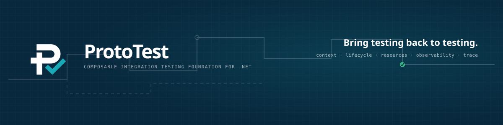

> Integration testing made as simple, readable, and frictionless as prototyping.

ProtoTest is short for **prototype testing**: not testing software prototypes, but bringing the simplicity, speed, and readability of prototyping back to integration testing. It is a .NET toolkit with a shared test lifecycle, a scoped `Proto.Context`, named clients, reusable hooks, and integration-specific assertions.

## Why ProtoTest?

Prototype testing is about trying an idea quickly and seeing the result clearly. ProtoTest applies that same feeling to integration tests: keep the test readable and focused on behavior while the framework manages the repeatable infrastructure around it.

ProtoTest provides:

- one lifecycle across NUnit, xUnit, xUnit v3, MSTest, and TUnit;
- per-test services, clients, typed state, and coverage hits;
- REST, GraphQL, and ASP.NET Core integrations;
- shared JSON shape matching through `ProtoTest.Json`;
- shared HTTP integration foundations through `ProtoTest.Http`;
- OpenAPI-driven REST coverage;
- extension points for hooks, attributes, clients, and collectors;
- automatic portable execution traces for lifecycle and integration operations.
- optional OpenTelemetry export through `ProtoTest.OpenTelemetry`, compatible with Sentry's official OpenTelemetry bridge.

## Example

```csharp
[ProtoTest]
[RestClient("Orders")]
[Auth<BearerTokenAuthenticator>("orders-token")]
public async Task GetOrder_ReturnsExpectedOrder()
{
	var response = await Proto.Context.Rest()
		.GetAsync("/orders/{id}", new { id = 42 });

	response
		.ShouldHaveStatus(HttpStatusCode.OK)
		.ShouldMatchShape(new { id = 42, status = "confirmed" });
}
```

This is an illustrative test excerpt. The complete setup is in the [getting-started guide](docs/getting-started/first-test.md).

## Documentation

Read the [ProtoTest documentation](docs/index.md), or start directly with:

- [First test](docs/getting-started/first-test.md)
- [REST integration](docs/integrations/rest.md)
- [GraphQL integration](docs/integrations/graphql.md)
- [ASP.NET Core integration](docs/integrations/aspnetcore.md)
- [Hooks and lifecycle extensions](docs/extending/hooks.md)
- [Context and state](docs/guides/context-and-state.md)
- [Extension points](docs/reference/extension-points.md)
- [Execution tracing](docs/reference/tracing.md)
- [Extension guide](docs/extending/index.md)

## Demo

[ProtoTest.Demo](samples/ProtoTest.Demo) is the single end-to-end showcase. It tests a multi-tenant control-plane SaaS through REST and GraphQL with parallel tenant provisioning, authentication, workspaces, releases, commerce, billing, audit, OpenAPI/GraphQL coverage, custom hooks, clients, contexts, observations, attachments, reports, and a complete ProtoTrace.

## Build and test

The repository contains VSTest projects as well as Microsoft Testing Platform projects. Run the checked-in entrypoint so every adapter and demo is included:

```powershell
./eng/test.ps1
```

CI uses the same command and validates every packable NuGet project afterwards.

To produce the complete package set locally:

```powershell
./eng/pack.ps1
```

## Status

| Area | Status |
| --- | --- |
| Core lifecycle and context | Available |
| NUnit, xUnit, xUnit v3, MSTest, TUnit | Available |
| REST | Available |
| ASP.NET Core | Available |
| OpenAPI | Available |
| GraphQL | Preview |
| gRPC (`ProtoTest.Grpc`), Playwright, standalone Coverage | Planned |

See the [integration overview](docs/integrations/overview.md) for package names and capabilities.
