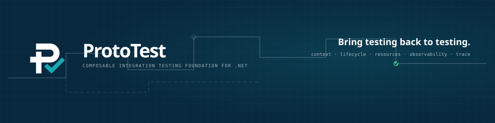
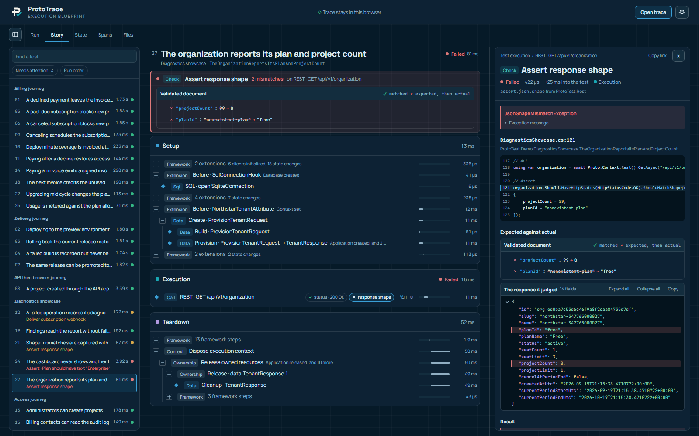

<p align="center">
  
</p>

<p align="center">
  <a href="https://github.com/MSeys/ProtoTest/actions/workflows/ci.yml"></a>
  <a href="https://www.nuget.org/packages/ProtoTest.Core"></a>
  <a href="https://www.nuget.org/packages/ProtoTest.Core"></a>
  <a href="https://www.nuget.org/profiles/MSeys"></a>
  <a href="LICENSE"></a>

ProtoTest is a foundation for integration testing on .NET 8, 9 and 10.

## What is ProtoTest?

ProtoTest is a foundation for integration testing: shared lifecycle, context and tracing that integrations build on.

It is something you can build upon to do integration testing without having to build all of the supporting infrastructure yourself.

[Documentation](https://prototest.dev/)

## What does it bring me?

Core gives you the foundation of ProtoTest.

It provides a lifecycle independent of the test runner you choose, so ProtoTest itself doesn't lock you into one runner. Adapters are available for NUnit, xUnit.net v2, xUnit.net v3, TUnit and MSTest.

Each test gets its own `ProtoExecutionContext`. That context can share state between hooks, attributes and the test itself, while also giving you access to configured clients and integrations, observations, tracing and other shared functionality.

The idea is that integrations don't each live in their own little world. They participate in the same test execution and can make use of the same lifecycle, context and tracing.

ProtoTest currently integrates with REST, GraphQL, gRPC, SQL, Entity Framework Core,
Playwright, Selenium, RabbitMQ, MassTransit, ASP.NET Core, background workers, Testcontainers,
WireMock, Aspire, MQTT and more.

The integrations cover commonly used infrastructure. A missing one can be added as an integration; see Extend ProtoTest yourself.

Use only what your test suite needs. You're not obligated to use everything.

[Learn more about Core](https://prototest.dev/docs/foundation/overview)

[Explore the integrations](https://prototest.dev/docs/integrations/overview)

[Extend ProtoTest yourself](https://prototest.dev/docs/advanced/extending)

## Supported and preview

Most suites need only the supported set: Core, one runner (NUnit, xUnit v2, xUnit v3, MSTest, TUnit), and the integrations for REST, GraphQL, gRPC, OpenAPI, ASP.NET Core, Web (Playwright, Selenium), SQL and Entity Framework Core, Messaging and RabbitMQ (each with a Testcontainers companion), Testcontainers, background workers (Hosting), Data, Reporting, Traces and Templates.

Preview packages exist and work, but their surface can change before 1.2: the agent layer (Mcp, Diagnosis, Verification, Feedback, Cli), the devices family (Devices, Devices.WebSocket, Devices.WebSocket.AspNetCore, Devices.Mqtt, Devices.Mqtt.Testcontainers), Sheets, Aspire, WireMock, Messaging.MassTransit and Analyzers. The [integrations map](https://prototest.dev/docs/integrations/overview) marks each one.

## Stability

ProtoTest 1.x stays additive. Released APIs change only through deprecated shims, and nothing breaks without a plan decision recorded in the changelog. Support is best effort by one maintainer in personal time. See [Support and sustainability](https://prototest.dev/docs/project/sustainability).

## What if it breaks?

ProtoTest moves setup behind shared layers, which keeps tests clean but can hide failure causes.

The built-in integrations hook into the tracing provided by Core. Every run writes a `.prototrace` file with setup, teardown, observations, state and attachments for the ProtoTrace viewer.

<p align="center">
  
</p>

[ProtoTrace](https://trace.prototest.dev) ·
[Open an interactive trace](https://trace.prototest.dev/?demo=1)

## Why ProtoTest

Integration suites repeat the same infrastructure setup. ProtoTest owns that setup once so each test states only its behavior.

[Read more about why ProtoTest exists.](https://prototest.dev/docs/project/why-prototest)

## What does that look like?

```csharp
[Application("Api")]
[ProtoTest]
[SignedInAs]
public async Task RestWritesAreVisibleThroughGraphQL()
{
    using var created = await Proto.Context.Rest()
        .Body(new CreateProjectRequest("atlas"))
        .PostAsync("/api/v1/projects");

    created.Should.HaveHttpStatus(HttpStatusCode.Created);

    using var projects = await Proto.Context.GraphQL()
        .Query("projects", new { first = 10 })
        .ExpectAsync(new
        {
            totalCount = 1,
            nodes = new[] { new { name = "atlas", status = ProjectStatuses.Active } }
        });

    projects.Should.HaveNoErrors();
}
```

This is a simple example combining the REST and GraphQL integrations. The focus lies on a clean test with most of the infrastructure moved out of the test once it has been configured.

The test can focus on the behavior. If something goes wrong, its lifecycle, operations and checks are written to the same `.prototrace` file.

## Wrappers with one lifecycle

The integrations wrap proven libraries and share one lifecycle, context and trace, so tests read as arrange, act, assert. Setup shared by the suite stays out of the test; setup the scenario needs stays visible.

## Try it

```bash
dotnet new install ProtoTest.Templates
dotnet new prototest -n Shop
cd Shop
dotnet test
```

[The Learning demo suite](https://github.com/MSeys/ProtoTest/tree/main/samples/Northstar.ProtoTest)

## License

ProtoTest is available under the [MIT license](https://github.com/MSeys/ProtoTest/blob/main/LICENSE). Issues and contributions are welcome. AI assistance is used in development and disclosed per change; see the [AI usage notes](https://prototest.dev/docs/project/ai-usage).
