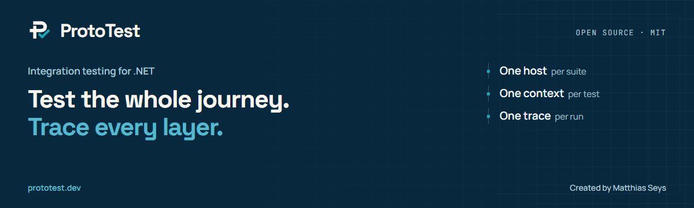
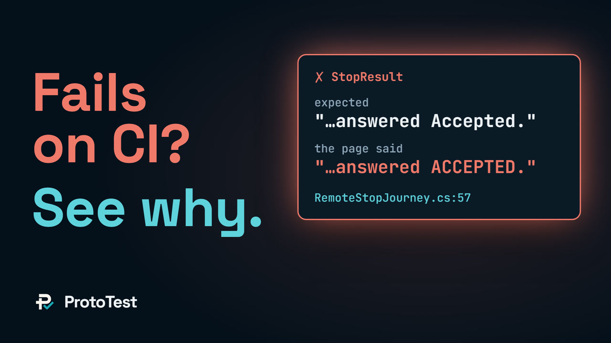
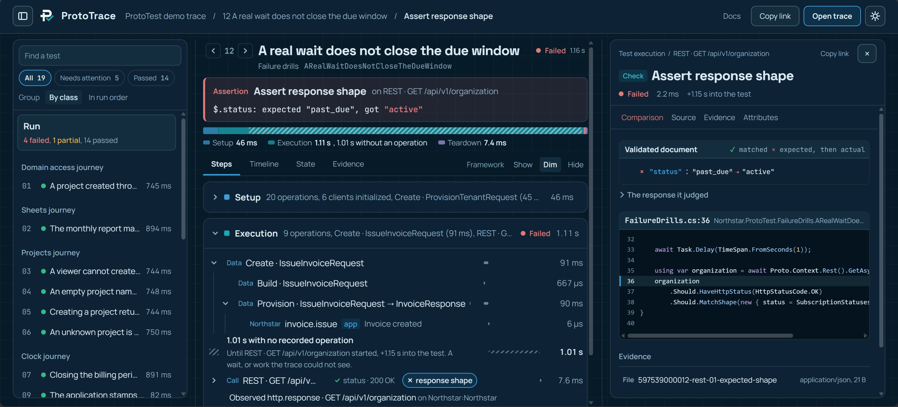

<p align="center">
  
</p>

<p align="center">
  <a href="https://github.com/MSeys/ProtoTest/actions/workflows/ci.yml"></a>
  <a href="https://www.nuget.org/packages/ProtoTest.Core"></a>
  <a href="LICENSE"></a>
</p>

ProtoTest is a foundation for integration testing on .NET 8, 9 and 10. One host per suite, one context per test, one trace per run.

<a href="https://youtu.be/mFhMaDeQtm8"></a>

[Watch ProtoTest in 70 seconds](https://youtu.be/v1r6VHSAzRE): one real test, from the failure on CI to the proven fix.

## Try it

```bash
dotnet new install ProtoTest.Templates
dotnet new prototest -n Shop
cd Shop
dotnet test
```

The template suite is green on a fresh checkout. It hosts the app in process and needs no containers or browsers.

## What a test looks like

```csharp
[Application("Api")]
[ProtoTest]
[SignedInAs]
public async Task RestWritesAreVisibleThroughGraphQL()
{
    using var created = await Proto.Context.Rest()
        .Body(new CreateProjectRequest("atlas"))
        .PostAsync("/api/v1/projects");

    created.Should.HaveHttpStatus(HttpStatusCode.Created);

    using var projects = await Proto.Context.GraphQL()
        .Query("projects", new { first = 10 })
        .ExpectAsync(new
        {
            totalCount = 1,
            nodes = new[] { new { name = "atlas", status = ProjectStatuses.Active } }
        });

    projects.Should.HaveNoErrors();
}
```

Each test gets its own `Proto.Context`. It carries the clients, the state and the trace for that test. Setup shared by the suite stays in the host composition. The scenario under test stays visible.

## What you get

- One lifecycle independent of the runner. Adapters exist for NUnit, xUnit.net v2, xUnit.net v3, TUnit and MSTest.
- Integrations that share that lifecycle: REST, GraphQL, gRPC, SQL, Entity Framework Core, Playwright, Selenium, RabbitMQ, ASP.NET Core, Testcontainers, background workers and more. The [integrations map](https://prototest.dev/docs/integrations/overview) marks what is supported and what is preview.
- One evidence trace per run. Every run writes a `.prototrace` file with setup, teardown, operations and checks.

## When it fails

The trace is the failure story. Drop the `.prototrace` file on the viewer and read the run: lifecycle, requests, checks, resources, attachments.

<p align="center">
  
</p>

[Open the interactive trace](https://trace.prototest.dev/?demo=1)

## With a coding agent

Your agent fixes and writes tests; ProtoTest judges the result from the trace. The MCP server and the
`prototest` CLI tell the agent where a run left the last green one, prove a fix only when the test failed
before, passes now and broke nothing else, and say what each test actually checks. On a pull request, the
[ProtoTest Evidence action](https://github.com/MSeys/prototest-action) posts what the change broke and
fixed. [Coding agents](https://prototest.dev/docs/agent-workflows/coding-agents) covers the setup.

## Learn

- [Documentation](https://prototest.dev/docs/foundation/overview)
- [Learning demo suite](samples/Northstar.ProtoTest/README.md) and the [Learn track](https://prototest.dev/learn)
- [Why ProtoTest exists](https://prototest.dev/docs/project/why-prototest)
- [Support and sustainability](https://prototest.dev/docs/project/sustainability)

ProtoTest 1.x stays additive. Preview packages can still change before 1.2; the integrations map says which ones.

## License

ProtoTest is [MIT](LICENSE). AI assistance is used in development and disclosed per change; see the [AI usage notes](https://prototest.dev/docs/project/ai-usage).
