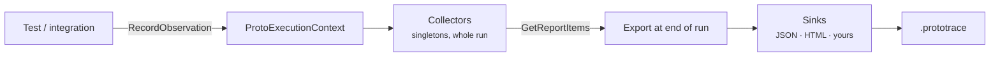

# Coverage and observations

Code coverage tells you which lines ran. It can't tell you which **parts of your API** your tests actually checked — an endpoint can be called by a setup helper a thousand times and never have its response asserted once.

ProtoTest measures coverage against the *contract*: your OpenAPI document, your GraphQL schema. And for REST, it counts a response property as covered only when a shape assertion actually matched it.

## Turning it on

```csharp
builder
    .AddApplication("Api", app => app
        .AddRest(rest => rest
            .AddClient("Api")
            .WithCollector<RestCoverageCollector>()
            .WithCollector<OpenApiCoverageCollector>())
        .AddGraphQL(graphQL => graphQL
            .AddClient("GraphQL")
            .WithSchemaCoverage("schema.graphql")))
    .AddSink<HtmlReportSink>();
```

| Collector | Reports |
| --- | --- |
| `RestCoverageCollector` | every REST endpoint your suite called, with hit counts |
| [`OpenApiCoverageCollector`](../integrations/openapi.md) | the **whole** OpenAPI document: endpoints → responses → response properties, covered or not |
| [GraphQL schema coverage](../integrations/graphql/coverage.md) | the whole schema: types → fields → arguments, and input types → input fields |

Collectors gather; [sinks](./reporting.md) write the results. Without a sink you won't see anything.

## Reading the report

```
OpenAPI  GET /api/v1/organization                12 hits  ✓
         └ 200                                   12 hits  ✓
           └ $.seatCount                          12 hits  ✓
           └ $.projectCount                        9 hits  ✓
           └ $.cancelAtPeriodEnd                   0 hits  ○   never asserted
         └ 403                                    0 hits  ○   never reached
OpenAPI  POST /api/v1/deployments/{id}/rollback   0 hits  ○   never called
```

Three different gaps, three different fixes:

- **An endpoint was never called** — there's a feature with no test at all.
- **A response status was never reached** — the error path is untested. `403` and `404` are the usual suspects.
- **A property was never asserted** — the test calls the endpoint but doesn't check that field. Add it to a `ShouldMatchShape`.

The summary at the top of each report gives the total, covered and uncovered counts and a coverage percentage.

:::tip Coverage rewards shape assertions
Property coverage comes from the paths `ShouldMatchShape` matched. A test that only checks the status code covers the endpoint and the status, but none of the fields. That's deliberate — a field nobody asserts is a field that can break silently.
:::

## How it works



1. Integrations record **observations** as tests run. REST records `http.response` for every response and `http.contract.shape` for every successful shape assertion; GraphQL records `graphql.response`.
2. Each observation is offered to every registered **collector** whose `CanCollect` accepts it. Collectors live for the whole run, so they aggregate across all tests.
3. When the run stops, every collector's **report items** are gathered, sorted by target, category and identifier, and passed to every **sink**.
4. Files the sinks wrote are added to the `.prototrace` archive.

## Observations

```csharp
public sealed record ProtoObservation(
    string TargetName,      // which client/target it concerns, e.g. "Api"
    string Kind,            // what kind of fact, e.g. "http.response"
    string Identifier,      // what it's about, e.g. "GET /api/orders/{id}"
    object? Data = null,
    IReadOnlyDictionary<string, object>? Metadata = null);
```

You can record your own — domain facts that deserve to be in a report:

```csharp
Proto.Context.RecordObservation(
    targetName: "Billing",
    kind: "invoice.state",
    identifier: invoice.State,
    data: new { invoice.Id, invoice.Total });
```

## Writing a collector

The simplest collector counts identifiers. Derive from `ProtoCoverageCollector` and give it a category:

```csharp
public sealed class InvoiceStateCoverage(string targetName) : ProtoCoverageCollector(targetName)
{
    public override string Category => "Invoice states";

    public override bool CanCollect(ProtoObservation observation) =>
        base.CanCollect(observation) && observation.Kind == "invoice.state";
}
```

The base class matches observations whose `TargetName` equals its own (ignoring case), and records one covered item per distinct `Identifier` with a hit count. That's exactly how `RestCoverageCollector` is built.

To report things that were **not** observed — the valuable part — override `GetReportItems` and enumerate the full set, as the OpenAPI collector does with the specification:

```csharp
public sealed class InvoiceStateCoverage(string targetName) : ProtoCoverageCollector(targetName)
{
    private static readonly string[] AllStates = ["draft", "open", "paid", "overdue", "void"];

    public override string Category => "Invoice states";

    public override bool CanCollect(ProtoObservation observation) =>
        base.CanCollect(observation) && observation.Kind == "invoice.state";

    public override IEnumerable<ProtoReportItem> GetReportItems()
    {
        lock (Lock)
        {
            return AllStates.Select(state => Items.TryGetValue(state, out var hit)
                ? hit
                : new ProtoReportItem(TargetName, Category, state,
                    Kind: ProtoReportItemKind.Coverage,
                    Status: ProtoReportStatus.Neutral,
                    IsCovered: false)).ToList();
        }
    }
}
```

Register it on a target — the target name is passed as the first constructor argument, and any extra arguments to `WithCollector` follow it:

```csharp
builder.AddApplication("Api", app => app
    .AddRest(rest => rest.AddClient("Billing").WithCollector<InvoiceStateCoverage>()));
```

Collectors must be thread-safe; tests run in parallel. Use the base class's `Lock`.

### Collectors not tied to a client

`WithCollector` hangs off a client registration. For a collector that isn't about any client, register it directly:

```csharp
builder.ConfigureServices(services =>
    services.AddSingleton<IProtoCollector>(new InvoiceStateCoverage("Billing")));
```

The interfaces underneath are small:

```csharp
public interface IProtoCollector
{
    bool CanCollect(ProtoObservation observation);
    void Collect(ProtoObservation observation);
}

public interface IProtoReportSource
{
    IEnumerable<ProtoReportItem> GetReportItems();
}
```

## Report items

```csharp
public sealed record ProtoReportItem(
    string TargetName,
    string Category,
    string Identifier,
    ProtoReportItemKind Kind = ProtoReportItemKind.Observation,   // Observation, Coverage, Finding, Metric
    ProtoReportStatus Status = ProtoReportStatus.Neutral,         // Neutral, Info, Success, Warning, Error
    int Count = 0,
    bool? IsCovered = null,
    double? Value = null,
    string? Unit = null,
    string? Message = null,
    IReadOnlyList<string>? Tags = null,
    IReadOnlyList<ProtoReportItem>? Children = null,
    IReadOnlyDictionary<string, object>? Metadata = null);
```

Items nest through `Children`, and the kinds cover more than coverage: a `Metric` with a `Value` and `Unit`, or a `Finding` with a `Warning` status and a `Message`, show up in the same reports.
