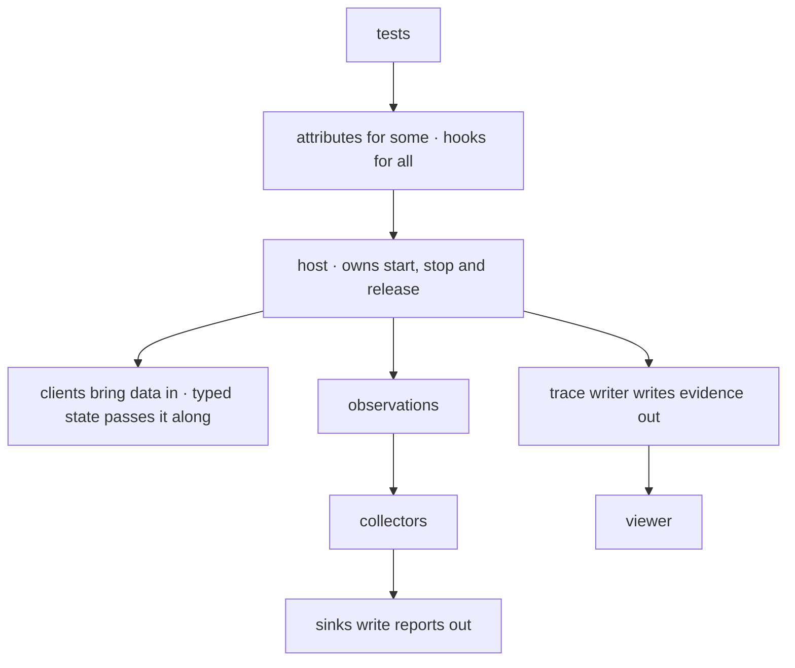
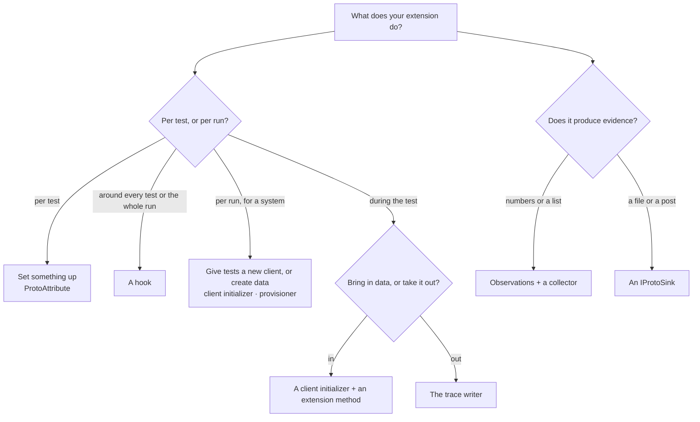

# Extending ProtoTest

Every built-in integration is built on public types, and a package you write uses the same ones. This page is the contract: which extension point to use, what it guarantees, and how the result reads in the trace.

## The contract

- **The extension points are public.** A minimal broker adapter and a minimal web backend compile against the public surface only, so a point that regressed to internals would break them. An integration never reaches into another package's internals.
- **One mechanism per concern.** A client is a client initializer, a wait is a readiness probe, run state is infrastructure, a capability is a capability descriptor, and evidence goes through the trace writer. An extension uses those mechanisms and does not add a second lifecycle.
- **Options follow one shape.** An options type implements `IProtoConfigurableOptions`, registers through `ProtoOptionsRegistration`, and binds its section over the code callback, so configuration wins the same way everywhere.
- **The run composes your package like any other.** A builder extension registers services on the `IProtoHostBuilder`, and the host owns start, stop and release from there.

## Where each extension point lives

Start from what you need to say, then take the part of the integration it belongs to. Where each part plugs in:





| You want to… | Use | Part |
| --- | --- | --- |
| package setup for *some* tests | a [`ProtoAttribute`](../foundation/attributes.md) | 1 |
| run code around *every* test or the whole run | a [hook](../foundation/hooks.md) | 1 |
| give tests a new client | a [client initializer](../foundation/clients.md) plus an extension method | 2 |
| publish and await over your own broker | an [`IProtoMessageBroker`](../integrations/messaging/adapters.md#the-adapter-contract) whose consumer derives from [`ProtoMessageConsumerBase`](../integrations/messaging/adapters.md#writing-an-adapter) | 2, 3 |
| pass data between setup and tests | [typed state](../foundation/execution-context.md#typed-state) | 3 |
| authenticate HTTP requests | an [`IProtoHttpAuthenticator`](../integrations/rest/authentication.md#writing-your-own) | 1 |
| log a browser in | an [`IWebLoginStrategy`](../integrations/web/login.md) | 1 |
| wait for app-specific readiness | an [`IWebWaitCondition`](../integrations/web/middleware.md) | 1 |
| create data in your system | an [`IProtoDataProvisioner`](../integrations/data/provisioners.md) | 2 |
| report on what tests did | observations plus a [collector](../observability/coverage.md#writing-a-collector) | 4 |
| write reports somewhere | an [`IProtoSink`](../observability/reporting.md#writing-a-sink) | 4 |
| show up in the trace viewer | the trace writer, below | 1 |
| support another test runner | `ProtoHost` plus `IProtoTestAttachmentPublisher`, below | separate |

## Your first integration package

A minimal package is six small steps, in this order. The worked bus client below follows them. Finish each step before the next: register the package on a host, write one test through the context accessor, and read its trace before adding the collector.

1. **Options.** An options type implementing `IProtoConfigurableOptions` with a section name, registered through `ProtoOptionsRegistration.Configure`, so code callbacks run in order and configuration binds over them. See [Options and configuration](#options-and-configuration).
2. **The client and its initializer.** A client class plus an initializer that opens it per test and registers it, so tests get a fresh client with the test's cancellation token. See [part 1](#1-the-client-and-its-initializer).
3. **A host builder extension.** An `Add...` method that registers the options and the initializer on the `IProtoHostBuilder`. See [part 2](#2-a-host-builder-extension).
4. **A context extension.** A `Proto.Context.X()` accessor that resolves the client by name. See [part 3](#3-a-context-extension).
5. **Trace the operations.** One `{area}.{action}` operation per act, so the package reads like a built-in in the viewer. See [Adding to the trace](#adding-to-the-trace).
6. **Optionally, a collector.** Turn the observations the client records into a report section. See [part 4](#4-optionally-a-collector).

## A worked example: a message-bus client

The sketch below is a message-bus client you could write. It has the four parts a typical integration has, and the result is this:

```csharp
builder.AddBus("Default", bus => bus.Endpoint = "amqp://localhost");

await Proto.Context.Bus().PublishAsync("orders.created", order);
```

| Part | The file it belongs in | What it does |
| --- | --- | --- |
| 1. The client and its initializer | `BusClient.cs` | Holds the connection, and records a `bus.publish` operation plus the observation that goes with it |
| 2. A host builder extension | `ProtoHostBuilderBusExtensions.cs` | Registers the options and the initializer on the builder |
| 3. A context extension | `ProtoExecutionContextBusExtensions.cs` | Resolves the client by name, so a test writes `Proto.Context.Bus()` |
| 4. Optionally a collector | `BusCoverageCollector.cs` | Turns your `bus.publish` observations into a report section |

### 1. The client and its initializer

```csharp
public sealed class BusClient(IConnection connection, ProtoExecutionContext context) : IAsyncDisposable
{
    public async Task PublishAsync(string topic, object message)
    {
        await context.Trace.ExecuteAsync(
            "bus.publish",
            $"BUS · Publish · {topic}",
            "Acme.ProtoTest.Bus",
            async () => await connection.PublishAsync(topic, message),
            attributes: new Dictionary<string, string?> { ["bus.topic"] = topic });

        context.RecordObservation("Bus", "bus.publish", topic);
    }

    public ValueTask DisposeAsync() => connection.DisposeAsync();
}

internal sealed class BusClientInitializer(string name, BusOptions options) : IProtoClientInitializer<BusClient>
{
    public string Name => name;

    public async Task<bool> TryInitializeAsync(ProtoExecutionContext context)
    {
        var connection = await Connection.OpenAsync(options.Endpoint, context.CancellationToken);
        context.RegisterClient(new BusClient(connection, context), name);
        return true;
    }
}
```

The initializer reads the test's cancellation token and passes it to its own I/O. A client that a test shares across tests must not hold the context. It resolves the context per call, only while it acts on the test's flow. See [Context lookups](https://github.com/MSeys/ProtoTest/blob/main/CONTRIBUTING.md#context-lookups).

### 2. A host builder extension

```csharp
public static class ProtoHostBuilderBusExtensions
{
    public static IProtoHostBuilder AddBus(this IProtoHostBuilder builder, string name, Action<BusOptions> configure)
    {
        var options = new BusOptions();
        configure(options);
        return builder.ConfigureServices(services =>
            services.AddSingleton<IProtoClientInitializer>(new BusClientInitializer(name, options)));
    }
}
```

### 3. A context extension

```csharp
public static class ProtoExecutionContextBusExtensions
{
    public static BusClient Bus(this ProtoExecutionContext context, string name = "Default") =>
        context.Client<BusClient>(name);
}
```

### 4. Optionally, a collector

A collector consuming your `bus.publish` observations, so topics show up in coverage reports. It derives from `ProtoCoverageCollector`, with the shape shown in [writing a collector](../observability/coverage.md#writing-a-collector).

### Options and configuration

Register options with `ProtoOptionsRegistration.Configure`. It runs code callbacks in registration order. It then binds the config section over the result. It runs `Validate()` once when the options resolve. The `IConfiguration` comes from the host's service provider, so an extension never touches configuration itself:

```csharp
public sealed class BusOptions : IProtoConfigurableOptions
{
    public const string SectionName = "Acme:Bus";

    public string Endpoint { get; set; } = "amqp://localhost";

    string IProtoConfigurableOptions.ConfigurationSectionName => SectionName;

    public void Validate()
    {
        if (!Uri.TryCreate(Endpoint, UriKind.Absolute, out _))
        {
            throw new ArgumentException(
                $"BusOptions.Endpoint must be an absolute address. Set it in code or under '{SectionName}:Endpoint'.",
                nameof(Endpoint));
        }
    }
}
```

Register the type in the builder extension and resolve it where it is used:

```csharp
public static class ProtoHostBuilderBusExtensions
{
    public static IProtoHostBuilder AddBus(this IProtoHostBuilder builder, string name,
        Action<BusOptions>? configure = null) =>
        builder.ConfigureServices(services =>
        {
            ProtoOptionsRegistration.Configure(services, () => new BusOptions(), configure);
            services.AddSingleton<IProtoClientInitializer>(serviceProvider =>
                new BusClientInitializer(name, serviceProvider.GetRequiredService<BusOptions>()));
        });
}
```

Calling `AddBus` twice now composes: both callbacks run, in order, and one options instance serves the host. A value in `appsettings.json` binds over the code default:

```json
{
  "Acme": {
    "Bus": {
      "Endpoint": "amqp://broker.internal:5672"
    }
  }
}
```

Built-ins use `ProtoTest:<Integration>[:<Area>]`. The area names the role, such as `Responses` or `Client`. An integration with one options set has no area. A package you write picks its own root. A section renamed during 1.x returns its old name from `FallbackConfigurationSectionName`, so the old key keeps working as a documented fallback, with the current section binding over it.

### Authenticator-style construction

`ProtoAuthenticatorFactory.Create<T>(context, constructorArgs)` is what `[Auth<T>]` and `[LoginAs<T>]` use to build their types: positional arguments from an attribute, the rest from DI and the `ProtoExecutionContext`. Use it for your own generic attributes so they behave the same way.

## Adding to the trace

`context.Trace` is an `IProtoTraceWriter`. One operation your package writes reads like this in the viewer:

```text
bus.publish            BUS · Publish · orders.created     Succeeded · 12 ms
kind                   name                               outcome
source: Acme.ProtoTest.Bus          attributes: bus.topic = orders.created
```

Kind, name, source and attributes are the four things every call sets. The conventions below are what makes the row read like a built-in one.

### Operations

The easiest way is `ExecuteAsync`, which records success, failure or cancellation for you and rethrows. The action is a `Func<ValueTask>` or `Func<ValueTask<T>>`, so an `async` lambda works for any awaitable:

```csharp
await context.Trace.ExecuteAsync(
    kind: "files.assert",
    name: $"FILE · Assert · {fileName}",
    source: "Acme.ProtoTest.Files",
    action: async () => await AssertWorkbookAsync(fileName),
    attributes: new Dictionary<string, string?> { ["file.name"] = fileName });

var rows = await context.Trace.ExecuteAsync(
    "files.read", $"FILE · Read · {fileName}", "Acme.ProtoTest.Files",
    async () => await ReadRowsAsync(fileName));
```

Or manage an operation yourself:

```csharp
using var operation = context.Trace.StartOperation(
    "files.assert", $"FILE · Assert · {fileName}", "Acme.ProtoTest.Files");

try
{
    var mismatches = await CompareAsync(fileName);
    operation.SetAttribute("file.mismatches", mismatches.Count.ToString());

    if (mismatches.Count == 0) operation.Succeed();
    else operation.Complete(ProtoTraceOutcome.Partial);
}
catch (Exception exception)
{
    operation.Fail(exception);
    throw;
}
```

`ProtoTraceOperation` is the handle you manage yourself. It completes once.

| Member | What it does |
| --- | --- |
| `Id` | the entry id the archive and the viewer use |
| `SetAttribute(name, value)` | adds a string attribute, and is chainable |
| `Succeed()` | completes as `Succeeded` |
| `Fail(exception)` | completes as `Failed` and records the exception |
| `Cancel(exception?)` | completes as `Cancelled` |
| `Complete(outcome, exception?)` | completes with an outcome you chose |
| `Dispose()` | releases the operation. Disposing without completing records `Unknown` |

### Events

```csharp
context.Trace.WriteEvent(
    "saas.correlation.begin",
    "Begin correlated SaaS scenario",
    "Northstar.ProtoTest",
    outcome: ProtoTraceOutcome.Succeeded,
    attributes: new Dictionary<string, string?> { ["saas.correlation_id"] = correlationId });
```

### Steps in sequence

`ProtoFlow` runs a named list of steps, one operation per step. It is the primitive behind ProtoTest's own teardown chains, and it suits an integration that cleans up several things in order:

```csharp
var result = await new ProtoFlow("Mailbox teardown", "Acme.ProtoTest.Mail", ProtoFlowFailureMode.Collect)
    .Step("delete messages", ct => new ValueTask(mailbox.ClearAsync(ct)))
    .Step("delete mailbox", ct => new ValueTask(mailbox.DeleteAsync(ct)))
    .RunAsync(context.Trace, context.CancellationToken);

if (!result.Succeeded) throw new AggregateException(result.Failures);
```

- `Step(name, action)` records a `flow.step` operation named `{flow} · {step}`, with the attributes `flow.name`, `step.name` and `step.index`.
- `Step(ProtoStepDescriptor, action)` records the kind, name, phase, attributes and entity the descriptor declares, so a release step can stay a `resource.release` entry.
- `FailFast`, the default, stops at the first failing step. `Collect` runs every step and keeps every failure.
- `RunAsync` returns the failures in step order and does not throw them. The caller decides.
- Cancelling the flow's token stops the flow and throws. In `Collect` mode, a step that cancels for another reason counts as a failure and the next steps still run.

### Conventions

- **Kind** is a dotted, lowercase identifier: `{area}.{action}`. The viewer groups by the prefix, so a new kind gets its own category without a viewer release.
- **Name** is for humans: the built-ins use `AREA · Verb · subject`.
- **Source** is your package name.
- **Attributes** are strings. Keep them small, and never put secrets in them.

Nesting is automatic. An operation started inside another becomes its child and inherits its phase. Pass `parentId` to attach elsewhere, or `phase` to set it explicitly.

### Reading a trace in code

The host exposes a live snapshot of the same tree, for code that needs to read a run without opening the archive:

```csharp
var run = host.Trace.Snapshot();
var click = run.Tests.Single().Entries.Single(entry => entry.Kind == "web.click");
Assert.That(click.Outcome, Is.EqualTo(ProtoTraceOutcome.Succeeded));
```

`ProtoTraceDiscovery.Discover(folder)` lists the readable runs a folder holds, newest first, and names the archives it had to skip. `ProtoTest.Traces` reads one archive.

## Supporting another runner

A runner integration needs three things, and the five shipped adapters are the worked examples:

1. Build and start one `ProtoHost` per process, and stop it at the end.
2. Around each test, call `ProtoTestAdapter.Prepare(method, host)` and start the returned preparation with `StartAsync(host, publisher)`. Skip through your runner's own mechanism when `CanRun` is false. Afterwards, call `CompleteTestAsync(result)` with the best outcome the runner can tell you. `ProtoTestResult` has factories for passed, skipped, partial, failed and cancelled.
3. Implement `IProtoTestAttachmentPublisher` using the runner's own attachment API.

Start the test on the same async flow the test body will run on, because `Proto.Context` depends on it. The shared `ProtoTest.AdapterContract` suite is what every adapter package runs. Extend it instead of forking it.

## Limits of the contract

- **There is no internal surface.** An extension compiles against the public packages only. When it needs a type it cannot see, the owning package publishes the contract or moves the code. If you believe a point is missing, open an issue so it can be added deliberately. See [Community packages](https://github.com/MSeys/ProtoTest/blob/main/CONTRIBUTING.md#community-packages).
- **A capability is declared only by something that can serve it.** An extension declares its capability while its address can be provided. Where the address is missing, the capability is absent and gated tests skip instead of failing at first use.
- **The trace viewer contract is additive.** A new kind or attribute needs no viewer release for a new prefix.
- **Use one mechanism per concern.** A second host builder or registry is not an extension.
