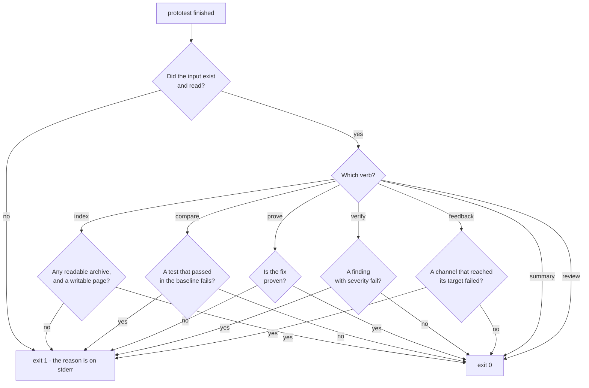

# CLI reference

`prototest` reads ProtoTest evidence from a terminal. It prints a run summary, builds a page over a folder of runs, checks two reports, and posts the feedback digest. It needs no agent and no browser. The [evidence action](../continuous-integration/index.md#the-evidence-action) installs it and calls the same commands in CI, so a local run and a CI step read the same archive the same way.

## Install

```bash
dotnet tool install --global ProtoTest.Cli
```

The tool command is `prototest`. The package targets .NET 8. On a machine with only a newer runtime, set `DOTNET_ROLL_FORWARD=LatestMajor` so the tool starts. The action sets that for you.

## The verbs

```text
usage: prototest summary <file.prototrace>
       prototest index <folder>
       prototest feedback <file.prototrace> [--digest <path>] [--baseline <file.prototrace>]
       prototest verify <baseline> <current>   (report.json or .prototrace)
       prototest compare <baseline.prototrace> <current.prototrace>
       prototest prove <baseline.prototrace> <current.prototrace>... [--test <name>]...
       prototest review <file.prototrace> [--test <name>]...
```

| You want to | Run | It writes |
| --- | --- | --- |
| read one run | `summary <file.prototrace>` | nothing |
| share a folder of runs | `index <folder>` | `index.html` and a `.digest.json` beside each archive |
| check a run against a baseline | `verify <baseline.json> <current.json>` | nothing |
| see what changed between two runs | `compare <baseline.prototrace> <current.prototrace>` | nothing |
| prove a fix | `prove <baseline.prototrace> <current.prototrace>... [--test <name>]...` | nothing |
| see what each test proves | `review <file.prototrace> [--test <name>]...` | nothing |
| post the digest | `feedback <file.prototrace> [--digest <path>] [--baseline <file.prototrace>]` | the `--digest` file, and the posts |

An unknown verb, or the wrong arguments, prints that usage to stderr and exits `1`. There is no `--help` verb: `prototest --help` prints the same usage to stderr and exits `1`.

### summary

Reads one trace and prints the deterministic diagnosis as text. It shows the run id, the outcome counts, the run gates, and every test that did not fully succeed with its error, source location and failing operation. It is the document `get_diagnosis` returns as JSON.

```bash
prototest summary TestResults/ProtoTest/run.prototrace
```

```text
ProtoTest trace 2.0 · run 761778e6dc82498a9f9965fa1e6b5a24 · 2026-09-29 06:19:01Z - 2026-09-29 06:19:05Z
1 tests · 1 failed

FAILED Northstar.ProtoTest.FailureDrills.TheAddressWasHardcodedForOneMachine (2.66 s)
  ConnectionError reaching http://127.0.0.1:5099: connection refused.
  test.execution Test execution · failed
  cause: runner-reported failure
```

Run ids and timestamps are new on every run, so compare the shape, not the values.

A run with nothing to report prints the header, the counts and the words `All green.`:

```text
ProtoTest trace 2.0 · run 761778e6dc82498a9f9965fa1e6b5a24 · 2026-09-29 06:19:01Z - 2026-09-29 06:19:05Z
1 tests · 1 succeeded
All green.
```

[Diagnosis](./diagnosis.md) explains every line of the failing block and the rules behind the `cause`.

Exit `0` when the summary printed. Exit `1` when the file is missing or cannot be read, with the reason on stderr:

```text
Trace file not found: TestResults/ProtoTest/run.prototrace
```

### index

Discovers the `.prototrace` archives under the folder, newest first, and writes the evidence into a folder you can share:

- `index.html` in the folder. It lists each run's outcome counts, the tests that did not pass, and links to its trace and its digest. Every archive that could not be read is listed with the reason.
- A `.digest.json` file beside each archive, the diagnosis JSON the page links to.

```bash
prototest index TestResults
```

```text
Indexed 2 runs into 'C:\dev\your-repo\TestResults\index.html'.
```

Discovery looks at the folder's `TestResults/` first and walks the tree only when that yields no readable run. [Setup](./setup.md#where-it-reads) has the details. An archive it could not read is named, not guessed at:

```text
Indexed 1 run into 'C:\dev\your-repo\TestResults\index.html'.
Skipped 'C:\dev\your-repo\TestResults\broken.prototrace': Central Directory corrupt.
```

Exit `0` when the page is written. Exit `1` when the folder is missing, holds no readable archive, or the page cannot be written.

### verify

Compares two JSON reports from a `ProtoTest.Reporting` sink, as files or as the reports two traces embedded:

```bash
prototest verify baseline.json TestResults/ProtoTest/report.json
prototest verify main.prototrace TestResults/ProtoTest/run.prototrace
prototest verify main.prototrace TestResults/ProtoTest/run.prototrace --strict
```

`--strict` also fails a unit the change added without a test (`added-uncovered`), which only warns by default.

The baseline is the default branch report. The current report is the run under review. The failing findings print one `::error` workflow command each, which a GitHub runner turns into an annotation. The verdict then lists the findings and the coverage deltas. The default severities make the verb a pull request gate: `regressed`, `stale-spec` and `gate-failed` fail, and `added-uncovered` warns.

```text
::error::regressed: Target 'Northstar:Api' unit 'GET /api/v1/orders' in category 'OpenAPI' was covered in the baseline and is uncovered now.
ProtoTest verification failed: 1 failing, 0 warning(s), 0 info
  fail regressed: Target 'Northstar:Api' unit 'GET /api/v1/orders' in category 'OpenAPI' was covered in the baseline and is uncovered now.
coverage deltas:
  Northstar:Api · OpenAPI: 1/2 covered -> 0/2 covered (-50 points, 1 regressed, 0 added uncovered)
```

[Verification](./verification.md) explains each finding class and the specification identity.

Exit `0` when no finding is a fail and `1` when one is. Exit `1` also when a report file is missing or cannot be read:

```text
Report or trace file not found: baseline.json
```

### compare

Compares two runs test by test:

```bash
prototest compare main.prototrace TestResults/prototest-<runId>.prototrace
```

Tests match by name. Each test is `broken` (it passed in the baseline and fails now), `fixed`, `still-failing`, `new`, `removed` or `unchanged`. For a test that changed, the output names the first operation where the two runs part: an operation whose status or error type changed, or one only one run recorded. That is usually the line to look at.

```text
::error::broken: orders are listed
ProtoTest comparison: run 5f2c... -> run 9a41...
3 tests · 1 broken · 2 unchanged

BROKEN orders are listed (succeeded -> failed)
  diverges at: http.request List orders [GET /orders] (status-changed)
    baseline: succeeded
    current:  failed · System.TimeoutException: No answer in 2 seconds.
```

Unchanged tests are counted, not listed. A test that fails the same way in both runs says so. A skipped test is not a failure, so a drill skipped in both runs reads unchanged. Steps pair even when their names carry values that change on every run (a port, an id, a long number). A changed status inside the test body wins over a step only one run recorded. Error messages are not compared, because they carry run-specific ids and ports; the error type is.

Exit `0` when no test broke and `1` when one did, or when a trace is missing or cannot be read.

### prove

Proves a fix from recorded runs. The baseline is the run that shows the failure; the current traces are runs after the fix:

```bash
prototest prove before.prototrace after.prototrace --test "orders are listed"
```

The fix is proven only when all of these hold:

- the baseline recorded each claimed test as not succeeded;
- every current run recorded each claimed test as succeeded;
- no test that passed in the baseline fails now;
- when both runs embedded a JSON report, `verify` over the two reports has no failing finding.

Each unmet condition prints a reason code (`not-in-baseline`, `not-failing-in-baseline`, `not-in-current`, `still-failing`) with the run it is about. Without `--test`, the fix claims every test the baseline did not pass. Pass two or more current traces to guard against a test that passes once by chance.

```text
ProtoTest fix proven: baseline run 5f2c... -> run 9a41...
  PROVEN orders are listed
    changed at: http.request List orders [GET /orders] (status-changed)
  note: No JSON report is embedded in baseline run 5f2c..., so coverage and run gates were not compared.
```

Exit `0` when the fix is proven and `1` when it is not, with one `::error` line per unproven or broken test.

### review

Reviews what each test proves from what it recorded: a body with no check, a call no check looked at, and time with no recorded operation. Every finding prints its next step:

```bash
prototest review TestResults/prototest-<runId>.prototrace
```

[Diagnosis](./diagnosis.md#review-what-a-test-proves) lists the rules. A review advises, so it exits `0` with findings; it exits `1` only when the trace is missing or cannot be read.

### feedback

Reads one run's digest and posts it:

```bash
prototest feedback TestResults/ProtoTest/run.prototrace --digest digest.json
```

With `--baseline <file.prototrace>`, the comment also says which tests the run broke or fixed against that trace, and where each one changed. When both traces embed a report, it adds the coverage that moved: each unit the change added without a test, with the test to extend or copy, and each unit it stopped covering. A run with no failures still posts when it fixed a test or changed coverage. The comment starts with `<!-- prototest-evidence -->`, and a later run updates that comment instead of posting a new one.

Two streams, and the split is the point:

| Stream | What carries |
| --- | --- |
| stdout | one `::error` workflow command per failing test and per failed run gate |
| stderr | one line per channel: `posted`, `skipped` with the reason, or `failed` |
| a file | `digest.json`, written by `--digest` |

The stderr half, from a run with no pull request configured:

```text
prototest feedback: github-annotations posted (1 annotation.)
prototest feedback: github-pr-comment skipped (No GitHub token: set GITHUB_TOKEN.)
prototest feedback: webhook skipped (No webhook URL: set PROTOTEST_FEEDBACK_WEBHOOK_URL.)
```

The stdout half is the annotation GitHub renders on the pull request, and [The evidence loop](./loop.md#run-it-locally) shows the same command with both streams. A failure with a source location renders it as properties (`::error file=path/to/OrderTests.cs,line=42::message`). Without one it is the bare `::error::message` form. Run-gate annotations never carry a location.

Every channel reports its outcome on stderr. A channel with no target, or nothing to post, skips. Only a channel that reached its target and failed makes the verb exit `1`. With no target configured the verb is safe to run locally.

## Environment targets

`feedback` reads its channel targets from the environment. The names are the GitHub Actions convention, so CI needs no extra inputs.

| Variable | Channel | Meaning |
| --- | --- | --- |
| `GITHUB_TOKEN` | comment | the token that posts the comment. The workflow needs `issues: write`. |
| `GITHUB_REPOSITORY` | comment | the repository as `owner/name` |
| `GITHUB_EVENT_PATH` | comment | the event payload file, which the pull request number is read from |
| `GITHUB_API_URL` | comment | the GitHub REST base URL, by default `https://api.github.com` |
| `PROTOTEST_FEEDBACK_TRACE_URL` | comment | the artifact URL the comment links to |
| `PROTOTEST_FEEDBACK_VIEWER_URL` | comment | the trace viewer the comment points to beside the trace link, by default `https://trace.prototest.dev/`. `off`, `none` or `false` leaves the pointer out. |
| `PROTOTEST_FEEDBACK_CARD_URL` | comment | the summary card's address, by default `https://api.prototest.dev/evidence/card.svg`. `off`, `none` or `false` leaves the card out. |
| `GITHUB_SERVER_URL`, `GITHUB_SHA` | comment | with the head commit from the event payload, the base for the source links. A run without a pull request links to `GITHUB_SHA`. |
| `PROTOTEST_FEEDBACK_WEBHOOK_URL` | webhook | the address the digest JSON is posted to |
| `PROTOTEST_FEEDBACK_WEBHOOK_SECRET` | webhook | the shared-secret header value. No header is sent without it. |
| `PROTOTEST_FEEDBACK_WEBHOOK_SECRET_HEADER` | webhook | the shared-secret header name, by default `X-ProtoTest-Secret` |

The [evidence action](../continuous-integration/index.md#action-inputs) maps its inputs to these names, so a local command and the action take the same path.

## Webhook payload

The webhook posts the run's diagnosis digest: the same document `prototest summary` prints as text and `get_diagnosis` returns as JSON. It is `POST`ed to `PROTOTEST_FEEDBACK_WEBHOOK_URL` with content type `application/json`, serialized with camel-case property names. A green run is posted too: the digest carries empty failures, so a machine consumer decides what to do with it (`Feedback_ShouldPostTheWebhookForAGreenRun` in `tests/ProtoTest.Feedback.Tests`). Only a missing URL skips.

```json
{
  "digestVersion": "1",
  "traceFormatVersion": "2.0",
  "runId": "761778e6dc82498a9f9965fa1e6b5a24",
  "traceFile": "TestResults/prototest-761778e6.run.prototrace",
  "startedAtUtc": "2026-09-29T06:19:01Z",
  "completedAtUtc": "2026-09-29T06:19:05Z",
  "environment": { "runtime": ".NET 10", "os": "Linux" },
  "outcomes": { "passed": 12, "failed": 1 },
  "failures": [
    {
      "testId": "…",
      "name": "Orders_endpoint_responds",
      "className": "Shop.Tests.OrderTests",
      "methodName": "Orders_endpoint_responds",
      "outcome": "failed",
      "durationMs": 2660.0,
      "failure": {
        "kind": "http.request",
        "name": "GET /api/orders",
        "phase": "Execution",
        "status": "Failed",
        "errorType": "ConnectionError",
        "errorMessage": "Connection refused.",
        "sourceFile": "Shop.Tests/OrderTests.cs",
        "sourceLine": 42
      },
      "rule": "operationError"
    }
  ],
  "gates": [{ "name": "NoRegressions", "verdict": "failed", "message": "…", "details": [] }],
  "findings": [],
  "coverage": { "total": 24, "covered": 23, "uncovered": 1, "percentage": 95.8 },
  "coverageAbsentReason": null
}
```

Trimmed: each failure also carries its mismatches, findings and artifacts, each gate its details, and the coverage its report artifact path. A run with no failures posts the same shape with empty `failures`, `gates` and `findings` and no stdout annotations. Run ids, file paths and timestamps differ on every run.

The secret header rules:

| Fact | Rule |
| --- | --- |
| No `PROTOTEST_FEEDBACK_WEBHOOK_SECRET` | No header is sent |
| Secret set, no custom header name | The secret rides `X-ProtoTest-Secret` |
| `PROTOTEST_FEEDBACK_WEBHOOK_SECRET_HEADER` set | The secret rides that header name instead |
| The endpoint refuses or does not answer | The channel reports `failed` and the verb exits `1` |

## Exit codes



| Code | Meaning |
| --- | --- |
| `0` | the verb did its job |
| `1` | the input was missing or unreadable |
| `1` | `index` found no readable archive or could not write the page |
| `1` | the verdict has a fail finding |
| `1` | `compare` found a broken test |
| `1` | `prove` could not prove the fix |
| `1` | a feedback channel that reached its target failed |

## Limits

- The verbs read files. The only writes are the `index` page, the digests beside the traces and the `--digest` file.
- No network call happens unless a target is configured. A missing target is a named skip, never a failure.
- The verbs take no other arguments, and there is no verb that reruns a suite, writes a trace or changes an archive.
- `compare` and `prove` match tests by name, so a renamed test reads as one removed and one new test.
- `prove` proves what the recorded runs show. It cannot see a test that was not run.
- The CLI writes UTF-8 without a BOM and sets the console output encoding, so the `·` separator renders on a default Windows console. Redirected output stays parsing-friendly.
- The digest is built from the written archive after the run, so it reflects what the run recorded ([The evidence loop](./loop.md#limits)).
- These seven verbs are the whole `prototest` surface.

Run `prototest summary` over the newest archive, or `prototest index` over the results folder, and the same evidence your agent reads is on your terminal.
