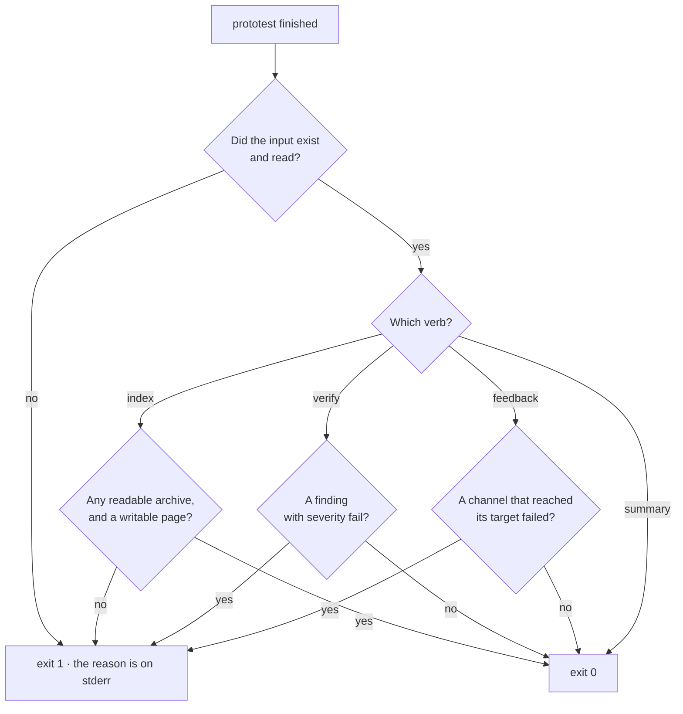

# CLI reference

`prototest` reads ProtoTest evidence from a terminal. It prints a run summary, builds a page over a folder of runs, checks two reports, and posts the feedback digest. It needs no agent and no browser. The [feedback action](../continuous-integration/index.md#the-feedback-action) installs it and calls the same commands in CI, so a local run and a CI step read the same archive the same way.

## Install

```bash
dotnet tool install --global ProtoTest.Cli
```

The tool command is `prototest`. The package targets .NET 8; on a machine with only a newer runtime, set `DOTNET_ROLL_FORWARD=LatestMajor` so the tool starts. The action sets that for you.

## The verbs

```text
usage: prototest summary <file.prototrace>
       prototest index <folder>
       prototest feedback <file.prototrace> [--digest <path>]
       prototest verify <baseline-report.json> <current-report.json>
```

| You want to | Run | It writes |
| --- | --- | --- |
| read one run | `summary <file.prototrace>` | nothing |
| share a folder of runs | `index <folder>` | `index.html` and a `.digest.json` beside each archive |
| check a run against a baseline | `verify <baseline.json> <current.json>` | nothing |
| post the digest | `feedback <file.prototrace> [--digest <path>]` | the `--digest` file, and the posts |

An unknown verb, or the wrong arguments, prints that usage to stderr and exits `1`.

### summary

Reads one trace and prints the deterministic diagnosis as text: the run id, the outcome counts, every test that did not fully succeed with its error, source location and failing operation, and the run gates. It is the document `get_diagnosis` returns as JSON.

```bash
prototest summary TestResults/ProtoTest/run.prototrace
```

```text
ProtoTest trace 2.0 · run 761778e6dc82498a9f9965fa1e6b5a24 · 2026-09-29 06:19:01Z - 2026-09-29 06:19:05Z
1 tests · 1 failed

FAILED Northstar.ProtoTest.FailureDrills.TheAddressWasHardcodedForOneMachine (2.66 s)
  ConnectionError reaching http://127.0.0.1:5099: connection refused.
  test.execution Test execution · failed
  cause: runner-reported failure
```

A run with nothing to report prints two lines and stops:

```text
All green.
```

[Diagnosis](./diagnosis.md) explains every line of the failing block and the rules behind the `cause`.

Exit `0` when the summary printed. Exit `1` when the file is missing or cannot be read, with the reason on stderr:

```text
Trace file not found: TestResults/ProtoTest/run.prototrace
```

### index

Discovers the `.prototrace` archives under the folder, newest first, and writes the evidence into a folder you can share:

- `index.html` in the folder, listing each run's outcome counts, the tests that did not pass, links to its trace and its digest, and every archive that could not be read with the reason.
- A `.digest.json` file beside each archive, the diagnosis JSON the page links to.

```bash
prototest index TestResults
```

```text
Indexed 2 runs into 'C:\dev\your-repo\TestResults\index.html'.
```

Discovery looks at the folder's `TestResults/` first and walks the tree only when that yields no readable run; [Setup](./setup.md#where-it-reads) has the details. An archive it could not read is named, not guessed at:

```text
Indexed 1 run into 'C:\dev\your-repo\TestResults\index.html'.
Skipped 'C:\dev\your-repo\TestResults\broken.prototrace': Central Directory corrupt.
```

Exit `0` when the page is written. Exit `1` when the folder is missing, holds no readable archive, or the page cannot be written.

### verify

Compares two JSON reports from a `ProtoTest.Reporting` sink:

```bash
prototest verify baseline.json TestResults/ProtoTest/report.json
```

The baseline is the default branch report. The current report is the run under review. The failing findings print one `::error` workflow command each, which a GitHub runner turns into an annotation, and the verdict then lists the findings and the coverage deltas. The default severities make the verb a pull request gate: `regressed`, `stale-spec` and `gate-failed` fail, and `added-uncovered` warns.

```text
::error::regressed: Target 'Northstar:Api' unit 'GET /api/v1/orders' in category 'OpenAPI' was covered in the baseline and is uncovered now.
ProtoTest verification failed: 1 failing, 0 warning(s), 0 info
  fail regressed: Target 'Northstar:Api' unit 'GET /api/v1/orders' in category 'OpenAPI' was covered in the baseline and is uncovered now.
coverage deltas:
  Northstar:Api · OpenAPI: 1/2 covered -> 0/2 covered (-50 points, 1 regressed, 0 added uncovered)
```

[Verification](./verification.md) explains each finding class and the specification identity.

Exit `0` when no finding is a fail and `1` when one is. Exit `1` also when a report file is missing or cannot be read:

```text
Report file not found: baseline.json
```

### feedback

Reads one run's digest and posts it:

```bash
prototest feedback TestResults/ProtoTest/run.prototrace --digest digest.json
```

Two streams, and the split is the point:

| Stream | What carries |
| --- | --- |
| stdout | one `::error` workflow command per failing test and per failed run gate |
| stderr | one line per channel: `posted`, `skipped` with the reason, or `failed` |
| a file | `digest.json`, written by `--digest` |

The stderr half, from a run with no pull request configured:

```text
prototest feedback: github-annotations posted (1 annotation.)
prototest feedback: github-pr-comment skipped (No GitHub token: set GITHUB_TOKEN.)
prototest feedback: webhook skipped (No webhook URL: set PROTOTEST_FEEDBACK_WEBHOOK_URL.)
```

The stdout half is the annotation GitHub renders on the pull request, and [The evidence loop](./loop.md#run-it-locally) shows the same command with both streams.

Every channel reports its outcome on stderr. A channel with no target, or nothing to post, skips. Only a channel that reached its target and failed makes the verb exit `1`. With no target configured the verb is safe to run locally.

## Environment targets

`feedback` reads its channel targets from the environment. The names are the GitHub Actions convention, so CI needs no extra inputs.

| Variable | Channel | Meaning |
| --- | --- | --- |
| `GITHUB_TOKEN` | comment | the token that posts the comment; the workflow needs `issues: write` |
| `GITHUB_REPOSITORY` | comment | the repository as `owner/name` |
| `GITHUB_EVENT_PATH` | comment | the event payload file; the pull request number is read from it |
| `GITHUB_API_URL` | comment | the GitHub REST base URL; defaults to `https://api.github.com` |
| `PROTOTEST_FEEDBACK_TRACE_URL` | comment | the artifact URL the comment links to |
| `PROTOTEST_FEEDBACK_WEBHOOK_URL` | webhook | the address the digest JSON is posted to |
| `PROTOTEST_FEEDBACK_WEBHOOK_SECRET` | webhook | the shared-secret header value; no header is sent without it |
| `PROTOTEST_FEEDBACK_WEBHOOK_SECRET_HEADER` | webhook | the shared-secret header name; defaults to `X-ProtoTest-Secret` |

The [feedback action](../continuous-integration/index.md#action-inputs) maps its inputs to these names, so a local command and the action take the same path.

## Exit codes



| Code | Meaning |
| --- | --- |
| `0` | the verb did its job |
| `1` | the input was missing or unreadable |
| `1` | `index` found no readable archive or could not write the page |
| `1` | the verdict has a fail finding |
| `1` | a feedback channel that reached its target failed |

## Limits

- The verbs read files. The only writes are the `index` page, the digests beside the traces and the `--digest` file.
- No network call happens unless a target is configured. A missing target is a named skip, never a failure.
- The verbs take no other arguments, and there is no verb that reruns a suite, writes a trace or changes an archive.
- The digest is built from the written archive after the run, so it reflects what the run recorded ([The evidence loop](./loop.md#limits)).
- These four verbs are the whole `prototest` surface.

Run `prototest summary` over the newest archive, or `prototest index` over the results folder, and the same evidence your agent reads is on your terminal.
