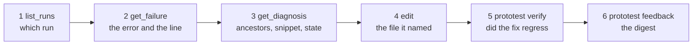

# Coding agents

A failing test produces the test, the failed operation, the request and response, the state change, and the code line. ProtoTest reads that evidence and hands it to a coding agent as a small, deterministic document. The agent spends its context on the fix, not on finding out what happened.

Your agent reads that document from a local read-only MCP server. Nothing leaves the machine.

Ask for the newest failure:

> **You:** List the ProtoTest runs in this repository and read the newest failure.
>
> **Agent:** Run `761778e6dc82498a9f9965fa1e6b5a24`, 1 test, 1 failed.
> `TheAddressWasHardcodedForOneMachine` failed with a `ConnectionError reaching
> http://127.0.0.1:5099: connection refused` at `Program.cs:65`, in `test.execution`.

The run id above stands in for any run; ids and times are new on every run.

## The workflow an agent follows



| The agent's turn | It calls | It learns |
| --- | --- | --- |
| Find the run | `list_runs` | which run failed and which tests it holds |
| Read the failure | `get_failure` | the error, the source location, the selected failing operation, the mismatches |
| Read the context | `get_diagnosis` with `detail=context` | the ancestors, the nearest call, the section previews, the source snippet, the artifacts, the state changes, the report rows |
| Fix | an editor | the file and line the context named |
| Verify | `prototest verify` | whether the fix regressed a covered unit or changed the specification |
| Report | `prototest feedback` or the action | the digest the pull request reads |

The steps map to the **evidence loop**: fail, evidence, fix, verify, report. [The evidence loop](./loop.md) names the same five steps and shows the pull request comment they produce.

## The pages in this section

- [Setup](./setup.md) installs the MCP server and points it at your runs.
- [Diagnosis](./diagnosis.md) shows what the agent reads when a test fails.
- [Verification](./verification.md) turns two runs' reports into a pull request verdict.
- [The evidence loop](./loop.md) wires the whole workflow into CI.
- [CLI reference](./cli.md) runs the same evidence from a terminal, with no agent.

The tools here are for your agent. How the project itself uses AI is on the [AI usage](../project/ai-usage.md) page.

## What the agent reads, and what it should not

- The MCP tool descriptions are the contract. An agent that lists tools sees four names, what each reads and that each is read-only.
- Summaries first. Every tool caps its payload, so the agent asks for one failure, one test or one page of coverage. It never pulls a whole trace into context.
- The trace itself is for depth. A `.prototrace` archive holds `spans.json`, `state.json`, embedded sources and artifacts ([ProtoTrace](../observability/prototrace.md)); the MCP tools read it, the viewer shows it.
- `prototest summary` and the pull request comment render the same diagnosis document. The agent log and the reviewer comment match.

## The skills bundle

The repository carries one skill: [`skills/prototest-evidence-loop/SKILL.md`](https://github.com/MSeys/ProtoTest/blob/main/skills/prototest-evidence-loop/SKILL.md). It covers the loop, the four MCP tools, `prototest verify`, `prototest feedback`, and the docs.

It is copy-in, not a package. No NuGet package carries it and no installer writes it: copy the folder into your client's skills directory, or paste the file into the instructions file your client reads. [Setup](./setup.md#give-the-agent-the-skill) shows both.

The skill is optional. The MCP tool descriptions and the CLI output are the contract; the skill only points at them, and this page is written so an agent pointed at it can follow the same commands.

## What is local and what is not

| Surface | Runs where | What leaves the machine |
| --- | --- | --- |
| `prototest-mcp` (stdio) | your machine | nothing |
| `prototest` CLI | your machine | only what you point it at: a pull request comment or a webhook |
| Trace viewer | your browser | nothing; the archive is read in the browser |
| Demo MCP endpoint | your machine, loopback only | nothing; it serves one bundled trace |

Nothing is uploaded by default. There is no telemetry, no account and no ProtoTest service to sign in to.

### Demo endpoint

`samples/ProtoTest.Mcp.DemoEndpoint` is a sample project. Run it on your own machine and it serves the same four read-only tools over Streamable HTTP against one bundled demo trace. It takes no filesystem input. It enforces 60 requests per minute and binds to loopback.

```bash
dotnet run --project samples/ProtoTest.Mcp.DemoEndpoint
```

The endpoint is then at `http://127.0.0.1:5199/`: the root path, with no `/mcp` prefix. Point a client that speaks MCP Streamable HTTP at it (for example MCP Inspector) and call `list_runs`: one bundled trace, four tools, no account. A plain JSON-RPC POST without the Streamable HTTP headers is answered `406`. The local stdio server is the surface that reads your repository; this one reads the bundled trace.

## Check it

Run your suite once so a `.prototrace` exists, then ask the question at the top of this page. If the agent sees no runs, the server is pointed at a folder that does not hold the archive; [Setup](./setup.md#where-it-reads) explains where discovery looks.
