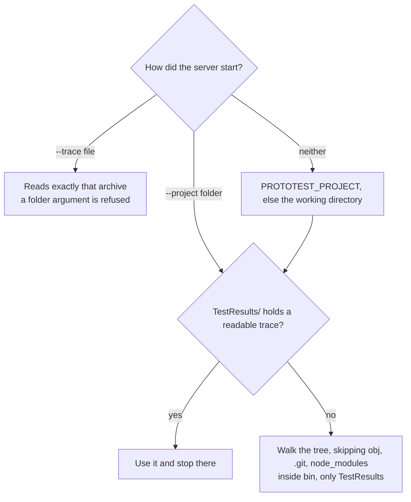

import TabbedCode from '@site/src/components/TabbedCode';

# Set up a coding agent with ProtoTest

One install connects a coding agent to the runs in your repository. The server is a .NET tool. It reads `.prototrace` archives and answers questions about them over the Model Context Protocol.

## Install

```bash
dotnet tool install --global ProtoTest.Mcp
```

The tool command is `prototest-mcp`. The package targets .NET 8, 9 and 10, so the install picks the framework your SDK has.

## Register it

An MCP client starts the server and talks to it over stdio. Add the server to the client's configuration file. The shape is the same everywhere. Only the file and the root key change.

<TabbedCode
  label="Client configuration"
  tabs={[
    {
      id: 'claude-code',
      label: 'Claude Code',
      filename: '.mcp.json (repository root)',
      code: `{
  "mcpServers": {
    "prototest": {
      "command": "prototest-mcp",
      "args": ["--project", "."]
    }
  }
}`,
    },
    {
      id: 'vscode',
      label: 'VS Code',
      filename: '.vscode/mcp.json',
      code: `{
  "servers": {
    "prototest": {
      "type": "stdio",
      "command": "prototest-mcp",
      "args": ["--project", "."],
      "cwd": "\${workspaceFolder}"
    }
  }
}`,
    },
    {
      id: 'cursor',
      label: 'Cursor',
      filename: '.cursor/mcp.json',
      code: `{
  "mcpServers": {
    "prototest": {
      "command": "prototest-mcp",
      "args": ["--project", "."]
    }
  }
}`,
    },
    {
      id: 'claude-desktop',
      label: 'Claude Desktop',
      filename: 'claude_desktop_config.json (user settings)',
      code: `{
  "mcpServers": {
    "prototest": {
      "command": "prototest-mcp",
      "args": ["--project", "C:\\\\dev\\\\your-repo"]
    }
  }
}`,
      footnote: 'Its working directory is not your repository, so give --project an absolute path.',
    },
  ]}
/>

The server resolves `.` against its working directory. Keep the file at the repository root. If the client starts the server elsewhere, pass an absolute `--project` path.

## Check it

Three steps, none of which needs a suite of your own.

1. Read a committed failing run with the CLI. Download [l0-environment-drill.prototrace](pathname:///lessons/l0-environment-drill.prototrace) from the Learn track, then:

   ```bash
   dotnet tool install --global ProtoTest.Cli
   prototest summary l0-environment-drill.prototrace
   ```

   ```text
   ProtoTest trace 2.0 · run bb2dd8b330924038894c161efda1e5f4 · 2026-09-29 18:36:55Z - 2026-09-29 18:36:58Z
   1 tests · 1 failed

   FAILED Northstar.ProtoTest.FailureDrills.TheAddressWasHardcodedForOneMachine (2.60 s)
     ConnectionError reaching http://127.0.0.1:5099: connection refused.
     test.execution Test execution · failed
     cause: runner-reported failure
   ```

   That is the drill file's own output, so it matches what you downloaded. Your own runs print different ids and times. `prototest summary` prints the same diagnosis the MCP tools return, which makes it the quickest way to check that the file an agent would read says what you expect. The [CLI reference](./cli.md) documents all four verbs, their arguments and their exit codes.

2. Point the server at one file with `--trace`, or at a folder of runs with `--project`. For one archive, `--trace` works wherever the file was written.

3. Run your own suite once so a `.prototrace` exists, and ask the agent to list the runs. It should answer with a run id and a trace file from your machine.

## Where it reads



"Newest" is the run's recorded start time, never a file timestamp. An archive the reader cannot open is skipped with a reason in `list_runs` and never guessed at.

The default trace lands in the test project's build output, `bin/<configuration>/<framework>/TestResults`. The walk reads those folders and nothing else inside `bin`, so a fixture copied to the output is never taken for a run. A results folder of your own is still the better setup: one place for every run, and the first place the server looks. The [continuous integration page](../continuous-integration/index.md#put-every-artifact-in-one-place) sets that up with one environment variable, so CI and local runs write to the same place:

```csharp
var results = Environment.GetEnvironmentVariable("PROTOTEST_RESULTS")
    ?? Path.Combine("TestResults", "ProtoTest");

builder.ConfigureTracing(trace =>
    trace.OutputPath = Path.Combine(results, "run.prototrace"));
```

Set `PROTOTEST_RESULTS` to an absolute path such as `<repository>/TestResults` when you run locally.

## Give the agent the skill

The repository carries two skills. [`prototest-evidence-loop`](https://github.com/MSeys/ProtoTest/blob/main/skills/prototest-evidence-loop/SKILL.md) teaches the loop from a red test to a fix. [`prototest-write-test`](https://github.com/MSeys/ProtoTest/blob/main/skills/prototest-write-test/SKILL.md) teaches writing a new test that reuses what the suite already composes, and proving it. Both are copy-in, not an install.

A client that reads skills folders (Claude Code, for example) loads it from its skills directory. From a checkout of the ProtoTest repository:

```bash
mkdir -p .claude/skills
cp -r skills/prototest-evidence-loop skills/prototest-write-test .claude/skills/
```

A project made with `dotnet new prototest` already has both in `.claude/skills/`. Otherwise download the files from the repository and place it in the same layout. A client without a skills folder reads a file as an instruction instead: paste its body into the client's rules or instructions file.

The skills are optional. The MCP server's tool descriptions are the contract, so an agent without the bundle can still list the tools and work from them.

## What the agent can see

The tools read your traces and return their content, including expected and actual values, to the connected agent. Run the server as an identity that may see them.

Every tool is read-only and returns a compact JSON document. `list_runs` over a folder holding one failing run:

```json
{
  "root": "C:/dev/your-repo",
  "runs": [
    {
      "runId": "761778e6dc82498a9f9965fa1e6b5a24",
      "traceFile": "C:/dev/your-repo/TestResults/run.prototrace",
      "startedAtUtc": "2026-09-29T06:19:01Z",
      "completedAtUtc": "2026-09-29T06:19:05Z",
      "outcomes": { "failed": 1 },
      "failingTests": [ { "testId": "00001", "name": "TheAddressWasHardcodedForOneMachine" } ],
      "failingTestsTruncated": false
    }
  ],
  "truncated": false,
  "skipped": null
}
```

The run id, file paths and timestamps above stand in for any run. A real call returns your machine's.

| Tool | Input | Returns | Cap |
| --- | --- | --- | --- |
| `list_runs` | optional `folder`, `limit` (default 10) | the newest runs first: run id, trace file, start and completion, outcome counts, failing test ids, and the archives it had to skip | 50 runs |
| `get_failure` | optional `runId`, `testId` | the failure entry: outcome, error, source location, the selected failing operation, the shape mismatches and the test's artifacts | 10 failed operations, 25 mismatches |
| `get_diagnosis` | optional `runId`, `testId`, `detail` (`summary` or `context`) | the run's diagnosis, or one failing test's context package | the [diagnosis caps](./diagnosis.md#limits) |
| `get_coverage` | optional `runId`, `target`, `category`, `includeUncovered`, `offset`, `limit` | coverage totals and uncovered units from the report the run embedded, with one suggestion per endpoint: extend the test that already calls it, or write a new test shaped like the named one | 200 uncovered units, 20 suggestions |
| `compare_runs` | optional `baselineRunId`, `currentRunId`, `baselineTrace` | each test that broke, was fixed, still fails, is new or was removed, with the first operation where the two runs part. Defaults to the newest run against the run before it | 50 tests |
| `check_fix` | optional `tests`, `baselineRunId`, `currentRunIds`, `baselineTrace` | the fix receipt: proven or not, each claimed test with its reasons and where it changed, the tests that broke, and the failing report findings. Defaults to the newest run against the run before it | 20 tests, 20 broken tests |
| `review_tests` | optional `runId`, `tests` | each test with findings: no check, an unchecked call or an untraced gap, each with its next step and source location; clean tests are counted | 30 tests, 10 findings per test |
| `get_suite_map` | optional `runId` | what a new test reuses: the capabilities and infrastructure the host composed, the clients, data provisioners, attributes, page objects and devices the tests used, one passed example test per kind of work with its file, and the open coverage gaps | 50 entries per list, 50 gaps |

[Diagnosis](./diagnosis.md) explains what `get_failure` and `get_diagnosis` return and what the agent can do with it.

`get_suite_map` lists what the run recorded, not the whole test project: a provisioner or page object no test used in that run is not in it. A keyed element lists its shape, `OrdersPage.Order[key].Status`, not the key one run found it by.

## The job prompts

The server offers three prompts. A client that shows prompts (a slash command or a prompt picker) starts a whole job from one, and each job ends with the tool that judges it, so the agent does not decide on its own that it is done:

| Prompt | Arguments | The job | Done when |
| --- | --- | --- | --- |
| `fix_failure` | optional `test` | read the failure, compare with the last green run, fix code or test, rerun | `check_fix` says proven |
| `cover_change` | `change`, optional `target` | read the suite map and the coverage suggestions, write or extend the test, make it fail once on purpose | the units read covered and `review_tests` reads the test clean |
| `improve_tests` | optional `test` | apply each review finding's next step in the suite's style | `review_tests` reads clean and `compare_runs` shows nothing broken |

Every prompt starts with `get_suite_map`, so the agent writes in the suite's own style: its clients, data provisioners, attributes and page objects, not new setup.

## Limits

- Read-only: no trace is written, no suite is rerun, the stdio host binds no port, and nothing on disk is modified.
- Nothing leaves the machine by default: no telemetry, no uploads, no accounts. The stdio host reads local archives, stdout carries the protocol only, and logs go to stderr.
- Hard caps bound every payload. `list_runs` returns at most 50 runs, `get_coverage` at most 200 uncovered units, `get_suite_map` at most 50 entries per list, and `get_diagnosis` applies the [diagnosis caps](./diagnosis.md#limits).
- The server reads evidence that already exists. A run with no `.prototrace` is not visible to it, so write the trace first.
- One external dependency: the official `ModelContextProtocol` SDK (Apache-2.0).
- The demo endpoint is a local sample. See [Coding agents](./coding-agents.md#demo-endpoint).
