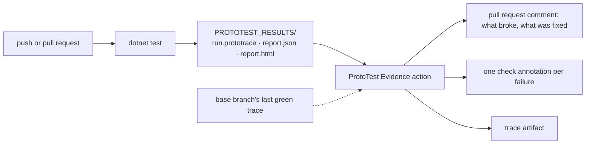
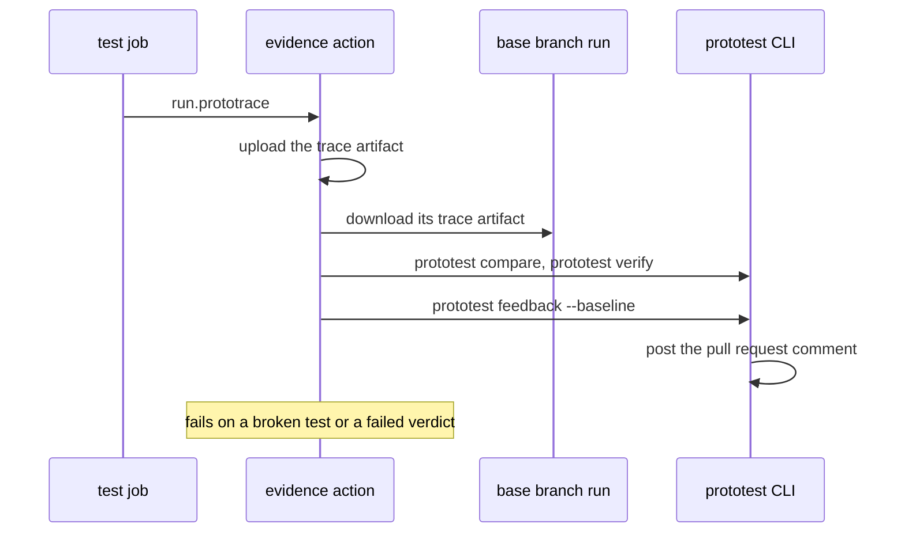

# Continuous integration

Keep the runner result, the HTML report and the `.prototrace` together. The runner names the failed test. The report shows coverage and findings. The trace shows the failing operation.

One suite, one results folder, one post-run step:



## Put every artifact in one place

Relative output paths resolve below the test project's build output. That is convenient locally, but it forces CI to search through `bin/**`. Give CI one absolute directory instead:

```csharp
var results = Environment.GetEnvironmentVariable("PROTOTEST_RESULTS")
    ?? Path.Combine("TestResults", "ProtoTest");

builder
    .ConfigureTracing(trace =>
        trace.OutputPath = Path.Combine(results, "run.prototrace"))
    .AddSink<JsonReportSink>(sink =>
        sink.OutputPath = Path.Combine(results, "report.json"))
    .AddSink<HtmlReportSink>(sink =>
        sink.OutputPath = Path.Combine(results, "report.html"));
```

This is the one place the wiring is written down. The CI configurations below set `PROTOTEST_RESULTS` to their artifact directory. Locally, the same setup keeps writing below `TestResults/ProtoTest`.

:::warning[Treat traces as test output]
A trace can contain sanitized requests, response bodies, state values and attachments. ProtoTest removes authorization headers and browser input values, but your own attributes and attachments may still carry application data. Use private build artifacts where the suite touches private data, and apply the same retention policy as other test results.
:::

## The evidence action

The [*ProtoTest Evidence*](https://github.com/MSeys/prototest-action) action runs after the tests. On a pull request it compares the run with the base branch's last green run, posts what the change broke and fixed, and keeps the trace.



On a pull request, the action:

- downloads the trace of the newest successful run of the same workflow on the base branch;
- compares the two runs test by test, and names each test the change broke or fixed with the operation where it changed;
- verifies the reports both runs embedded: a unit the base branch covered and this run does not, a changed specification, a failed run gate;
- posts one comment with the comparison, the failure digest and the coverage that moved, and one check annotation per failing test. A later push updates that comment instead of adding a new one;
- uploads the trace, writes the comparison and the run summary to the job summary, and fails the step when a test broke or the verdict failed.

A run with no failures, no changed outcome and no coverage change posts no comment. When a pull request turns green, its comment is updated to say so.

Here is what the post step prints, from a committed failing run of the Learn track with no pull request configured:

```text
::error::Northstar.ProtoTest.FailureDrills.TheAddressWasHardcodedForOneMachine: ConnectionError reaching http://127.0.0.1:5099: connection refused.
prototest feedback: github-annotations posted (1 annotation.)
prototest feedback: github-pr-comment skipped (No GitHub token: set GITHUB_TOKEN.)
prototest feedback: webhook skipped (No webhook URL: set PROTOTEST_FEEDBACK_WEBHOOK_URL.)
```

The `::error` lines are the check annotations. This one is the bare form, because the failure carries no source location. One that does renders `::error file=path/to/OrderTests.cs,line=42::message`. The channel lines are the per-channel outcome, and each one names why it skipped or failed.

The comment a reviewer reads, from the action's committed fixtures: a base branch run where both tests pass, and a pull request run where one times out.

````markdown
<!-- prototest-evidence -->
<a href="https://github.com/you/your-repo/actions/runs/123/artifacts/456">
<picture>
  <source media="(prefers-color-scheme: dark)" srcset="https://api.prototest.dev/evidence/card.svg?broke=1&amp;failed=1&amp;fixed=0&amp;passed=1&amp;total=2&amp;uncovered=0&amp;cov=OpenAPI:2/2:1/2&amp;theme=dark">
  
</picture>
</a>

**1 test broke** against the base branch · **1 no longer covered** · [**Open the full trace ↗**](https://github.com/you/your-repo/actions/runs/123/artifacts/456) (download it and drop it on [ProtoTrace](https://trace.prototest.dev/))

### What failed

| | Test | What failed |
|:-:|---|---|
| 🔴 | **orders are listed**<br><sub>`TestMethods` · 1 ms</sub> | The API did not answer within 2 seconds.<br><sub>[RecordedRuns.cs:67](https://github.com/you/your-repo/blob/4f2c9e1/tests/ProtoTest.TestSupport/RecordedRuns.cs#L67)</sub> |

### Coverage

| Surface | Base branch | This pull request | Change |
|---|:-:|:-:|:-:|
| OpenAPI<br><sub>`Shop:Api`</sub> | 2 / 2 | 1 / 2 | 🔻 −50 pts |
| All recorded coverage | | 1 / 2 · 50 % | |

> [!WARNING]
> **No longer covered**
> - `GET /api/orders` · Shop:Api · OpenAPI. No test calls GET /api/orders. 'invoices are paid' calls POST /api/invoices/7/pay on the same resource; write a new test shaped like it.

<details>
<summary><b>Failure details</b> · 1 test</summary>

#### orders are listed
```text
FAILED  orders are listed  (1 ms)
http.request  List orders  · failed
GET /api/orders
The API did not answer within 2 seconds.
left the base branch at http.request  GET /api/orders
at tests/ProtoTest.TestSupport/RecordedRuns.cs:67
```

</details>

<sub>ProtoTest · 2 tests · 1 failed · 1 succeeded · run <code>663e1a9608e341af9018bc3e36801024</code> compared with base branch run <code>238777bb3fba47d0b9ae9cd1daf8191d</code> · <a href="https://prototest.dev/docs/continuous-integration">what is this?</a></sub>
````

From the top:

- a summary card with the counts and the coverage that moved, linked to the trace. It appears only when the run was compared with the base branch;
- one line with what changed: the tests the change broke and fixed, other failures, additions without a test, coverage it lost, failed run gates, and the trace link with the viewer that opens the downloaded artifact (`PROTOTEST_FEEDBACK_VIEWER_URL`, `off` leaves it out);
- a caution when two or more failures share a cause: the same check failing on the same call, with identifiers in the call path treated as one;
- a table of the failing tests with the first mismatch or error line and the source line, linked to the pull request's head commit;
- the tests the change fixed, the coverage table, and warnings for additions without a test and coverage the change lost;
- the full record per failing test, folded under **Failure details**.

The comment shows at most 20 failing tests and 20 coverage rows. The trace and the job summary have the rest.

#### The summary card

The card is an image that `api.prototest.dev` draws from numbers in its URL: tests broken, failed, fixed, passed and in total, additions without a test, and up to three coverage rows. A coverage row carries its coverage category as the report names it (`OpenAPI Property`, or a suite's own category), shortened to 40 characters, and never a target, endpoint or test name. GitHub fetches the image through its own image proxy, so the service never sees the repository or the reader, and it stores nothing.

To leave the card out, set `PROTOTEST_FEEDBACK_CARD_URL` to `off` on the step. Any other value is the address of a card you host:

```yaml
      - name: ProtoTest evidence
        if: always()
        uses: MSeys/prototest-action@v1.0.0
        env:
          PROTOTEST_FEEDBACK_CARD_URL: off
        with:
          trace: ${{ env.PROTOTEST_RESULTS }}/run.prototrace
```

[The evidence loop](../agent-workflows/loop.md) walks the loop around this comment.

```yaml
name: Integration tests

on:
  pull_request:
  push:
    branches: [main]

permissions:
  contents: read
  actions: read
  pull-requests: write

jobs:
  test:
    runs-on: ubuntu-latest
    env:
      PROTOTEST_RESULTS: ${{ github.workspace }}/TestResults/ProtoTest

    steps:
      - uses: actions/checkout@v4
      - uses: actions/setup-dotnet@v4
        with:
          dotnet-version: 10.0.x

      - run: dotnet restore
      - run: dotnet test --configuration Release --no-restore

      - name: ProtoTest evidence
        if: always()
        uses: MSeys/prototest-action@v1.0.0
        with:
          trace: ${{ env.PROTOTEST_RESULTS }}/run.prototrace
```

- `if: always()` matters, because the step must run when the test step failed. That is when the evidence is needed.
- The workflow runs on pushes to `main` too. Each green run there keeps the trace the next pull request compares with.
- `actions: read` lets the action download the base branch's trace. `pull-requests: write` lets it comment.
- A pull request from a fork runs with a token that cannot comment, so the action skips the comment there and says why. The annotations, the job summary and the gates still run.
- The verdict needs both runs to embed a JSON report, so keep the `JsonReportSink` from [the wiring above](#put-every-artifact-in-one-place). Without it the comparison still runs and the verdict is skipped.
- Pin a release tag or a commit SHA for a stable pipeline.

### Compare with the base branch

`baseline: auto`, the default, finds the base branch's trace by itself: the newest successful run of the same workflow on the pull request's base branch, and its artifact with the same `artifact-name`. Until the base branch has such a run, the action skips the comparison and says why.

To compare with a trace from somewhere else, such as a nightly run, download it first and pass its path as `baseline`. `baseline: none` skips the comparison.

To run the same checks locally, compare two traces and verify their reports:

```bash
prototest compare main.prototrace TestResults/ProtoTest/run.prototrace
prototest verify main.prototrace TestResults/ProtoTest/run.prototrace
```

[Verification](../agent-workflows/verification.md) explains the verdict and its finding classes.

### Action inputs

| Input | Default | Meaning |
| --- | --- | --- |
| `trace` | (required) | the `.prototrace` the run wrote |
| `baseline` | `auto` | `auto`, a path to a trace, or `none` |
| `artifact-name` | `prototest-trace` | the uploaded artifact, and the one `auto` looks for on the base branch |
| `fail-on-broken` | `true` | fail the step when a test that passed on the base branch fails now |
| `fail-on-regression` | `true` | fail the step when the verdict over the embedded reports has a failing finding |
| `fail-on-new-uncovered` | `false` | also fail when the change adds an endpoint, operation or page no test covers; the comment names those either way |
| `version` | latest | the `ProtoTest.Cli` version to install |
| `source` | | an extra NuGet source for the CLI, such as a folder of pre-release packages |
| `webhook-url`, `webhook-secret`, `webhook-secret-header` | | post the digest JSON to your endpoint too; the header defaults to `X-ProtoTest-Secret` |
| `dotnet-roll-forward` | `LatestMajor` | lets the .NET 8 tool run on a newer runtime |

The outputs are `artifact-url`, `baseline-run-id`, `broken` and `regressed`. The digest leaves the runner for your webhook, and the pull request comment is visible to the repository, so treat both like the trace.

[The evidence loop](../agent-workflows/loop.md#what-the-reviewer-sees) shows what the reviewer sees. The [CLI reference](../agent-workflows/cli.md#environment-targets) lists every environment target.

## Provider configurations

If you prefer to keep only the raw artifacts, each provider runs the suite and uploads the results folder. The three differ in two lines: the results variable and the publish condition.

| Provider | Results variable | Publish even on failure | Containers |
| --- | --- | --- | --- |
| GitHub Actions | `github.workspace` + `/TestResults/ProtoTest` | `if: always()` | Docker available on hosted Linux runners |
| [Azure Pipelines](./azure-pipelines.md) | `$(Build.ArtifactStagingDirectory)/ProtoTest` | `succeededOrFailed()` | Microsoft-hosted Linux agents |
| [GitLab CI](./gitlab-ci.md) | `$CI_PROJECT_DIR/TestResults/ProtoTest` | `when: always` | needs a Docker-capable runner |

```yaml title=".github/workflows/integration-tests.yml"
name: Integration tests

on:
  push:
  pull_request:

permissions:
  contents: read

jobs:
  test:
    runs-on: ubuntu-latest
    env:
      PROTOTEST_RESULTS: ${{ github.workspace }}/TestResults/ProtoTest

    steps:
      - uses: actions/checkout@v4
      - uses: actions/setup-dotnet@v4
        with:
          dotnet-version: 10.0.x

      - run: dotnet restore
      - run: dotnet test --configuration Release --no-restore

      - name: Keep ProtoTest evidence
        if: always()
        uses: actions/upload-artifact@v4
        with:
          name: prototest-results
          path: TestResults/ProtoTest
          if-no-files-found: error
```

`if: always()` matters, because the trace is most useful when the test step failed. The [Azure](./azure-pipelines.md) and [GitLab](./gitlab-ci.md) pages carry the same shape with `succeededOrFailed()` and `when: always`. A container-backed suite on GitLab also needs a Docker-capable runner. Your runner setup decides if Docker-in-Docker is allowed and which service config it needs. ProtoTest only needs a reachable Docker endpoint.

### Playwright on Linux

When the suite uses the bundled Playwright browsers, build once, install the browser and its Linux dependencies, then test without rebuilding:

```yaml
- run: dotnet build --configuration Release --no-restore

- name: Install Chromium
  shell: pwsh
  run: |
    $installer = Get-ChildItem -Recurse -Filter playwright.ps1 |
      Where-Object FullName -Match 'bin/Release' |
      Select-Object -First 1
    if (-not $installer) { throw "playwright.ps1 was not generated." }
    pwsh $installer.FullName install --with-deps chromium

- run: dotnet test --configuration Release --no-build --no-restore
```

If `InstallBrowsers` is true, ProtoTest downloads a missing browser binary. Keep the explicit CI step on Linux. Playwright also installs the OS libraries the browser needs.

## One suite, three jobs

A pipeline around this suite usually splits into three jobs. These are patterns, not a fixed pipeline. Start from the workflows above.

| Job | When it runs | How the suite is composed | What it publishes |
| --- | --- | --- | --- |
| **Pull request** | every change | In-process. The fastest job | The digest comment, the check annotations, the trace artifact, and the verdict against the nightly baseline |
| **Nightly** | on a schedule | The container topology, where the store and the broker are real processes the run owns | The baseline `report.json` the pull request job compares against |
| **Smoke** (optional) | on a schedule or a deployment | A deployed environment. Tests that need the test host skip, and the rest run against real addresses | The digest and the trace |

The suite is the same in all three. What changes is the composition, and the composition decides which capabilities exist and which journeys skip.

## What to keep

| Artifact | Keep when | Why |
| --- | --- | --- |
| `.prototrace` | Always, with shorter retention for sensitive suites | Complete execution story and attachments |
| HTML report | Always | Human-readable run, coverage, gates and findings |
| JSON report | When another job consumes it | Machine-readable run summary |
| Runner output (`.trx`, NUnit XML, JUnit XML) | Always | Native CI test history and annotations |
| Playwright trace and screenshots | On failure, or for a short retention period | Browser-specific diagnostics carried inside `.prototrace` and by the runner |

The action [above](#the-evidence-action) uploads the trace for you. Without it, upload the results folder as an artifact. Open a downloaded `.prototrace` in the [ProtoTrace viewer](https://trace.prototest.dev). The file stays in the browser. It is not uploaded.

### Retention and size

A trace is small until it carries diagnostics. A synthetic test records about 7 KB of trace, and the OpenCSMS health-check trace holds 25.8 MB for 1,000 tests, about 25 KB each. Browser screenshots, response bodies and embedded sources grow it from there. Attachment capture is opt-in per integration, and `EmbedSources` and `EmbedArtifacts` decide whether the bytes travel inside the archive. The [benchmarks](../project/benchmarks.md) page has the full numbers.

Keep the same retention as other test results, and shorter for sensitive suites. On GitHub Actions the upload step takes `retention-days`. The evidence action uploads its trace artifact with the defaults, so name it with `artifact-name` and expire the raw folder yourself. On GitLab, `expire_in: 14 days` on the [GitLab page](./gitlab-ci.md) is the starting point. Shorten it for suites with browser diagnostics, or keep failures longer than green runs.

## Related

- [ProtoTrace](../observability/prototrace.md) explains the archive and the viewer.
- [Reporting](../observability/reporting.md) configures the JSON and HTML sinks.
- [Attachments](../foundation/attachments.md) explains what runners publish.
- [The evidence loop](../agent-workflows/loop.md) turns the same artifacts into a pull request comment and a verdict.
- [CLI reference](../agent-workflows/cli.md) documents the four verbs, the environment targets and the exit codes.
- [Troubleshooting](../getting-started/troubleshooting.md#the-ci-artifact-is-empty) covers missing CI output.
