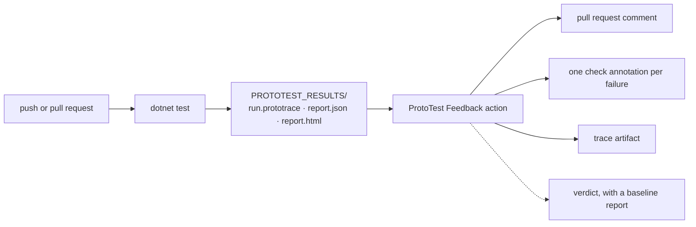
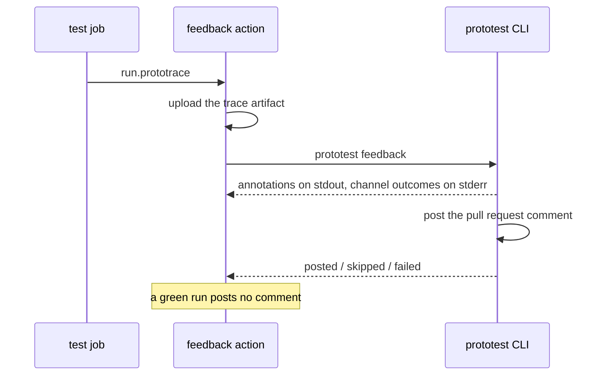

# Continuous integration

Keep the runner result, the HTML report and the `.prototrace` together. The runner names the failed test. The report shows coverage and findings. The trace shows the failing operation.

One suite, one results folder, one post-run step:



## Put every artifact in one place

Relative output paths resolve below the test project's build output. That is convenient locally, but it forces CI to search through `bin/**`. Give CI one absolute directory instead:

```csharp
var results = Environment.GetEnvironmentVariable("PROTOTEST_RESULTS")
    ?? Path.Combine("TestResults", "ProtoTest");

builder
    .ConfigureTracing(trace =>
        trace.OutputPath = Path.Combine(results, "run.prototrace"))
    .AddSink<JsonReportSink>(sink =>
        sink.OutputPath = Path.Combine(results, "report.json"))
    .AddSink<HtmlReportSink>(sink =>
        sink.OutputPath = Path.Combine(results, "report.html"));
```

This is the one place the wiring is written down. The CI configurations below set `PROTOTEST_RESULTS` to their artifact directory. Locally, the same setup keeps writing below `TestResults/ProtoTest`.

:::warning[Treat traces as test output]
A trace can contain sanitized requests, response bodies, state values and attachments. ProtoTest removes authorization headers and browser input values, but your own attributes and attachments may still carry application data. Use private build artifacts where the suite touches private data, and apply the same retention policy as other test results.
:::

## The feedback action

The *ProtoTest Feedback* action runs after the tests. It installs the CLI, uploads the trace, posts the digest to the pull request, and can gate the pull request on a baseline report.



The digest is the run summary the CLI prints: the run, every test that did not pass with its cause and source location, and the artifact link. The action turns it into a pull request comment, one check annotation per failing test and per failed run gate, and one uploaded artifact. A green run posts no comment; the status check is its report.

Here is what the post-run step prints, from a committed failing run of the Learning track with no pull request configured:

```text
::error::Northstar.ProtoTest.FailureDrills.TheAddressWasHardcodedForOneMachine: ConnectionError reaching http://127.0.0.1:5099: connection refused.
prototest feedback: github-annotations posted (1 annotation.)
prototest feedback: github-pr-comment skipped (No GitHub token: set GITHUB_TOKEN.)
prototest feedback: webhook skipped (No webhook URL: set PROTOTEST_FEEDBACK_WEBHOOK_URL.)
```

The `::error` lines are the check annotations. The channel lines are the per-channel outcome; each one names why it skipped or failed.

The same digest reaches a reviewer as a pull request comment, from the committed failing fixture:

```markdown
## ProtoTest run `29e344f9cf54431ca7d8bad3f87a1749`

**2 tests · 1 failed · 1 succeeded**

- **FAILED `orders match their shape`** (16 ms)
  - `assert.json.shape` · failed
  - Shape mismatch failed with 1 error(s):
    • [$.orderId]: Values did not match. (Expected: '7', Actual: '42')
  - at `artifacts/fixture-gen/Program.cs:65`
  - mismatch `$.orderId`: expected 7, actual 42

Coverage: 151/198 (76.26%)

[Full trace](https://github.com/you/your-repo/actions/runs/123/artifacts/prototest-trace)
```

A green run posts no comment; the status check is its report. [The evidence loop](../agent-workflows/loop.md) walks the loop around this comment.

```yaml
name: Integration tests

on:
  pull_request:

permissions:
  contents: read
  issues: write

jobs:
  test:
    runs-on: ubuntu-latest
    env:
      PROTOTEST_RESULTS: ${{ github.workspace }}/TestResults/ProtoTest

    steps:
      - uses: actions/checkout@v4
      - uses: actions/setup-dotnet@v4
        with:
          dotnet-version: 10.0.x

      - run: dotnet restore
      - run: dotnet test --configuration Release --no-restore

      - name: Post the evidence
        if: always()
        uses: MSeys/ProtoTest/.github/actions/feedback@main
        with:
          trace: ${{ env.PROTOTEST_RESULTS }}/run.prototrace
```

- `if: always()` matters: the step runs when the test step failed, which is when the evidence is needed.
- `issues: write` lets the action comment on the pull request. The annotations and the artifact upload need nothing extra.
- The comment carries the artifact link, so a reviewer opens the trace from the comment.
- The action fails when a configured channel fails to post.
- `@main` tracks the default branch. Pin a commit SHA for a stable pipeline. Switch to a release tag once one exists.

### Add the verdict

Give the action both reports to gate the pull request. A nightly job runs the suite on the default branch and keeps its `report.json`. The pull request job fetches it.

```yaml
# nightly.yml
name: Nightly baseline

on:
  schedule:
    - cron: '30 2 * * *'

jobs:
  baseline:
    runs-on: ubuntu-latest
    env:
      PROTOTEST_RESULTS: ${{ github.workspace }}/TestResults/ProtoTest

    steps:
      - uses: actions/checkout@v4
      - uses: actions/setup-dotnet@v4
        with:
          dotnet-version: 10.0.x

      - run: dotnet restore
      - run: dotnet test --configuration Release --no-restore

      - name: Keep the baseline report
        if: always()
        uses: actions/upload-artifact@v4
        with:
          name: prototest-baseline
          path: ${{ env.PROTOTEST_RESULTS }}/report.json
          if-no-files-found: error
```

The pull request job downloads the newest nightly artifact and hands the action both reports. It needs `actions: read` in the workflow's permissions for the download:

```yaml
      - name: Fetch the nightly baseline
        env:
          GH_TOKEN: ${{ github.token }}
        run: |
          run_id=$(gh run list --workflow nightly.yml --branch main --limit 1 --json databaseId --jq '.[0].databaseId')
          gh run download "$run_id" --name prototest-baseline --dir baseline

      - name: Post the evidence
        if: always()
        uses: MSeys/ProtoTest/.github/actions/feedback@main
        with:
          trace: ${{ env.PROTOTEST_RESULTS }}/run.prototrace
          baseline-report: baseline/report.json
          current-report: ${{ env.PROTOTEST_RESULTS }}/report.json
```

The step fails the pull request when the run is worse than the baseline; without the two reports it only posts the digest. To run the same comparison locally, end the loop with `prototest verify baseline/report.json TestResults/ProtoTest/report.json`. [Verification](../agent-workflows/verification.md) explains the verdict and its finding classes.

### Action inputs

The action installs the ProtoTest CLI as a global tool. Set `version` to pin it (`version: 1.1.0`). Without it, the action updates the tool to the latest stable release. `dotnet-roll-forward` defaults to `LatestMajor`, so the .NET 8 tool runs on a newer runtime.

The other inputs are optional. `webhook-url` and `webhook-secret` post the digest JSON to your endpoint, with `webhook-secret-header` naming the shared-secret header (default `X-ProtoTest-Secret`). `artifact-name` names the uploaded trace (default `prototest-trace`).

[The evidence loop](../agent-workflows/loop.md#what-the-reviewer-sees) shows what the reviewer sees. The [CLI reference](../agent-workflows/cli.md#environment-targets) lists every environment target.

## GitHub Actions

If you prefer to keep only the raw artifacts, this job runs the suite and uploads the results folder:

```yaml
name: Integration tests

on:
  push:
  pull_request:

permissions:
  contents: read

jobs:
  test:
    runs-on: ubuntu-latest
    env:
      PROTOTEST_RESULTS: ${{ github.workspace }}/TestResults/ProtoTest

    steps:
      - uses: actions/checkout@v4
      - uses: actions/setup-dotnet@v4
        with:
          dotnet-version: 10.0.x

      - run: dotnet restore
      - run: dotnet test --configuration Release --no-restore

      - name: Keep ProtoTest evidence
        if: always()
        uses: actions/upload-artifact@v4
        with:
          name: prototest-results
          path: TestResults/ProtoTest
          if-no-files-found: error
```

`if: always()` matters here too: the trace is most useful when the test step failed. GitHub-hosted Linux runners have Docker available for Testcontainers-based infrastructure.

### Playwright on Linux

When the suite uses the bundled Playwright browsers, build once, install the browser and its Linux dependencies, then test without rebuilding:

```yaml
- run: dotnet build --configuration Release --no-restore

- name: Install Chromium
  shell: pwsh
  run: |
    $installer = Get-ChildItem -Recurse -Filter playwright.ps1 |
      Where-Object FullName -Match 'bin/Release' |
      Select-Object -First 1
    if (-not $installer) { throw "playwright.ps1 was not generated." }
    pwsh $installer.FullName install --with-deps chromium

- run: dotnet test --configuration Release --no-build --no-restore
```

If `InstallBrowsers` is true, ProtoTest downloads a missing browser binary. Keep the explicit CI step on Linux. Playwright also installs the OS libraries the browser needs.

## Azure Pipelines

```yaml
trigger:
  - main

pool:
  vmImage: ubuntu-latest

variables:
  PROTOTEST_RESULTS: $(Build.ArtifactStagingDirectory)/ProtoTest

steps:
  - task: UseDotNet@2
    inputs:
      packageType: sdk
      version: 10.x

  - task: DotNetCoreCLI@2
    inputs:
      command: test
      arguments: --configuration Release

  - task: PublishPipelineArtifact@1
    condition: succeededOrFailed()
    inputs:
      targetPath: $(PROTOTEST_RESULTS)
      artifact: prototest-results
```

Use `succeededOrFailed()` for the same reason as GitHub's `always()`: publish the evidence even when a test fails.

## GitLab CI

```yaml
integration-tests:
  image: mcr.microsoft.com/dotnet/sdk:10.0
  variables:
    PROTOTEST_RESULTS: "$CI_PROJECT_DIR/TestResults/ProtoTest"
  script:
    - dotnet restore
    - dotnet test --configuration Release --no-restore
  artifacts:
    when: always
    paths:
      - TestResults/ProtoTest/
    expire_in: 14 days
```

A container-backed suite also needs a Docker-capable GitLab runner. Your runner setup decides if Docker-in-Docker is allowed and which service config it needs. ProtoTest only needs a reachable Docker endpoint.

## One suite, three jobs

A pipeline around this suite usually splits into three jobs. These are patterns, not a fixed pipeline. Start from the workflows above.

| Job | When it runs | How the suite is composed | What it publishes |
| --- | --- | --- | --- |
| **Pull request** | every change | In-process. The fastest job | The digest comment, the check annotations, the trace artifact, and the verdict against the nightly baseline |
| **Nightly** | on a schedule | The container topology, where the store and the broker are real processes the run owns | The baseline `report.json` the pull request job compares against |
| **Smoke** (optional) | on a schedule or a deployment | A deployed environment. Tests that need the test host skip; the rest run against real addresses | The digest and the trace |

The suite is the same in all three. What changes is the composition, and the composition decides which capabilities exist and which journeys skip.

## What to keep

| Artifact | Keep when | Why |
| --- | --- | --- |
| `.prototrace` | Always; shorter retention for sensitive suites | Complete execution story and attachments |
| HTML report | Always | Human-readable run, coverage, gates and findings |
| JSON report | When another job consumes it | Machine-readable run summary |
| Runner output (`.trx`, NUnit XML, JUnit XML) | Always | Native CI test history and annotations |
| Playwright trace and screenshots | On failure, or for a short retention period | Browser-specific diagnostics carried inside `.prototrace` and by the runner |

The action [above](#the-feedback-action) uploads the trace for you. Without it, upload the results folder as an artifact. Open a downloaded `.prototrace` in the [ProtoTrace viewer](https://trace.prototest.dev). The file stays in the browser. It is not uploaded.

## Related

- [ProtoTrace](../observability/prototrace.md) explains the archive and the viewer.
- [Reporting](../observability/reporting.md) configures the JSON and HTML sinks.
- [Attachments](../foundation/attachments.md) explains what runners publish.
- [The evidence loop](../agent-workflows/loop.md) turns the same artifacts into a pull request comment and a verdict.
- [CLI reference](../agent-workflows/cli.md) documents the four verbs, the environment targets and the exit codes.
- [Troubleshooting](../getting-started/troubleshooting.md#the-ci-artifact-is-empty) covers missing CI output.
