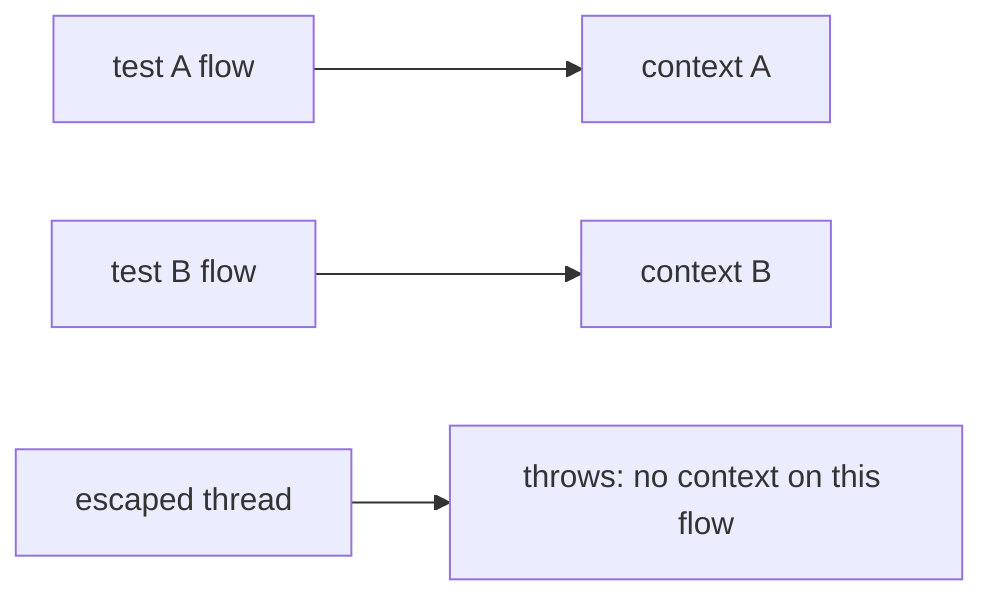
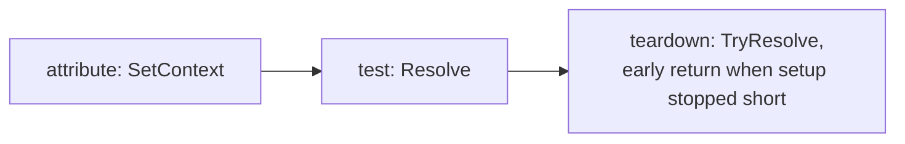

import AnnotatedCode from '@site/src/components/AnnotatedCode';

export const contextCode = `public sealed record MemberContext(string Id, string Email) : IProtoContext;

[ProtoTest]
public async Task MemberSeesOwnInvoices()
{
    Proto.Context.SetContext(new MemberContext("owner", "owner@example.test"));

    using var response = await Proto.Context.Rest().GetAsync("/api/invoices");
    response.Should.HaveHttpStatus(HttpStatusCode.OK);

    Proto.Context.RecordObservation("invoices", "http.response", "GET /api/invoices");
    Proto.Context.AddAttachment("invoices.json", await response.Content.ReadAsStringAsync(), "application/json");
    Proto.Context.AddFinding("Invoices listed without a filter; check the default page size.");
}`;

export const contextCallouts = [
  {
    line: 6,
    title: 'Typed state',
    note: 'An attribute would usually set this. Set here, any helper on the flow reads it with Resolve.',
  },
  {
    line: 8,
    title: 'Client',
    note: 'The per-test client the initializer created in setup. No address, no lookup, no test.',
  },
  {
    line: 11,
    title: 'Observation',
    note: 'A fact the test learned. Collectors turn it into coverage and reports.',
  },
  {
    line: 12,
    title: 'Attachment',
    note: 'A file the test produced. Stored under the test id, handed to the runner and the archive.',
  },
  {
    line: 13,
    title: 'Finding',
    note: 'Worth reporting, not a failure. Reaches the reports and the run gates.',
  },
];

# Execution context

## What it is

A `ProtoExecutionContext` lives for exactly one test. It is where that test's clients, state, services, resources, attachments and observations are kept.

```text
Proto.Context
  clients ......... per-test clients the initializers created
  typed state ..... what attributes and hooks published with SetContext
  services ........ the test DI scope
  resources ....... owned handles released in reverse at teardown
  findings ........ worth reporting, not failures
  attachments ..... files handed to the runner and the archive
  observations .... facts collectors turn into coverage and reports
  trace ........... the test own entries
  identity ........ test name, method, id
  cancellation .... the token the runner supplied
```

<AnnotatedCode
  filename="MemberInvoices.cs"
  code={contextCode}
  callouts={contextCallouts}
  foot={<>State, client, observation, attachment and finding in one test body.</>}
/>

## Reaching it

```csharp
var context = Proto.Context;
```

`Proto.Context` works anywhere on the test's async flow: in the test method, in helpers it awaits, in page objects, in authenticators. Hooks and attributes receive the context as a parameter instead.

Outside a test, `Proto.Context` throws. The message names the alternatives: off-flow telemetry uses `ProtoHost.FindTraceWriter(Activity?)`, and run-level code uses `ProtoHost.CurrentHost` or the host reference a hook receives. The usual cause is work started with `Task.Run` or a timer callback that escaped the test's flow, or code running in a static initializer.

:::tip[Parallel tests are isolated]
The context is stored in an `AsyncLocal`, so parallel tests each see their own. You do not need to pass it around, and one test cannot accidentally read another's state.
:::



### Test identity

| Member | Meaning |
| --- | --- |
| `TestName` | the name the runner reported |
| `TestMethod` | the `MethodInfo` of the test |
| `Id` | a `ProtoTestId`, see [test ids](./lifecycle.md#test-ids) |
| `TestId` | the id as a zero-padded string |
| `TestNumber` | the id as a `long` |

### Cancellation

`CancellationToken` is the token the caller supplied when the test was started. The runner adapters pass the token their runner exposes:

| Runner | Token the adapter passes | Notes |
| --- | --- | --- |
| NUnit | the test execution context token | cancellable with `[CancelAfter]` |
| xUnit v2 | the runner's `CancellationTokenSource` | |
| xUnit v3 | `TestContext.Current.CancellationToken` | |
| TUnit | `TestContext.CancellationToken` | |
| MSTest | `CancellationToken.None` | `ExecuteAsync(ITestMethod)` exposes no token; setup runs to the integration's own timeout |

```csharp
await using var cancellation = new CancellationTokenSource(TimeSpan.FromSeconds(30));
var context = await host.StartTestAsync("Checkout", method, cancellation.Token);
context.CancellationToken;   // the same token in hooks, attributes and setup I/O
```

`ProtoTest.Sql` passes the token to the connection open and transaction begin. The run-scoped [`IProtoRunHook`](./hooks.md#run-hooks) keeps taking its token as a parameter.

### Unique names

A record that outlives the test process, such as a tenant, an operator or a customer, needs a name that is unique per test and stable across reruns. `UniqueName` derives one from the test id:

```csharp
var tenant = Proto.Context.UniqueName("tenant");        // "tenant-0042317"
var second = Proto.Context.UniqueName("member", 2);     // "member-0042317-2"
```

```csharp
string UniqueName(string name, int sequence = 0);
```

The name is `{name}-{TestId}`, or `{name}-{TestId}-{sequence}` when the optional sequence is given for a second object of the same kind. Because the id carries the run prefix, parallel tests never collide and a rerun against a persistent database or a configured environment never collides either. The same record is reused only when the suite fixes `RunPrefix` (`ConfigureTestIds`), since the default prefix is random per run. `ProtoTest.Data`'s generated member defaults are deterministic per test in the same spirit.

### Typed state

Typed state is how attributes, hooks and tests hand information to each other without globals.



```csharp
public sealed record SampleUserContext(
    string Id, string Tenant, string Email, string Role, string AccessToken) : IProtoContext;

context.SetContext(new SampleUserContext(user.Id, user.Tenant, user.Email, user.Role, user.AccessToken));

var user = Proto.Context.Resolve<SampleUserContext>();        // throws if missing
var maybe = Proto.Context.TryResolve<SampleUserContext>();    // null if missing
```

```csharp
void SetContext<T>(T context) where T : class, IProtoContext;
T Resolve<T>() where T : class, IProtoContext;
T? TryResolve<T>() where T : class, IProtoContext;
```

- `IProtoContext` is an empty marker interface.
- State is keyed by the **exact type** you pass. Setting the same type again replaces it, and you must read it back with the same type, not a base class or interface.
- A missing resolve throws *"No context of type 'X' is registered for this test. Register it before the test body reads it ..."*. Use `TryResolve` in teardown code, where setup may not have got that far.
- `SetContext` records the value as traced state for the context entity. `TryResolve` never traces, and `Resolve` writes a `context.resolve` event only when it fails, so the trace tells you which lookups were missing, not every read.

### Clients

Integrations with a system to talk to register their clients on the context. You normally use their extension methods (`Rest()`, `GraphQL()`, `Web()`). The underlying API:

```csharp
void RegisterClient<TClient>(TClient client, string name = "Default",
    ProtoClientOwnership ownership = ProtoClientOwnership.Context) where TClient : class;
TClient Client<TClient>(string name = "Default") where TClient : class;
TClient? TryClient<TClient>(string name = "Default") where TClient : class;
```

Clients are keyed by type and **case-insensitive** name. Registering the same type and name twice throws, and registering anything after release has begun throws `ObjectDisposedException`. Disposable clients are disposed when the test ends, in reverse registration order. A failing `Client<T>` lookup writes a `client.resolve` event before it throws; `TryClient` never traces. See [Clients](./clients.md) for writing your own.

### Attachments

```csharp
ProtoTestAttachment AddAttachment(string name, string content, string mediaType = "text/plain", string? description = null);
ProtoTestAttachment AddAttachment(string name, ReadOnlyMemory<byte> content, string mediaType = "application/octet-stream", string? description = null);
ProtoTestAttachment AddAttachmentFile(string filePath, string? name = null, string mediaType = "application/octet-stream", string? description = null);
ProtoTestAttachment AddAttachment(ProtoTestAttachment attachment);

IReadOnlyList<ProtoTestAttachment> Attachments { get; }
```

Names without a prefix are stored as `{testId}-{name}`, and a duplicate name (case-insensitive) throws. See [Attachments](./attachments.md).

## Beyond the basics

Services, owned resources, findings, observations and the trace writer live on [Execution context advanced topics](./execution-context-advanced.md).

## Limits

- `RegisterResource` refuses run-scoped resources. `AddResource` on the builder is the run-scoped counterpart.
- `context.DisposeAsync` is idempotent and attempts every release. Failures are aggregated.
- A skipped test never creates a context. See [Skip conditions](./skip-conditions.md).
- `Proto.Context` cannot answer on flows that escaped the test. See [Concurrency](./concurrency.md) for the isolation rule both pages share.
