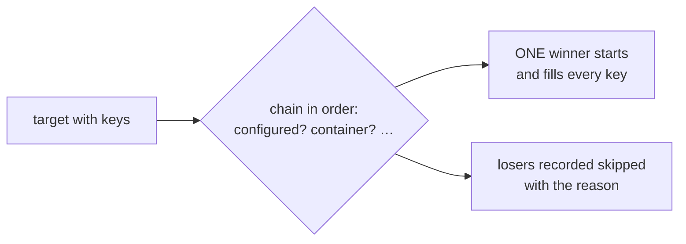

import AnnotatedCode from '@site/src/components/AnnotatedCode';
import TabbedCode from '@site/src/components/TabbedCode';

export const chainCode = `builder.AddInfrastructure(
    "NorthstarDatabase",
    chain => chain
        .UseConfigured()                        // ConnectionStrings:Northstar is set: the environment serves it
        .UseContainer(PostgresDatabase.Container()),
    "ConnectionStrings:Northstar");`;

export const chainCallouts = [
  {
    line: 1,
    title: 'One target, once',
    note: 'The name and the keys identify the target. A repeated target name throws; add providers to the chain instead.',
  },
  {
    line: 4,
    title: 'Configured first',
    note: 'Holds when every declared key already has a value. The environment serves the target, so nothing starts.',
  },
  {
    line: 5,
    title: 'Container next',
    note: 'Holds when the container runtime is available. Only the winner starts and fills every declared key.',
  },
  {
    line: 6,
    title: 'Keys live on the target',
    note: 'Every provider checks or fills these keys. No per-provider address parameter exists.',
  },
];

export const chainTabs = [
  {
    id: 'database',
    label: 'Database',
    filename: 'Setup.cs',
    code: 'builder.AddInfrastructure(\n    "NorthstarDatabase",\n    chain => chain\n        .UseConfigured()\n        .UseContainer(PostgresDatabase.Container()),\n    "ConnectionStrings:Northstar");',
  },
  {
    id: 'broker',
    label: 'Broker',
    filename: 'Setup.cs',
    code: 'builder.AddInfrastructure(\n    "MessagingBroker",\n    chain => chain\n        .UseConfigured()\n        .UseContainer(RabbitMqBroker.Container()),\n    RabbitMqOptions.ConnectionStringSetting,\n    "Messaging:RabbitMq:ConnectionString");',
  },
];

# Infrastructure

## What it is

Infrastructure is what the run provides for itself: a database, a broker, a storage emulator. Declare it on the host builder, and the host starts it once before any test, records it, and releases it with the run. No `BeforeRun` hook, no manual start and stop.



## Run a container

<AnnotatedCode
  filename="Setup.cs"
  code={chainCode}
  callouts={chainCallouts}
/>

The first provider whose condition holds serves the target. Only its piece starts and fills every declared key. The same shape for a broker:

<TabbedCode tabs={chainTabs} label="Infrastructure chains" />

The [recipes](./infrastructure-recipes.md) show the sample flows, readiness, run-scoped setup, and when `AddResource` fits instead.

```csharp
public interface IProtoInfrastructure : IProtoResource
{
    ValueTask StartAsync(CancellationToken cancellationToken = default);
}

public interface IProtoConnectionInfrastructure : IProtoInfrastructure
{
    string ConnectionString { get; }
}

public interface IProtoSettingsInfrastructure : IProtoInfrastructure
{
    IReadOnlyDictionary<string, string> Settings { get; }
}
```

- `IProtoInfrastructure` is anything the host starts with the run. It is an `IProtoResource`, so it is also recorded as a run entity and released at the end.
- `IProtoConnectionInfrastructure` provides a single `ConnectionString` for a database or broker the application and the tests both connect to.
- `IProtoSettingsInfrastructure` provides arbitrary `Settings` values, for example the address of a standalone application the run started.

Implementations must be run-scoped: `AddInfrastructure` rejects anything whose `Scope` is not `ProtoResourceScope.Run`, because infrastructure outlives a test.

## How it works

### Registering a target

```csharp
IProtoHostBuilder AddInfrastructure(
    this IProtoHostBuilder builder,
    string name,
    Action<IProtoProviderChainBuilder> configure,
    params string[] keys);
```

Register a **target** once with its **providers** in priority order and the keys every provider checks or fills. The first provider whose condition holds serves the target, and only its piece starts and fills every declared key. A container can feed the tests and an in-process application under the configuration roots each of them reads:

```csharp
builder.AddInfrastructure(
    "MessagingBroker",
    chain => chain
        .UseConfigured()
        .UseContainer(RabbitMqBroker.Container()),
    RabbitMqOptions.ConnectionStringSetting,   // "ProtoTest:Messaging:RabbitMq:ConnectionString"
    "Messaging:RabbitMq:ConnectionString");    // the in-process application's key
```

Declaring keys requires providers whose pieces provide addresses: an `IProtoConnectionInfrastructure` (a connection string per key) or an `IProtoSettingsInfrastructure` (the values it will fill). A target that declares no key serves its winner's piece unconditionally, so give such a provider no condition. [Environment resolution](./environment-resolution.md) has the full provider contract, the conditions and the trace record.

:::note[The single-piece registration is obsolete]
`AddInfrastructure(piece, keys)` keeps its rule for 1.x: a piece whose every declared key is configured is skipped, and `AddInfrastructureAlways` keeps the opt-out. Migrate a call by moving the piece into a chain: `chain.UseConfigured().Use(new ProtoTargetProvider("piece", piece))` is the exact replacement, and a provider with no condition replaces `AddInfrastructureAlways`. See [Migrating from 1.0](../getting-started/migrating-from-1-0.md#skip-key-infrastructure).
:::

```csharp
// Legacy: the piece starts even when Relay:Url is configured.
builder.AddInfrastructureAlways(LocalRelay.Sidecar(), "Relay:Url");
```

### When the environment already provides the addresses

`UseConfigured()` is the provider that holds when every key the **target** declares already has a configured value. The environment has the address the piece would fill, so a container or process would only shadow it. When `ConnectionStrings:Northstar` is configured, through environment variables, user secrets, appsettings in the runner project or an earlier configuration source, `UseConfigured()` wins and the container provider never starts.

The rule reads the target's keys all at once:

- One unconfigured key means the provider after `UseConfigured()` serves the target and fills all of the keys.
- A provider with no condition always wins when nothing before it did.
- A provider that loses is not started, not owned and not released, and its values stay absent from `ProtoInfrastructureSettings`.
- Readers that resolve an address at use time find the configured value in `IConfiguration`.
- The trace records the resolution with `environment.resolved`, and the losing piece's run entity as `infrastructure.state: skipped` with the reason.

Register each target once as a chain. The configured environment, a container, an AppHost resource and a published address are providers of that target. The first provider whose condition holds wins. Only the winner's piece starts and declares its capabilities; the others are recorded skipped with the reason, and a target no provider can serve fails the build naming every unmet condition.

### When it starts

`ProtoHost.StartAsync` runs in this order:

```text
run hooks → capabilities → infrastructure in registration order → trace listening begins
                          (a run setup step starts at its own position)
```

1. the **run hooks**: `BeforeRunAsync`, ascending `Order`;
2. the host's **capabilities**, recorded as run entities;
3. each **infrastructure** registration, in registration order. A losing chain provider is never started. `StartAsync` runs on each piece, then its settings. **Run setup steps** (`AddRunSetup`) are infrastructure too, so a step starts after the pieces registered before it;
4. trace listening begins.

Runner assembly setups call `StartAsync` before any test (see the [runner overview](../runners/overview.md)), so infrastructure is guaranteed to be started and its settings filled before the first test lifecycle begins. Each started piece is recorded in the trace as a run entity with `change: "started"` and its settings keys.

If a registered piece throws during `StartAsync`, the run fails to start. `ProtoHost.StartAsync` releases the pieces that had already started, clears the settings it filled, and rethrows, leaving the host in `Created` for a retry. A retry starts the released pieces again, and each piece is released once per ownership period. The runner's host lifetime then disposes the host. The container packages offer `TryStart`, which reports *why* a container could not start instead of throwing, so a suite can fall back or decide to [skip](./skip-conditions.md) before registering it.

### How settings reach tests

The host fills the single `ProtoInfrastructureSettings` instance for the run. Its `Values` is a snapshot of key/value pairs, and it is an ordinary service:

```csharp
var values = Proto.Context.TryService<ProtoInfrastructureSettings>()?.Values;
var connection = values?["ConnectionStrings:Northstar"];
```

The sample suite's `Setup` reads it while composing the test-side domain, so the domain connects to the same database as the application.

An **in-process application** receives the same keys automatically. The ASP.NET Core initializer applies every infrastructure setting with `webHost.UseSetting(key, value)` before your `configureWebHost` callback runs, so explicit code wins:

```csharp
app.AddAspNetCoreServer<Program>(configureWebHost: webHost =>
{
    // Infrastructure settings are already applied here; this call overrides one of them.
    webHost.UseSetting("ConnectionStrings:Northstar", "Data Source=override.db");
});
```

The address readers share one precedence: an address a started piece published through `ProtoInfrastructureSettings` wins over static configuration. The in-process web host and the RabbitMQ adapter decide their own settings differently, and `AddAspNetCoreServer`'s configured provider deliberately reads static configuration only:

| Reader | Order | Winner |
| --- | --- | --- |
| Application address (REST, GraphQL, gRPC, readiness, web sessions, device clients) | published infrastructure settings first, then configuration | the started instance's address |
| In-process application (`AddAspNetCoreServer`, its own settings) | infrastructure settings first, then `configureWebHost` | explicit `configureWebHost` |
| RabbitMQ adapter (`UseRabbitMq`) | `ProtoTest:Messaging:RabbitMq:ConnectionString` first, then infrastructure settings | explicit configuration |

`AddAspNetCoreServer`'s **configured provider** is the one deliberate asymmetry: it reads static configuration, so an application whose address only a started piece published keeps its in-process server, for `ServerFactory`-style access, while the address readers above talk to the published process. Give the published process its own application name when both must coexist.

## Recipes

The sample flows, readiness probes, run-scoped setup, and `AddResource` against `AddInfrastructure` live on [Infrastructure recipes](./infrastructure-recipes.md).

## What the trace shows

- One `environment.resolved` event per target with the target, its keys, the winning provider and every skipped provider with the reason, plus one `environment.provider.skipped` event per loser.
- Each piece as a run entity: `infrastructure.state: started` with its settings keys, or `infrastructure.state: skipped` with the reason.
- A readiness probe as a `readiness` run entity carrying its attempts and the wait it spent, and `readiness.skipped` when it found no address to wait for.
- A run setup step as a run entity like any other piece. A step that throws fails the run's start.
- Release runs after the reports export and before the trace archive is written. Each piece is released at most once, and a failed release is reported rather than swallowed.

The winner in run state, the learning sample's project journey:

```text
application:loopback:Northstar web
  settings ProtoTest:Applications:Northstar web:BaseUrl, released
readiness:application:Northstar web
  1 attempt, waited 89 ms, released
```

The per-target `environment.resolved` events live in the run phase of a full run archive. The single-test lesson archives carry the winner as run state above, so read the decision there.

## Limits

- **Once per run.** Infrastructure starts and stops at run boundaries. Per-test setup is a [hook or attribute](./hooks.md) job. `AddRunSetup` is the run-level counterpart of a setup hook: it runs once at run start and owns nothing to release.
- **A started container is not watched.** The host waits for readiness once, at run start, and never polls the container again. If a container dies mid-run, the next call through its published connection string fails with the transport's own error in that test. There is no restart, failover or liveness probe.
- **Failures are run failures.** There is no automatic skip for infrastructure that cannot start. Use `TryStart` and decide before registering.
- **Settings do not change `IConfiguration`.** They live in `ProtoInfrastructureSettings`. A reader that only looks at `IConfiguration` will not see them.
- **No ordering control.** Registrations start in the order they were added, and there is no dependency graph between pieces.
