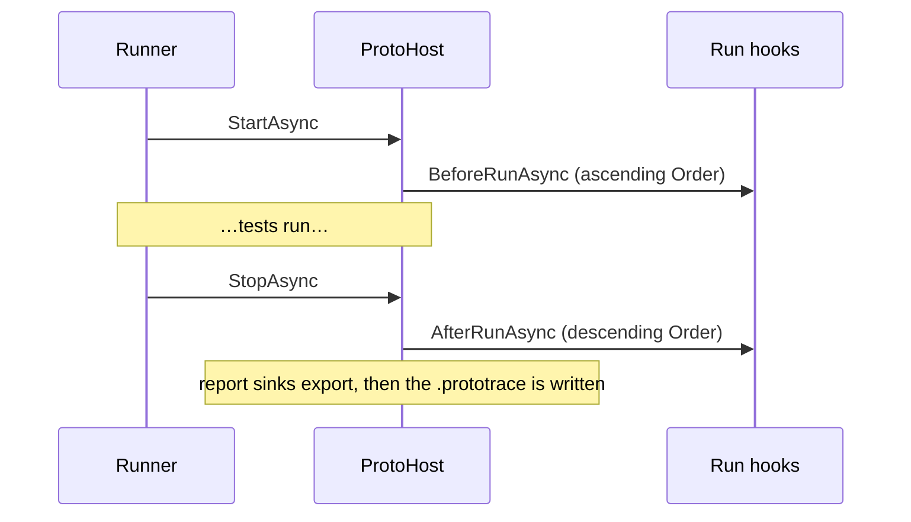

# Host and lifecycle

## Building the host

Your runner's [assembly setup](../runners/overview.md) gives you an `IProtoHostBuilder`:

```csharp
protected override void Configure(IProtoHostBuilder builder) =>
    builder
        .ConfigureAppConfiguration(configuration => configuration.AddJsonFile("appsettings.Test.json", optional: true))
        .ConfigureServices(services => services.AddSingleton<IClock, FixedClock>())
        .ConfigureTracing(trace => trace.OutputPath = "TestResults/run.prototrace")
        .ConfigureTestIds(ids => ids.RunPrefix = 42)
        .AddRunHook<StartDependenciesHook>()
        .AddTestHook<ResetMailboxHook>()
        .AddApplication("Api", app => app.AddRest(rest => rest.AddClient("Api")));
```

```csharp
IProtoHostBuilder ConfigureServices(Action<IServiceCollection> configure);
IProtoHostBuilder ConfigureAppConfiguration(Action<IConfigurationBuilder> configure);
IProtoHostBuilder ConfigureTracing(Action<ProtoTraceOptions> configure);
IProtoHostBuilder ConfigureTestIds(Action<ProtoTestIdOptions> configure);
IProtoHostBuilder AddRunHook<TRunHook>() where TRunHook : class, IProtoRunHook;
IProtoHostBuilder AddTestHook<THook>() where THook : class, IProtoTestHook;
ProtoHost Build();
```

Every integration's `Add…` method is an extension on this same builder. A builder can only build once.

## Test ids

Every test gets a numeric id, and everything the test produces is keyed by it — trace entries, archived artifacts, and often the data your own attributes create (`$"test-{context.TestId}"`).

An id is a **run prefix** followed by a **sequence**: with the defaults, `482913000001`, `482913000002`, …

| `ProtoTestIdOptions` | Default |
| --- | --- |
| `RunPrefix` | a random six-digit number per host |
| `SequenceDigits` | `6` (1–9) |

The random prefix keeps ids from colliding when several test processes create data in the same shared environment. Set a fixed `RunPrefix` — for example from a CI build number — when you want ids you can trace back to a pipeline run. Ids are at most 18 digits; running out of sequence numbers throws.

To replace the scheme entirely, register your own `IProtoTestIdGenerator`:

```csharp
public interface IProtoTestIdGenerator
{
    ProtoTestId Next(MethodInfo testMethod);
}
```

## The run



- If a `BeforeRunAsync` throws, the hooks that already started get their `AfterRunAsync` in reverse, and startup fails.
- `StopAsync` runs every `AfterRunAsync` even if some throw, then reports all failures together.
- Once stopping has begun, starting a new test throws.

ProtoTest's own run hooks are ordered to run **last** on the way out: report sinks export first, then the trace archive is written, so it can include the reports.

## A test

### Setup

When the runner starts a test:

1. A `ProtoExecutionContext` and a new DI scope are created, and the context becomes `Proto.Context` for this async flow.
2. **Every `IProtoTestHook`** runs `BeforeTestAsync`, in ascending `Order`. ProtoTest's client-initializing hook has the lowest possible order, so clients exist before any of your hooks run.
3. **Every `ProtoAttribute`** on the test runs `BeforeTestAsync`, in ascending `Order`.
4. Your test body runs.

**All hooks run before any attribute**, whatever their `Order` values. Among attributes, only `Order` matters — whether an attribute sits on the class or the method doesn't change when it runs; ties keep class attributes first.

### Teardown

When the runner completes the test:

1. Attributes run `AfterTestAsync` in **reverse** order.
2. Hooks run `AfterTestAsync` in **reverse** order.
3. [Attachments](./attachments.md) are published to the runner.
4. Clients are disposed in reverse registration order, then the DI scope.
5. The test's trace is finalised with its outcome, and `Proto.Context` is cleared.

**Every step is attempted**, even when an earlier one throws. All failures are collected and thrown together as one `AggregateException` — so a failing cleanup never hides another failing cleanup.

### When setup fails

If a hook or attribute throws during setup, ProtoTest **rolls back**: only the components that *completed* their `BeforeTestAsync` get their `AfterTestAsync`, in reverse. The one that threw does not.

```
FirstHook:Before
SecondHook:Before
FirstAttribute:Before
FailingAttribute:Before   ← throws
FirstAttribute:After
SecondHook:After
FirstHook:After
```

The test is recorded as failed, the trace shows a `Rollback` phase instead of `Teardown`, and the exception reads *"Test setup failed and completed lifecycle components were rolled back."*

This is why teardown code should tolerate partial setup. The sample environment attribute uses `TryResolve` rather than `Resolve` in its `AfterTestAsync` for exactly that reason.

### One test per async flow

A context is tied to the async flow that started it. Starting a second test on the same flow before completing the first throws, as does completing a test from a different host.

## `ProtoHost`

```csharp
public sealed class ProtoHost : IAsyncDisposable
{
    static ProtoExecutionContext CurrentContext { get; }
    static ProtoHost CurrentHost { get; }

    IConfiguration Configuration { get; }
    IProtoTraceSource Trace { get; }

    Task StartAsync(CancellationToken cancellationToken = default);
    Task StopAsync(CancellationToken cancellationToken = default);

    Task<ProtoExecutionContext> StartTestAsync(string testName, MethodInfo testMethod,
        IEnumerable<ProtoAttribute>? attributes = null, IProtoTestAttachmentPublisher? attachmentPublisher = null);
    Task<ProtoExecutionContext> StartTestAsync(string testName, string testId, MethodInfo testMethod,
        IEnumerable<ProtoAttribute>? attributes = null, IProtoTestAttachmentPublisher? attachmentPublisher = null);

    Task CompleteTestAsync();                          // outcome Unknown
    Task CompleteTestAsync(ProtoTestResult result);
}
```

Runner packages call these for you. You'd only call them yourself when building a runner integration, or when testing ProtoTest extensions — as the repository's own tests do:

```csharp
var host = new ProtoHostBuilder().AddRest().Build();
await using var ownedHost = host;
await host.StartAsync();

var context = await host.StartTestAsync("my test", testMethod);
// ...
await host.CompleteTestAsync(ProtoTestResult.Passed);
```

`ProtoTestResult` has `Passed`, `Skipped`, `Unknown`, `Failed(exception)`, `Failed(error)` and `Cancelled(exception)`.

`Proto.Host` returns the host of the current test — or, outside a test, the only active host (with more than one active, it throws).
