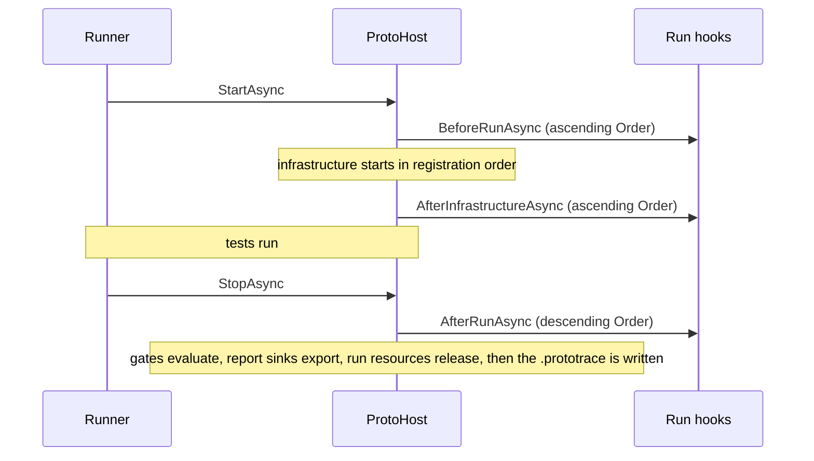

import TraceAnatomy from '@site/src/components/TraceAnatomy';
import {lessonTraces} from '@site/src/data/traceSources';

export const orderLayers = [
  {
    id: 'setup',
    label: 'Setup',
    when: '500.5 ms',
    lead: 'Hooks first in ascending Order, then attributes in ascending Order. The client hook runs before everything else.',
    entries: [
      {kind: 'hook.before', name: 'ProtoClientInitializerHook', meta: 'Order First: clients exist before any other hook'},
      {kind: 'hook.before', name: 'SqlConnectionHook, NorthstarScenarioHook', meta: 'Order -1000 each'},
      {kind: 'hook.before', name: 'ProtoHttpAuthLifecycleHook twice', meta: 'Order 100: auth applies last'},
      {kind: 'attribute.before', name: 'Application, NorthstarTenant, SignedInAs, NorthstarMember', meta: 'Orders First, -200, -100, 0'},
    ],
  },
  {
    id: 'teardown',
    label: 'Teardown',
    when: '36.7 ms',
    lead: 'The same components walk back: attributes in reverse, then hooks in reverse, then publish and release.',
    entries: [
      {kind: 'attribute.after', name: 'NorthstarMember, SignedInAs, NorthstarTenant, Application', meta: 'reverse of setup'},
      {kind: 'hook.after', name: 'Auth hooks, scenario, SQL, completion, initializer', meta: 'reverse of setup'},
      {kind: 'attachment.publish', name: 'Request, response, expected shape, scenario summary', meta: 'after every hook and attribute finished'},
      {kind: 'resources.release', name: 'Tenant cleanup, services, connection, consumer', meta: 'reverse registration order'},
    ],
  },
];

# Host and lifecycle

## What it is

`ProtoHost` is built once per test process by your runner's [assembly setup](../runners/overview.md). It owns the dependency injection container, runs suite-wide hooks and [run gates](#run-gates-and-resources), starts [infrastructure](./infrastructure.md), and starts and completes each test.

`ProtoExecutionContext` exists for exactly one test. It holds that test's clients, typed state, resources, attachments and observations. See [Execution context](./execution-context.md).

```text
1 hooks → 2 attributes → 3 body → 4 attributes back → 5 hooks back → 6 publish → 7 dispose
```

Hooks run before all attributes. A setup failure rolls back only what completed.

## How it works

### Building the host

The runner's setup class receives an `IProtoHostBuilder`:

```csharp
protected override void Configure(IProtoHostBuilder builder) =>
    builder
        .ConfigureAppConfiguration(configuration => configuration.AddJsonFile("appsettings.Test.json", optional: true))
        .ConfigureServices(services => services.AddSingleton<IClock, FixedClock>())
        .ConfigureTracing(trace => trace.OutputPath = "TestResults/run.prototrace")
        .ConfigureTestIds(ids => ids.RunPrefix = 42)
        .AddRunHook<StartDependenciesHook>()
        .AddTestHook<ResetMailboxHook>()
        .AddApplication("Api", app => app.AddRest(rest => rest.AddClient("Api")));
```

```csharp
IProtoHostBuilder ConfigureServices(Action<IServiceCollection> configure);
IProtoHostBuilder ConfigureAppConfiguration(Action<IConfigurationBuilder> configure);
IProtoHostBuilder ConfigureTracing(Action<ProtoTraceOptions> configure);
IProtoHostBuilder ConfigureTestIds(Action<ProtoTestIdOptions> configure);
IProtoHostBuilder AddTestHook<THook>() where THook : class, IProtoTestHook;
IProtoHostBuilder AddRunHook<TRunHook>() where TRunHook : class, IProtoRunHook;
IProtoHostBuilder AddRunGate<TGate>() where TGate : class, IProtoRunGate;
IProtoHostBuilder AddRunGate(string name, Func<ProtoRunGateContext, ProtoRunGateResult> evaluate);
IProtoHostBuilder AddResource(IProtoResource resource);
ProtoHost Build();
```

Every integration's `Add...` method is an extension on this same builder. A builder can only build once. The option tables for `ProtoTestIdOptions` and `ProtoTraceOptions` are in [Configuration](../getting-started/configuration.md#host-options-code-only).

### The run


```mermaid
sequenceDiagram
    participant Runner
    participant Host as ProtoHost
    participant RunHooks as Run hooks
    Runner->>Host: StartAsync
    Host->>RunHooks: BeforeRunAsync (ascending Order)
    Note over Host: infrastructure starts in registration order
    Host->>RunHooks: AfterInfrastructureAsync (ascending Order)
    Note over Runner,Host: tests run
    Runner->>Host: StopAsync
    Host->>RunHooks: AfterRunAsync (descending Order)
    Note over Host: gates evaluate, report sinks export, run resources release, then the .prototrace is written
```

- If a `BeforeRunAsync` throws, the hooks that already started get their `AfterRunAsync` in reverse, and startup fails.
- If an `AfterInfrastructureAsync` throws, startup fails the same way: every hook gets its `AfterRunAsync` in reverse, the started infrastructure releases, and a retry runs the whole start again.
- `StopAsync` runs every `AfterRunAsync` even if some throw, then reports all failures together.
- Once stopping has begun, starting a new test throws.

ProtoTest's own run hooks are ordered to run **last** on the way out. Run gates evaluate first, report sinks export next, and run-scoped resources release. The trace archive is written last, so it can include the reports.

### A test

When the runner starts a test:

1. A `ProtoExecutionContext` and a new DI scope are created, and the context becomes `Proto.Context` for this async flow.
2. **Every `IProtoTestHook`** runs `BeforeTestAsync`, in ascending `Order`. ProtoTest's client-initializing hook has the lowest possible order, so clients exist before any of your hooks run.
3. **Every `ProtoAttribute`** on the test runs `BeforeTestAsync`, in ascending `Order`.
4. Your test body runs.

**All hooks run before any attribute**, whatever their `Order` values. Among attributes, only `Order` matters. Whether an attribute sits on the class or the method does not change when it runs, and ties keep class attributes first.

When the runner completes the test:

1. Attributes run `AfterTestAsync` in **reverse** order.
2. Hooks run `AfterTestAsync` in **reverse** order.
3. [Attachments](./attachments.md) are published to the runner.
4. `context.DisposeAsync` releases owned resources in reverse registration order, then disposes the DI scope.
5. The test's trace artifacts are captured and the recorder is completed with its outcome. `Proto.Context` is cleared.

**Teardown attempts each step**, even when an earlier one throws. A teardown failure is recorded as an `Error` finding and does not replace the outcome the test already reported, so a cleanup error never hides a failed assertion. `CompleteTestAsync` rethrows one failure as-is and aggregates several. The runner adapters complete through `ProtoTestScope`, which keeps the test's own outcome.

### When setup fails

If a hook or attribute throws during setup, ProtoTest **rolls back**. Only the components that *completed* their `BeforeTestAsync` get their `AfterTestAsync`, in reverse. The one that threw does not.

```
FirstHook:Before
SecondHook:Before
FirstAttribute:Before
FailingAttribute:Before   <- throws
FirstAttribute:After
SecondHook:After
FirstHook:After
```

The test is recorded as failed, and the trace shows a `Rollback` phase instead of `Teardown`. The exception reads *"Test setup failed and completed lifecycle components were rolled back."*

The same reversal in the recording, the sample suite's project journey: setup runs attributes `Application, NorthstarTenant, SignedInAs, NorthstarMember`, and teardown answers `NorthstarMember, SignedInAs, NorthstarTenant, Application`.

<TraceAnatomy
  source={lessonTraces.firstJourney}
  title="Setup order, teardown reversal"
  test="Northstar.ProtoTest.ProjectsJourney.CreatingAProjectReturnsIt"
  layers={orderLayers}
  blindSpots={[]}
/>

This is why teardown code should tolerate partial setup. The sample environment attribute uses `TryResolve` rather than `Resolve` in its `AfterTestAsync` for exactly that reason.

### One test per async flow

A context is tied to the async flow that started it. Starting a second test on the same flow before completing the first throws, as does completing a test from a different host. Skipped tests never reach this point. A [skip condition](./skip-conditions.md) is evaluated before `StartTestAsync`, so there is no context to complete.

## How to use it

Runner packages start and complete tests for you. The hand-driven surface lives on [Host API](./lifecycle-host-api.md).

### Test ids

Every test gets a numeric id, and everything the test produces is keyed by it. That covers trace entries, archived artifacts, and often the data your own attributes create (`$"test-{context.TestId}"`).

An id is a **run prefix** followed by a **sequence**: with the defaults, `482913000001`, `482913000002`, and so on.

| `ProtoTestIdOptions` | Default |
| --- | --- |
| `RunPrefix` | a random six-digit number per host |
| `SequenceDigits` | `6` (1 to 9) |

The random prefix keeps ids from colliding when several test processes create data in the same shared environment. Set a fixed `RunPrefix`, for example from a CI build number, when you want ids you can trace back to a pipeline run. Ids are at most 18 digits, and running out of sequence numbers throws.

To replace the scheme entirely, register your own `IProtoTestIdGenerator`:

```csharp
public interface IProtoTestIdGenerator
{
    ProtoTestId Next(MethodInfo testMethod);
}
```

### Run gates and resources

`AddRunGate` registers a check that runs **once, after the last test and before the reports are written**. It can see everything the run's collectors produced. `ProtoRunGateContext` exposes `Items`, `ItemsOfKind`, `InCategory`, `ForTarget` and `WithStatus`, plus coverage helpers such as `CoverageFor(target)`. A failed gate throws `ProtoRunGateException` out of `AfterRunAsync`. The delegate overload is the quick form:

```csharp
builder.AddRunGate("no error findings", context => context
    .ItemsOfKind(ProtoReportItemKinds.Finding)
    .Any(item => item.Status == ProtoReportStatus.Error)
    ? ProtoRunGateResult.Failed("The run recorded error findings.")
    : ProtoRunGateResult.Passed("No error findings were recorded."));
```

| Result | Meaning |
| --- | --- |
| `Passed` | the run continues to the reports |
| `Warning` | recorded, but the run continues |
| `Failed` | throws `ProtoRunGateException` out of `AfterRunAsync` |
| `Skipped` | recorded. A gate that returns no result is treated as failed. |

`AddResource(IProtoResource)` registers an already-created, run-scoped resource, such as a started container or a connection. The host owns it and releases it with the run, without starting anything. `AddInfrastructure` is the variant that starts with the run and fills settings, as [Infrastructure](./infrastructure.md) explains.

## What the trace shows

- Each test's record opens with a `test.setup` operation. It carries one `hook.before` and `hook.after` per hook, with its type and order, and one `attribute.before` and `attribute.after` per attribute. The test's own operations follow.
- A failed setup shows a `Rollback` phase instead of `Teardown`, and only the components that completed appear.
- Attachments land on the record of the operation that produced them. Resources appear as entities, and each release writes a `resource.release` operation. A framework-managed client records only a failed release, as an event ([Clients](./clients.md)).
- Run-level pieces are entities: capabilities, infrastructure with its state, and readiness probes. Run gates evaluate report items after the last test and before the reports export.
- The trace archive is written last, after the reports, so a report's coverage is inside the archive.
- A teardown failure is recorded as an `Error` finding without changing the test's outcome.

## Limits

- **One context per async flow.** Starting a second test on the same flow before completing the first throws, and completing a test from a different host throws. `Proto.Context` is flow-local, so work that escapes the test's flow cannot read it. See [Execution context](./execution-context.md) and [Concurrency](./concurrency.md).
- **One build per builder.** `Build()` can only run once, and once stopping has begun, starting a new test throws.
- **A skipped test never reaches the lifecycle.** It never creates a context. See [Skip conditions](./skip-conditions.md).
- **A teardown failure does not replace the outcome.** It is recorded as an `Error` finding while the test's own outcome stands.
- **Ids cannot grow past 18 digits.** Running out of sequence numbers throws.
