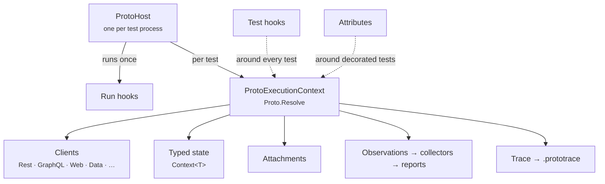

# Foundation overview

Everything in ProtoTest sits on a handful of concepts from `ProtoTest.Core`. Learn these once and every integration makes sense.



## The pieces

**[`ProtoHost`](./lifecycle.md)** is built once per test process by your runner's [assembly setup](../runners/overview.md). It owns the dependency injection container, runs suite-wide hooks, and starts and completes each test.

**[`ProtoExecutionContext`](./execution-context.md)** exists for exactly one test. It holds that test's clients, typed state, attachments and observations, and its own DI scope. You reach it anywhere in the test through `Proto.Context`.

**[Hooks](./hooks.md)** run around *every* test (`IProtoTestHook`) or around the whole run (`IProtoRunHook`). They're registered on the host.

**[Attributes](./attributes.md)** run around the tests they decorate. They're how you package a capability — "a fresh tenant", "a logged-in administrator" — and compose it onto any test.

**[Clients](./clients.md)** are what integrations give you: `Rest()`, `GraphQL()`, `Web()`. Under the hood each is created per test by a client initializer, which you can write yourself.

**[Attachments](./attachments.md)** are files a test produces — response bodies, screenshots — handed to your runner and bundled into the trace.

Two things build on top and have their own sections:

- **[ProtoTrace](../advanced/prototrace.md)** records every operation, automatically.
- **[Observations and coverage](../advanced/coverage.md)** turn what tests did into reports.

## A test, end to end

```csharp
[Application("Api")]                         // attribute: selects the system under test
[SampleEnvironment]                          // attribute: provisions a tenant, deletes it afterwards
[RestAuth<SampleUserAuthenticator>]              // attribute metadata read by the REST hook
public sealed class BillingTests
{
    [ProtoTest]                              // runner attribute: starts and completes the context
    [SampleUser(SampleRoles.BillingAdministrator)]
    public async Task Open_invoices_are_listed()
    {
        var user = Proto.Context.Resolve<SampleUserContext>();       // typed state an attribute set

        using var response = await Proto.Context.Rest()              // client, created for this test
            .GetAsync("/api/billing/invoices", new { state = "open" });

        response.ShouldHaveHttpStatus(HttpStatusCode.OK);                 // traced, observed, attached
    }
}
```

What happens around that method:

1. The runner calls `StartTestAsync`. A context and DI scope are created.
2. **Test hooks** run — including ProtoTest's own, which creates clients and applies `[RestAuth<T>]`.
3. **Attributes** run in `Order`: `[SampleEnvironment]` (−200), then `[SampleUser]` (−100).
4. Your test body runs. Every request, assertion and state access is traced.
5. The runner calls `CompleteTestAsync`. Attributes and hooks tear down in reverse, attachments are published, clients and the scope are disposed.

[Lifecycle](./lifecycle.md) covers the exact rules, including what happens when something fails.
