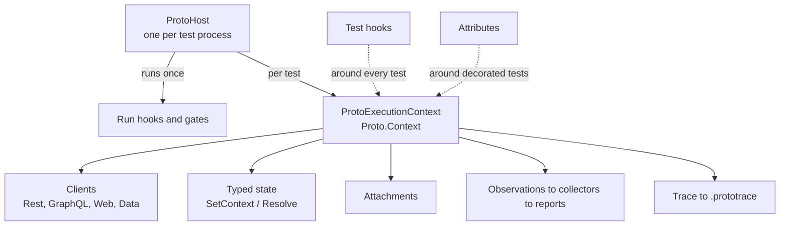

import TraceAnatomy from '@site/src/components/TraceAnatomy';
import {lessonTraces} from '@site/src/data/traceSources';

export const lifecycleLayers = [
  {
    id: 'setup',
    label: '1-2 Setup',
    when: '522.9 ms',
    lead: 'Steps 1 and 2 of the lifecycle: hooks create the clients, attributes provision the tenant.',
    entries: [
      {kind: 'hook.before', name: 'Client initializer, SQL, scenario, auth hooks', meta: '6 hooks, lowest order first'},
      {kind: 'client.initialize', name: 'Rest, GraphQL, loopback web, in-process, probe, messaging', meta: 'one operation per client'},
      {kind: 'attribute.before', name: 'Application, NorthstarTenant, SignedInAs, NorthstarMember', meta: '4 attributes in Order'},
    ],
  },
  {
    id: 'execution',
    label: '3 Execution',
    when: '161.1 ms',
    lead: 'Step 3: the body runs. One request and the two checks that decided the test.',
    entries: [
      {kind: 'http.request', name: 'REST POST /api/v1/projects', meta: '142.2 ms, 201 Created'},
      {kind: 'assert.http.status', name: 'Assert status 201 Created', meta: 'the check that decided the request'},
      {kind: 'assert.json.shape', name: 'Assert response shape', meta: '5 properties matched at once'},
    ],
  },
  {
    id: 'teardown',
    label: '4-5 Teardown',
    when: '30.0 ms',
    lead: 'Steps 4 and 5: attributes and hooks reverse, attachments publish, resources release.',
    entries: [
      {kind: 'attribute.after', name: 'NorthstarMember down to Application', meta: 'reverse of setup'},
      {kind: 'attachment.publish', name: 'Request, response, expected shape, scenario summary', meta: '4 files into the archive'},
      {kind: 'resource.release', name: 'Tenant cleanup, services, connection, consumer', meta: 'reverse registration order'},
    ],
  },
];

# Foundation overview

Everything in ProtoTest sits on a handful of concepts from `ProtoTest.Core`. Learn these once and every integration makes sense. One host per process, one context per test; everything else hangs off these two. New to integration testing? The [Learn track](/learn/) starts from why these tests get hard.


```mermaid
flowchart TB
    Host["ProtoHost<br/>one per test process"]
    Host -->|runs once| RunHooks["Run hooks and gates"]
    Host -->|per test| Context["ProtoExecutionContext<br/>Proto.Context"]
    Context --> Clients["Clients<br/>Rest, GraphQL, Web, Data"]
    Context --> State["Typed state<br/>SetContext / Resolve"]
    Context --> Attachments["Attachments"]
    Context --> Observations["Observations to collectors to reports"]
    Context --> Trace["Trace to .prototrace"]
    TestHooks["Test hooks"] -.->|around every test| Context
    Attributes["Attributes"] -.->|around decorated tests| Context
```

## The pieces

| Piece | Job | Page |
| --- | --- | --- |
| `ProtoHost` | built once per test process; owns DI, run hooks, gates, infrastructure, and each test's start and completion | [Lifecycle](./lifecycle.md) |
| `ProtoExecutionContext` | exists for exactly one test; holds its clients, state, resources, findings, attachments and observations | [Execution context](./execution-context.md) |
| Hooks | run around every test or the whole run; registered on the host | [Hooks](./hooks.md) |
| Attributes | run around the tests they decorate; package a capability onto any test | [Attributes](./attributes.md) |
| Clients | what integrations give you: `Rest()`, `GraphQL()`, `Web()` | [Clients](./clients.md) |
| Assertions | one `Should` / `ShouldNot` surface on every integration | [Assertions](./assertions.md) |
| Attachments | files a test produces, handed to the runner and the trace | [Attachments](./attachments.md) |
| Skip conditions | stop a test before its lifecycle starts when the host cannot run it | [Skip conditions](./skip-conditions.md) |

Two things build on top and have their own sections:

- **[ProtoTrace](../observability/prototrace.md)** records every operation, automatically.
- **[Observations and coverage](../observability/coverage.md)** turn what tests did into reports.

Two pieces matter less often. The context can own test-scoped [resources](./execution-context-advanced.md#resources) and record [findings](./execution-context-advanced.md#findings) without failing the test. The host builder can [gate the whole run](./lifecycle.md#run-gates-and-resources) on what the reports collected.

[Test time](./time.md) and [Concurrency](./concurrency.md) cover two questions every suite meets: how to move a clock instead of sleeping, and what ProtoTest keeps isolated when tests run in parallel.

## A test, end to end

```csharp
[Application("Api")]                         // attribute: selects the system under test
[SampleEnvironment]                          // attribute: provisions a tenant, deletes it afterwards
[Auth<SampleUserAuthenticator>]              // attribute metadata read by the HTTP hooks
public sealed class BillingTests
{
    [ProtoTest]                              // runner attribute: starts and completes the context
    [SampleUser(SampleRoles.BillingAdministrator)]
    public async Task OpenInvoicesAreListed()
    {
        var user = Proto.Context.Resolve<SampleUserContext>();   // typed state an attribute set

        using var response = await Proto.Context.Rest()          // client, created for this test
            .GetAsync("/api/billing/invoices", new { state = "open" });

        response.Should.HaveHttpStatus(HttpStatusCode.OK);       // traced, observed, attached
    }
}
```

What happens around that method:

1. **[1]** The runner calls `StartTestAsync`. A context and DI scope are created.
2. **[2]** **Test hooks** run, including ProtoTest's own, which creates clients and applies `[Auth<T>]`.
3. **[3]** **Attributes** run in `Order`: `[SampleEnvironment]` at -200, then `[SampleUser]` at -100.
4. **[4]** Your test body runs. Requests, assertions and recorded state are traced. A failing `Resolve` or client lookup is traced too.
5. **[5]** The runner calls `CompleteTestAsync`. Attributes and hooks tear down in reverse, attachments are published, and owned resources and the scope are disposed.

The same five steps in a recording, the learning sample's project journey:

<TraceAnatomy
  source={lessonTraces.firstJourney}
  title="The lifecycle, recorded"
  test="Northstar.ProtoTest.ProjectsJourney.CreatingAProjectReturnsIt"
  layers={lifecycleLayers}
  blindSpots={[]}
/>

[Lifecycle](./lifecycle.md) covers the exact rules, including what happens when something fails.

## Where to go next

- [Vocabulary](./vocabulary.md): every term above, and the trace entity each one records.
- [Integrations map](../integrations/overview.md): every package that plugs into this model.
- [Observability](../observability/prototrace.md): what the run records and how to read it.
- [Recipes](../recipes/overview.md): common journeys, built from these pieces.
