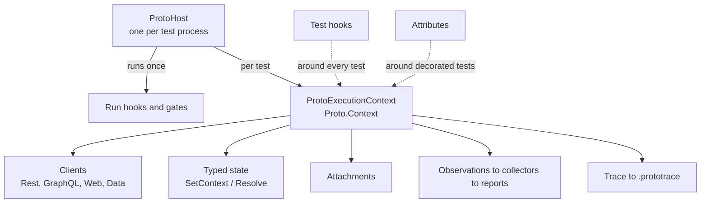

# Foundation overview

Everything in ProtoTest sits on a handful of concepts from `ProtoTest.Core`. Learn these once and every integration makes sense. New to integration testing? The [Learn track](/learn/) starts from why these tests get hard.


```mermaid
flowchart TB
    Host["ProtoHost<br/>one per test process"]
    Host -->|runs once| RunHooks["Run hooks and gates"]
    Host -->|per test| Context["ProtoExecutionContext<br/>Proto.Context"]
    Context --> Clients["Clients<br/>Rest, GraphQL, Web, Data"]
    Context --> State["Typed state<br/>SetContext / Resolve"]
    Context --> Attachments["Attachments"]
    Context --> Observations["Observations to collectors to reports"]
    Context --> Trace["Trace to .prototrace"]
    TestHooks["Test hooks"] -.->|around every test| Context
    Attributes["Attributes"] -.->|around decorated tests| Context
```

## The pieces

- **[`ProtoHost`](./lifecycle.md)** is built once per test process by your runner's [assembly setup](../runners/overview.md). It owns the dependency injection container, runs suite-wide hooks and [run gates](./lifecycle.md#run-gates-and-resources), starts [infrastructure](./infrastructure.md), and starts and completes each test.
- **[`ProtoExecutionContext`](./execution-context.md)** exists for exactly one test. It holds that test's clients, typed state, resources, findings, attachments and observations, and its own DI scope. You reach it anywhere in the test through `Proto.Context`.
- **[Hooks](./hooks.md)** run around *every* test (`IProtoTestHook`) or around the whole run (`IProtoRunHook`). They are registered on the host.
- **[Attributes](./attributes.md)** run around the tests they decorate. They are how you package a capability, such as "a fresh tenant" or "a logged-in administrator", and compose it onto any test.
- **[Clients](./clients.md)** are what integrations give you: `Rest()`, `GraphQL()`, `Web()`. Under the hood each is created per test by a client initializer, which you can write yourself.
- **[Assertions](./assertions.md)** are the surface every integration exposes: `Should` and `ShouldNot`, chainable assertion members and `Should.MatchShape`.
- **[Attachments](./attachments.md)** are files a test produces, such as response bodies and screenshots. They are handed to your runner and bundled into the trace.
- **[Skip conditions](./skip-conditions.md)** stop a test before its lifecycle starts when the host cannot run it, so an environment-specific test reads as skipped.

Two things build on top and have their own sections:

- **[ProtoTrace](../observability/prototrace.md)** records every operation, automatically.
- **[Observations and coverage](../observability/coverage.md)** turn what tests did into reports.

A few pieces are worth knowing even if you reach for them rarely: the context can own test-scoped [resources](./execution-context.md#resources) released at teardown and record [findings](./execution-context.md#findings) that reach the report without failing the test, and the host builder can [gate the whole run](./lifecycle.md#run-gates-and-resources) on what the reports collected.

[Test time](./time.md) and [Concurrency](./concurrency.md) cover two questions every suite meets: how to move a clock instead of sleeping, and what ProtoTest keeps isolated when tests run in parallel.

## A test, end to end

```csharp
[Application("Api")]                         // attribute: selects the system under test
[SampleEnvironment]                          // attribute: provisions a tenant, deletes it afterwards
[Auth<SampleUserAuthenticator>]              // attribute metadata read by the HTTP hooks
public sealed class BillingTests
{
    [ProtoTest]                              // runner attribute: starts and completes the context
    [SampleUser(SampleRoles.BillingAdministrator)]
    public async Task OpenInvoicesAreListed()
    {
        var user = Proto.Context.Resolve<SampleUserContext>();   // typed state an attribute set

        using var response = await Proto.Context.Rest()          // client, created for this test
            .GetAsync("/api/billing/invoices", new { state = "open" });

        response.Should.HaveHttpStatus(HttpStatusCode.OK);       // traced, observed, attached
    }
}
```

What happens around that method:

1. The runner calls `StartTestAsync`. A context and DI scope are created.
2. **Test hooks** run, including ProtoTest's own, which creates clients and applies `[Auth<T>]`.
3. **Attributes** run in `Order`: `[SampleEnvironment]` at -200, then `[SampleUser]` at -100.
4. Your test body runs. Requests, assertions and recorded state are traced. A failing `Resolve` or client lookup is traced too.
5. The runner calls `CompleteTestAsync`. Attributes and hooks tear down in reverse, attachments are published, and owned resources and the scope are disposed.

[Lifecycle](./lifecycle.md) covers the exact rules, including what happens when something fails.

## Where to go next

- [Vocabulary](./vocabulary.md): every term above, and the trace entity each one records.
- [Integrations map](../integrations/overview.md): every package that plugs into this model.
- [Observability](../observability/prototrace.md): what the run records and how to read it.
- [Recipes](../recipes/overview.md): common journeys, built from these pieces.
