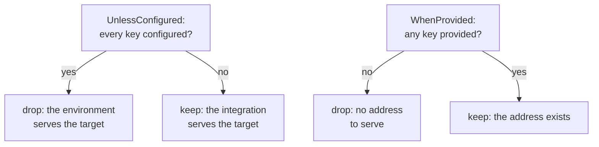

import TraceAnatomy from '@site/src/components/TraceAnatomy';
import {brokerSkipLayers, brokerSkipReason, brokerSkipSource, brokerSkipTest} from '@site/src/data/brokerSkipWalk';

# Skip conditions

## What it is

Not every test can run in every environment. A **skip condition** stops a test before its lifecycle starts and hands the runner a reason, so an environment-specific test reads as *skipped* instead of *failed*.

```csharp
[RequiresCapability(ProtoCapabilityKinds.Store, Reason = "The suite does not own the store.")]
```

The test body never runs. No context is created, so no hook or attribute sees the test. Nothing is written to the trace. No teardown runs, because there is nothing to tear down. The reason reaches the runner's skip mechanism; see [what a skip means](#what-a-skip-means).

One skipped test, as the runner reports it:

```text
Skipped PayingAnInvoicePublishesAnInvoicePaidEvent
  {brokerSkipReason}
```

The archive for that run holds the run and nothing else:

<TraceAnatomy
  source={brokerSkipSource}
  title="A skipped test, layer by layer"
  test={brokerSkipTest}
  layers={brokerSkipLayers}
  blindSpots={[]}
/>

A condition is a `ProtoAttribute`. Conditions are evaluated with the test's other attributes, and an adapter that does not know them runs the test: the contract is opt-in. To write your own, see [writing your own](#writing-your-own).

## How it works

```csharp
[AttributeUsage(AttributeTargets.Method | AttributeTargets.Class, AllowMultiple = true, Inherited = true)]
public class RequiresCapabilityAttribute : ProtoAttribute, IProtoSkipCondition
{
    public RequiresCapabilityAttribute(string kind);

    public string Kind { get; }
    public string? CapabilityName { get; init; }
    public string? CapabilityInstance { get; init; }
    public string? Reason { get; init; }
}
```

The test runs when `ProtoHost.HasCapability(kind, CapabilityName, CapabilityInstance)` is true. `CapabilityName` matches the descriptor name and `CapabilityInstance` matches the instance a capability describes (an `AddAspNetCoreServer` name); every non-null filter must match. Otherwise the test skips with `Reason`, or with *"This test requires the '...' capability, which this host is not composed with."* when no reason is given:

```csharp
[RequiresCapability(
    ProtoCapabilityKinds.Broker,
    Reason = "No broker is configured; set ProtoTest:Messaging:RabbitMq:ConnectionString.")]
```

Integrations register a capability when they are configured, so the condition answers what the host *can actually do* rather than what it was asked to do. `ProtoCapabilityKinds` lists the built-in kinds: `server`, `worker`, `device`, `protocol`, `browser`, `store`, `broker`, `data`, `document`, `aspire` and `clock`. An integration may use its own. Use `CapabilityName` to require one specific capability of that kind:

```csharp
[RequiresCapability(ProtoCapabilityKinds.Server, CapabilityName = "ASP.NET Core")]
```

An integration whose capability depends on an address can declare it conditionally: `AddCapabilityUnlessConfigured(capability, "ProtoTest:Applications:Api:BaseUrl")` drops the declaration when every listed key is already configured. The environment provides the address, so the capability stays honest and the tests that require it skip. `AddAspNetCoreServer` uses this: with `BaseUrl` configured its `ASP.NET Core` capability is absent and `[RequiresInProcess]` skips.

Each declaration is evaluated on its own. A descriptor drops only when every conditional declaration for it drops and no unconditional declaration promises it. A capability for one named instance carries that instance, so satisfying one instance's keys drops only that instance.

The conditional registration kinds answer the address question in both directions:

| Registration | Drops when | For |
| --- | --- | --- |
| `AddCapabilityUnlessConfigured(capability, keys...)` | every key is configured, because the environment provides what the integration would serve | `AddAspNetCoreServer`, the in-process device transport |
| `AddCapabilityWhenProvided(capability, keys...)` | none of the keys is provided, neither as a configured value nor as a key a registered infrastructure piece declares | an integration that cannot serve without an address: `UseRabbitMq` declares `broker` over its connection string, so a run with neither a configured key nor a broker container skips instead of failing |



A dropped declaration is recorded as a `capability.skipped` event naming the deciding keys (`capability.keys`) and the reason (`capability.reason`: `already configured`, or `no key provided`).

Class-level and method-level conditions accumulate like any other attribute. The first one that applies supplies the reason.

## How to use it

### Typed conditions for the host composition

Three shipped conditions remove the stringly-typed gates for the most common cases. Each sets its capability from a type or a name and reports a reason naming the registration call:

```csharp
[RequiresWorker<BillingWorker>]        // the worker AddWorkerHost<BillingWorker>() starts
[RequiresServer("Api")]                // the named AddAspNetCoreServer<Program>(name: "Api") instance
[RequiresApplication("Api")]           // the application AddApplication("Api", ...) declares
[RequiresTestClock]                    // the run's clock is authoritative for the application
public async Task ...() { ... }
```

- `[RequiresWorker<TProgram>]` checks the `worker` capability by the program assembly's name, the identity `AddWorkerHost<TProgram>()` registers, so a typo cannot turn a missing worker into a plausible skip. Its default reason names `AddWorkerHost<TProgram>()`.
- `[RequiresServer(name)]` checks the `server` capability's instance (the server name), not the descriptor name `ASP.NET Core`, so configuring one named server's `BaseUrl` drops only that server. Its default reason names `AddAspNetCoreServer<TProgram>(name: "...")`.
- `[RequiresApplication(name)]` checks that the suite declared the application with `AddApplication`, regardless of which protocols it registered. Its default reason names `AddApplication("...", app => ...)`.
- `[RequiresTestClock]` checks the `clock` capability: the winning in-process application provider and a hosted worker declare it, because they bridge the test clock into the process they serve. A published, container, AppHost or loopback application declares none, so a journey that advances the clock skips instead of asserting a time the application never saw.

Each accepts `Reason` like `[RequiresCapability]`, and `[RequiresCapability(kind)]` stays for open kinds and integration-specific names.

### One reason for the suite

A reason that would be the same on every gated test is declared once on the builder:

```csharp
builder.AddCapabilityReason(
    ProtoCapabilityKinds.Broker,
    "No broker is configured; set ProtoTest:Messaging:RabbitMq:ConnectionString.");
```

`[RequiresCapability(kind)]` and the typed gates read it before their built-in default. A per-test `Reason` still wins, and a `name` narrows the reason to one capability name or the instance a capability describes (a named server):

```csharp
builder.AddCapabilityReason(
    ProtoCapabilityKinds.Server,
    "The Api server is only hosted in-process.",
    "Api");
```

A gate whose `(kind, name)` has no declared reason falls back to its default message, so a suite can state the common reasons and leave the rest. `[RequiresApplication]` checks that an application was declared rather than a capability, so it keeps its own `Reason` and default.

### In-process only

`[RequiresInProcess]` is shorthand for `[RequiresCapability(ProtoCapabilityKinds.Server)]`: it skips unless a `server` capability is registered, with the reason *"This test requires an in-process application server; the suite is running against a published environment."*

```csharp
[RequiresInProcess]
```

Because `"server"` is a capability *kind* and not a hosting mode, any registered server capability satisfies it. A suite that registers a `server` capability for something other than the in-process application, such as a standalone copy it started itself, will run the test too. Require a `CapabilityName` when only a particular server may satisfy the condition.

### Requiring a Playwright browser

`AddWeb(...)` registers a `browser` capability named `Playwright` (or `Selenium`), so `[RequiresCapability(ProtoCapabilityKinds.Browser, CapabilityName = "Playwright")]` proves the backend is composed. It says nothing about whether a browser actually exists on the machine. `ProtoTest.Web.Playwright` ships a stronger, opt-in condition that probes the browser before the lifecycle starts, without launching one:

```csharp
[RequiresPlaywrightBrowser]                                   // the configured browser
[RequiresPlaywrightBrowser(browser: PlaywrightBrowser.Firefox)]
[RequiresPlaywrightBrowser(channel: "msedge", Reason = "No Edge in this environment.")]
public async Task ...() { ... }
```

The condition reads the host's Playwright options, where your `AddWeb(...)` callback supplies the defaults and configuration overrides them, and returns:

- **nothing to skip** when `InstallBrowsers` is true. The backend pool downloads the browser on demand before its first launch.
- **nothing to skip** when the configured bundled browser's executable exists. The probe starts the Playwright driver, with no browser process launched, and reads `BrowserType.ExecutablePath`.
- **nothing to skip** for a channel Playwright recognizes (`chrome`, `msedge`, ...). A channel names a system browser, which only a real launch can resolve, so the condition cannot prove one absent. An unrecognized channel does skip.
- **a reason naming Playwright** otherwise, pointing at the install options (`playwright.ps1 install ...`, `InstallBrowsers=true`, or a `Channel`).

Like any condition, `Reason` replaces that default message.

Selenium has no equivalent probe: the driver comes from your own factory, so the framework cannot know whether a browser exists. Gate Selenium tests with `[RequiresCapability(ProtoCapabilityKinds.Browser, CapabilityName = "Selenium")]` and a try/catch around the first session that uses the browser, calling your runner's skip mechanism:

```csharp
try
{
    var home = Proto.Context.Web().Page<HomePage>();
    await home.OpenAsync("/");
}
catch (Exception exception) when (exception is WebDriverException or InvalidOperationException)
{
    Assert.Ignore($"No Selenium browser is available: {exception.Message}");
}
```

### Writing your own

Derive from `ProtoAttribute` and implement `IProtoSkipCondition`:

```csharp
public interface IProtoSkipCondition
{
    /// <summary>Returns the reason to skip, or null when the test can run.</summary>
    string? GetSkipReason(ProtoHost host);
}
```

`GetSkipReason` is called once per test, before the lifecycle starts. Return `null` to let the test run.

## What a skip means

Adapters evaluate the conditions before calling `StartTestAsync`:

- the test body never runs;
- no `ProtoExecutionContext` is created, so no hook or attribute sees the test;
- nothing is written to the trace: no test record, no entries;
- no teardown runs, because there is nothing to tear down.

The reason is handed to the runner's skip mechanism:

| Runner | How the skip is raised | Reason reported |
| --- | --- | --- |
| [NUnit](../runners/nunit.md) | `Assert.Ignore(reason)` | yes |
| [xUnit v2](../runners/xunit.md) with `[ProtoTestFact]` and `[ProtoTestTheory]` | the discovered test case's `SkipReason` | yes |
| [xUnit v3](../runners/xunit3.md) | `Assert.Skip(reason)` | yes |
| [TUnit](../runners/tunit.md) | `TUnit.Core.Skip.Test(reason)` | yes |
| [MSTest](../runners/mstest.md) | an ignored `TestResult` | yes, on its `DisplayName` and `LogOutput` |

MSTest has no public dynamic skip API in the version ProtoTest targets, so the adapter returns an ignored result instead. Its `IgnoreReason` is internal, so the reason travels on the public `LogOutput` and is also prefixed to the display name: the test reads as skipped and the runner's output still says why.

:::note[Skipped tests are absent, not empty]
Because nothing starts, a skipped test has no context, no trace record and no report entry. It appears in the runner's own results as skipped and nowhere in ProtoTest's output. The [runner overview](../runners/overview.md) describes the same rule from the outcome side.
:::

## Limits

- **A condition only sees registered capabilities.** If an integration is not configured, its capability is absent and tests that require it skip, which is the point. Configure the integration, or provide the connection string it reads, to make them run.
- **`[RequiresInProcess]` does not inspect `BaseUrl`.** With no in-process server registered it skips, regardless of what the host can reach over the network.
- **An attribute's `Reason` is fixed at compile time.** Attribute arguments are constants. A suite-level reason (`AddCapabilityReason`) is declared on the builder instead, and both can name a configuration key, as the examples do.
- **Conditions are selected in resolution order, not `Order`.** `ProtoTestSkip.GetReason` returns the first non-null `GetSkipReason` in the order the adapter resolved the attributes. For NUnit that is class-level before method-level in reflection order, because ordering by `Order` only happens inside `StartTestAsync`, which a skipped test never reaches.

## In the sample suite

The learning sample gates each environment-dependent journey with a condition: the domain journey requires the `store` capability, the web journey requires the Playwright browser, and the broker journey requires the `broker` capability. The broker reason is declared once in the sample's `Setup` with `AddCapabilityReason`. See [Environments](../getting-started/environments.md) for how the three shapes select those capabilities.
