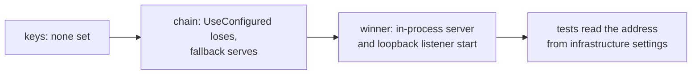
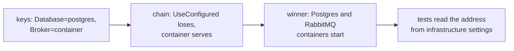
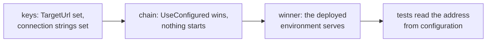

import TraceAnatomy from '@site/src/components/TraceAnatomy';
import {brokerSkipLayers, brokerSkipReason, brokerSkipSource, brokerSkipTest} from '@site/src/data/brokerSkipWalk';

# Run one suite in three environments

You can run the same suite in three ways without changing a test:

- **In-process**: the host starts your application inside the test process. This suits a laptop.
- **Container-backed**: the host also starts a database or message broker in a container. This needs a machine with Docker.
- **Published**: the tests call an application that is already deployed.

Only the host setup and the configuration differ. The tests, attributes, assertions and reports stay the same.

The examples below come from the Northstar.ProtoTest sample suite (`samples/Northstar.ProtoTest`). Its `NorthstarRun` class chooses the mode from configuration:

```csharp
var run = NorthstarRun.From(configuration);
var hostedInProcess = run.RunsLocalApplications;   // ProtoTest:TargetUrl is empty
var configuredDatabase = run.ConfiguredStore;
var postgresStore = run.OwnsPostgres;
var useMessagingContainer = run.OwnsMessagingBroker;
```

| | In-process | Container-backed | Published |
| --- | --- | --- | --- |
| Selected by | `ProtoTest:TargetUrl` empty | `ProtoTest:Database=postgres`, `ProtoTest:Messaging:Broker=container` | `ProtoTest:TargetUrl` set |
| Application | `AddAspNetCoreServer<Program>` | in-process, fed by infrastructure settings | never started; clients target `BaseUrl` |
| Store | file SQLite under `TestResults/Northstar.ProtoTest` | `PostgresDatabase.Container()` | `ConnectionStrings:Northstar` |
| Broker | none configured; broker journeys skip | `RabbitMqBroker.Container()` | `ProtoTest:Messaging:RabbitMq:ConnectionString` |
| Browser journeys | a loopback listener the run starts | the same | the configured `BaseUrl` |

## In-process

When `ProtoTest:TargetUrl` is empty, the host builds the application in-process. The REST and GraphQL clients reuse its transport, so no port is opened:

```csharp
if (run.RunsLocalApplications)
{
    app.AddAspNetCoreServer<NorthstarProgram>(configureWebHost: webHost =>
        ConfigureHostedApplication(webHost, run));
}
```

The sample owns one file-based SQLite database per run and deletes it before the run starts. The run hosts the application twice over that database. One instance is in-process, for the API tests. The other listens on the loopback address, for the browser test.

The loopback instance is its **own application**, named `Northstar web`. The run starts it with `AddLoopbackApplication` and waits for its `/health` address. The [web sessions](../integrations/web/index.md) then follow its published base URL. Each application has one source for its address.

```csharp
builder.AddLoopbackApplication(NorthstarTargets.Web, NorthstarProgram.CreateApp);
builder.AddHttpReadiness(NorthstarTargets.Web, "/health");
```



The tests' own domain code uses the same database, so `DomainAccessJourney` runs. No broker is configured, so `BrokerJourney` skips.

## Container-backed

Set `ProtoTest:Database=postgres` or `ProtoTest:Messaging:Broker=container`. The run then starts and owns the container through [infrastructure](../foundation/infrastructure.md):

```csharp
builder.AddInfrastructure(
    "MessagingBroker",
    chain => chain
        .UseConfigured()
        .UseContainer(RabbitMqBroker.Container()),
    RabbitMqOptions.ConnectionStringSetting,
    "Messaging:RabbitMq:ConnectionString");

builder.AddInfrastructure(
    "NorthstarDatabase",
    chain => chain
        .UseConfigured()
        .UseContainer(PostgresDatabase.Container()),
    "ConnectionStrings:Northstar");
```

Once the containers start, the host publishes their connection strings. Tests read them from `ProtoInfrastructureSettings`, and both hosted instances read them from host settings. Everything then uses the same database and broker.

The loopback instance follows the suite's configuration. The browser test therefore runs in every local mode and skips only when the browser is not installed. A published run starts no loopback instance and follows the configured `ProtoTest:Applications:{application}:BaseUrl` instead.



## Published

Set `ProtoTest:TargetUrl` to point the suite at a deployed system:

```csharp
if (!run.RunsLocalApplications)
{
    values[$"{ProtoApplication.SectionPath}:{NorthstarTargets.Api}:BaseUrl"] = run.TargetUrl;
    values[$"{ProtoApplication.SectionPath}:{NorthstarTargets.Web}:BaseUrl"] = run.TargetUrl;
}
```

No ASP.NET Core server is registered and no loopback listener starts. HTTP clients connect over the network to `BaseUrl`. The browser test follows the same address when Playwright is available, and skips when the browser is not installed. Connection strings come from configuration. The tests' own domain code is set up when `ConnectionStrings:Northstar` is set:

```csharp
var composeDomainInTests = run.CanComposeDomain;
```

The run does not start the application, so it may not be ready when the first test runs. `AddHttpReadiness(application)` waits for the application's published address instead of sleeping in setup, and records the wait in the trace:

```csharp
builder.AddHttpReadiness(NorthstarTargets.Api);   // waits for ProtoTest:Applications:{app}:BaseUrl
```



:::warning[Readiness probes run in registration order]
Register the probe **after** the infrastructure that publishes the address. A probe registered first sees no address. It records a `readiness.skipped` reason that names the ordering requirement, and does not wait. See [Infrastructure recipes](../foundation/infrastructure-recipes.md#wait-until-it-is-ready) for the full rule.
:::

An in-process application has no address to wait for, so its probe skips and records the reason.

## What a skip records

In the in-process mode no broker is configured, so `BrokerJourney` skips. It reports the reason the sample declares once in its setup:

```text
Skipped PayingAnInvoicePublishesAnInvoicePaidEvent
  {brokerSkipReason}
```

The trace for that run holds the run and nothing else. It has five entries: two run reports plus the manifest, spans and state. It has no test record at all.

<TraceAnatomy
  source={brokerSkipSource}
  title="A skipped test, layer by layer"
  test={brokerSkipTest}
  layers={brokerSkipLayers}
  blindSpots={[]}
/>

## What does not change

- The journeys and their `[ProtoTest]` tests, attributes, authenticators and provisioners.
- The runner attribute and the assembly setup: one host per process, with the same lifecycle.
- The trace and the HTML and JSON reports. Every run produces the same files wherever it ran.
- The names of records that outlive the process. `Proto.Context.UniqueName("tenant")` derives a deterministic name from the test id. See [Execution context](../foundation/execution-context.md#unique-names) for the rerun rule.
- [Skip conditions](../foundation/skip-conditions.md). A test that needs something the host does not have is skipped. A test that suits only one environment therefore skips in the others and does not fail.

## Only an in-process application can do this

<details>
<summary>Features that only work in-process</summary>

Some features need the application's own process. A published environment cannot offer them, so the suite skips those tests and does not fail them:

| Feature | Why it is in-process only | Suite pattern |
| --- | --- | --- |
| `Proto.Context.ApplicationServices<TProgram>()` | resolves from the in-process server's container. With no server registered, `ApplicationServices` throws. | `[RequiresInProcess]` |
| `ServerService<TProgram, TService>()` | resolves from the in-process server's container | `[RequiresInProcess]` |
| `ServerFactory<TProgram>()` | resolves from the in-process server's container | `[RequiresInProcess]` |
| `IGraphQLWebSocketFactory` over the test server | subscriptions ride the in-process WebSocket connection | `[RequiresInProcess]` |
| Transactional isolation of the application's writes (`SqlIsolation.Transaction` + `ShareConnectionWith`) | the transaction covers only the connection ProtoTest owns, and a deployed process cannot share it | `[RequiresInProcess]` |

The tests' own domain code runs wherever the suite has a database, whether from a container or from a configured connection string. `[RequiresCapability(ProtoCapabilityKinds.Store)]` on `DomainAccessJourney` matches the capability that `AddSql` registers. The journey therefore skips exactly when the domain code cannot be set up. The sample sets `SqlIsolation.None` for that domain. Its application has its own connection, and a test transaction would hide the test's writes from it.

</details>

For a test that only needs an in-process server, `[RequiresInProcess]` is the shorthand. It expands to `[RequiresCapability("server")]` and skips whenever no server capability is registered. See [Skip conditions](../foundation/skip-conditions.md) for the exact evaluation and the limits for each runner.

## The sample's switches

| Key | Read from | Effect |
| --- | --- | --- |
| `ProtoTest:TargetUrl` | configuration / environment | non-empty selects the published environment and becomes the application's `BaseUrl` |
| `ProtoTest:Database` | configuration / environment | `postgres` starts `PostgresDatabase.Container()` |
| `ProtoTest:Messaging:Broker` | configuration / environment | `container` starts `RabbitMqBroker.Container()` |
| `ConnectionStrings:Northstar` | configuration / environment | points the application and the test-side domain at an existing store |
| `ProtoTest:Messaging:RabbitMq:ConnectionString` | configuration / environment | points the messaging adapter at an existing broker |

Each key also works as an environment variable, with `__` in place of the colon (`ProtoTest__TargetUrl`). That works only when the suite added an environment-variable source. See [Configuration](./configuration.md) for how to add sources and which value wins. See [Infrastructure](../foundation/infrastructure.md) for what the host starts and when it releases it.

The [recipes](../recipes/overview.md) work in all three modes unchanged: [REST, then GraphQL](../recipes/rest-then-graphql.md), [a write that lands in the database](../recipes/write-lands-in-the-database.md) and [API, then browser](../recipes/api-then-browser.md).

:::note[The same shapes in a product suite]
OpenCSMS, an independent EV charging platform in its own repository, runs one suite in every shape on this page. It adds one more: an Aspire AppHost that starts the product's own processes. Each target declares its providers in priority order with `UseConfigured()` first, so the environment decides which link serves the store, the broker and the application.


:::
