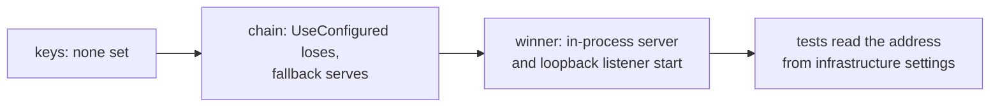
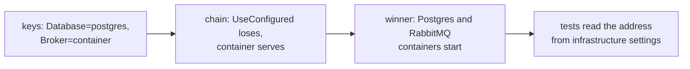
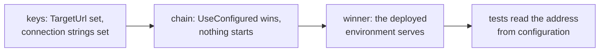

import TraceAnatomy from '@site/src/components/TraceAnatomy';
import {brokerSkipLayers, brokerSkipReason, brokerSkipSource, brokerSkipTest} from '@site/src/data/brokerSkipWalk';

# Run one suite in three environments

The same suite runs in three shapes without a code change: **in-process** on a laptop, **container-backed** on a machine with a container runtime, and **published** against a deployed environment. Only the host setup and configuration differ. The journeys, attributes, assertions and reports stay the same.

The shapes below come from the Northstar.ProtoTest sample suite (`samples/Northstar.ProtoTest`). Its `NorthstarRun` decides all three from configuration:

```csharp
var run = NorthstarRun.From(configuration);
var hostedInProcess = run.RunsLocalApplications;   // ProtoTest:TargetUrl is empty
var configuredDatabase = run.ConfiguredStore;
var postgresStore = run.OwnsPostgres;
var useMessagingContainer = run.OwnsMessagingBroker;
```

| | In-process | Container-backed | Published |
| --- | --- | --- | --- |
| Selected by | `ProtoTest:TargetUrl` empty | `ProtoTest:Database=postgres`, `ProtoTest:Messaging:Broker=container` | `ProtoTest:TargetUrl` set |
| Application | `AddAspNetCoreServer<Program>` | in-process, fed by infrastructure settings | never started; clients target `BaseUrl` |
| Store | file SQLite under `TestResults/Northstar.ProtoTest` | `PostgresDatabase.Container()` | `ConnectionStrings:Northstar` |
| Broker | none configured; broker journeys skip | `RabbitMqBroker.Container()` | `ProtoTest:Messaging:RabbitMq:ConnectionString` |
| Browser journeys | a loopback listener the run starts | the same | the configured `BaseUrl` |

## In-process

With no `TargetUrl`, the host builds the application in-process and the REST and GraphQL clients reuse its transport. No port is opened:

```csharp
if (run.RunsLocalApplications)
{
    app.AddAspNetCoreServer<NorthstarProgram>(configureWebHost: webHost =>
        ConfigureHostedApplication(webHost, run));
}
```

The sample owns one file SQLite database per run. It is deleted before the run starts. The run hosts the application twice over that store: in-process for the API journeys, and on a loopback listener for the browser journey. The loopback instance is its **own application** (`Northstar web`); the run starts it with `AddLoopbackApplication` and waits for its `/health` address, so the [web sessions](../integrations/web/index.md) follow the published base URL. One address authority per application.

```csharp
builder.AddLoopbackApplication(NorthstarTargets.Web, NorthstarProgram.CreateApp);
builder.AddHttpReadiness(NorthstarTargets.Web, "/health");
```



The test-side domain is composed over the same store, so `DomainAccessJourney` runs. No broker is configured, so `BrokerJourney` skips.

## Container-backed

Setting `ProtoTest:Database=postgres` or `ProtoTest:Messaging:Broker=container` makes the run own the container through [infrastructure](../foundation/infrastructure.md):

```csharp
builder.AddInfrastructure(
    "MessagingBroker",
    chain => chain
        .UseConfigured()
        .UseContainer(RabbitMqBroker.Container()),
    RabbitMqOptions.ConnectionStringSetting,
    "Messaging:RabbitMq:ConnectionString");

builder.AddInfrastructure(
    "NorthstarDatabase",
    chain => chain
        .UseConfigured()
        .UseContainer(PostgresDatabase.Container()),
    "ConnectionStrings:Northstar");
```

The host publishes the started connection strings in `ProtoInfrastructureSettings` for tests and in host settings for both hosted instances. All of them then use the same store or broker. The loopback instance follows the suite's configuration, so the web journey runs in every local mode and skips only when the browser is not installed. A published run skips the loopback and follows the configured `ProtoTest:Applications:{application}:BaseUrl` instead.



## Published

Setting `ProtoTest:TargetUrl` points the suite at a deployed system:

```csharp
if (!run.RunsLocalApplications)
{
    values[$"{ProtoApplication.SectionPath}:{NorthstarTargets.Api}:BaseUrl"] = run.TargetUrl;
    values[$"{ProtoApplication.SectionPath}:{NorthstarTargets.Web}:BaseUrl"] = run.TargetUrl;
}
```

No ASP.NET Core server is registered and no loopback listener is started. HTTP clients connect over the network to `BaseUrl`, and the browser journey follows the same published address when Playwright is available; it skips when the browser is not installed. Connection strings come from configuration, and the test-side domain is composed when `ConnectionStrings:Northstar` is set:

```csharp
var composeDomainInTests = run.CanComposeDomain;
```

The run does not start the application, so the suite cannot assume it is up when the first test runs. `AddHttpReadiness(application)` waits for its published address instead of sleeping in setup, and records the wait in the trace:

```csharp
builder.AddHttpReadiness(NorthstarTargets.Api);   // waits for ProtoTest:Applications:{app}:BaseUrl
```



:::warning[Readiness probes run in registration order]
Register the probe **after** the infrastructure that publishes the address. A probe registered first sees no address and records a `readiness.skipped` reason naming the ordering requirement instead of waiting. See [Infrastructure recipes](../foundation/infrastructure-recipes.md#wait-until-it-is-ready) for the full rule.
:::

An in-process application has no address to wait for, so the probe skips and records the reason.

## What a skip records

No broker is configured, so `BrokerJourney` skips with the reason the sample declares once in its setup:

```text
Skipped PayingAnInvoicePublishesAnInvoicePaidEvent
  {brokerSkipReason}
```

The archive for that run holds the run and nothing else: five entries, two run reports plus manifest, spans and state, and no test record at all.

<TraceAnatomy
  source={brokerSkipSource}
  title="A skipped test, layer by layer"
  test={brokerSkipTest}
  layers={brokerSkipLayers}
  blindSpots={[]}
/>

## What does not change

- The journeys and their `[ProtoTest]` tests, attributes, authenticators and provisioners.
- The runner attribute and assembly setup: one host per process, same lifecycle.
- The trace and the HTML/JSON reports. Every run produces the same artifacts wherever it ran.
- Records that outlive the process keep their identity: `Proto.Context.UniqueName("tenant")` derives a deterministic name from the test id. See [Execution context](../foundation/execution-context.md#unique-names) for the rerun rule.
- [Skip conditions](../foundation/skip-conditions.md): a test that needs something the host does not have skips, so an environment-specific journey is an environment-specific skip, not a failure.

## Only an in-process application can do this

Some things need the application's own process. Against a published environment they are unreachable, and the suite skips them rather than failing:

| Feature | Why it is in-process only | Suite pattern |
| --- | --- | --- |
| `Proto.Context.ApplicationServices<TProgram>()` | resolves from the in-process server's container; with no server registered, `ApplicationServices` throws | `[RequiresInProcess]` |
| `ServerService<TProgram, TService>()` | resolves from the in-process server's container | `[RequiresInProcess]` |
| `ServerFactory<TProgram>()` | resolves from the in-process server's container | `[RequiresInProcess]` |
| `IGraphQLWebSocketFactory` over the test server | subscriptions ride the in-process WebSocket connection | `[RequiresInProcess]` |
| Transactional isolation of the application's writes (`SqlIsolation.Transaction` + `ShareConnectionWith`) | the transaction covers only the connection ProtoTest owns; a deployed process cannot share it | `[RequiresInProcess]` |

The test-side domain runs wherever the suite has a store. That includes a container or a configured connection string. `[RequiresCapability(ProtoCapabilityKinds.Store)]` on `DomainAccessJourney` matches the capability `AddSql` registers, so the journey skips exactly when the domain cannot be composed. The sample sets `SqlIsolation.None` for that domain, because its application has its own connection and a test transaction would hide the test's writes from it.

For a test that only needs *an* in-process server, `[RequiresInProcess]` is the shorthand: it expands to `[RequiresCapability("server")]` and skips whenever no server capability is registered. See [Skip conditions](../foundation/skip-conditions.md) for the exact evaluation and per-runner limits.

## The sample's switches

| Key | Read from | Effect |
| --- | --- | --- |
| `ProtoTest:TargetUrl` | configuration / environment | non-empty selects the published environment and becomes the application's `BaseUrl` |
| `ProtoTest:Database` | configuration / environment | `postgres` starts `PostgresDatabase.Container()` |
| `ProtoTest:Messaging:Broker` | configuration / environment | `container` starts `RabbitMqBroker.Container()` |
| `ConnectionStrings:Northstar` | configuration / environment | points the application and the test-side domain at an existing store |
| `ProtoTest:Messaging:RabbitMq:ConnectionString` | configuration / environment | points the messaging adapter at an existing broker |

All of them work as environment variables with the usual `__` separator (`ProtoTest__TargetUrl`), but only when the suite added an environment-variable source. See [Configuration](./configuration.md) for how configuration sources are added and which value wins, and [Infrastructure](../foundation/infrastructure.md) for what the host starts and when it is released.

The [recipes](../recipes/overview.md) work in all three modes as they are: [REST, then GraphQL](../recipes/rest-then-graphql.md), [a write that lands in the database](../recipes/write-lands-in-the-database.md) and [API, then browser](../recipes/api-then-browser.md).

:::note[The same shapes in a product suite]
OpenCSMS, an independent EV charging platform in its own repository, runs one suite in every shape on this page and one more: an Aspire AppHost that starts the product's own processes. Each target declares its providers in priority order with `UseConfigured()` first, so the environment decides which link serves the store, the broker and the application.


:::
