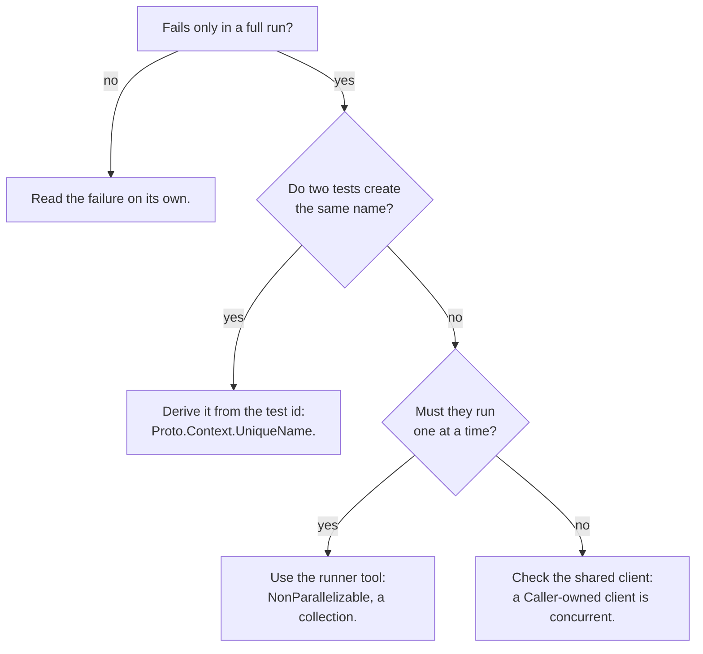

# Troubleshooting

This page covers the problems a new suite meets first. Each one starts with the message you see, so you can search for it.

## Messages to fix

Find your message in the table. Each row says what it means, how to fix it, and which section below explains it in full.

| What you see | What it means | Fix | Deep dive |
| --- | --- | --- | --- |
| `CS0616: 'ProtoTest' is not an attribute class` | `[ProtoTest]` resolved to the `ProtoTest` namespace because the adapter's attribute is not in scope | add `using ProtoTest.NUnit;`, or the adapter package for your runner. The runner pages list the usings. | [I see `ProtoHost is not initialized`](#i-see-protohost-is-not-initialized) |
| `NU1605: Detected package downgrade: NUnit from 4.6.1 to 4.3.2` | `dotnet new nunit` pins NUnit 4.3.2 while `ProtoTest.NUnit` needs 4.6.1 or newer | bump NUnit first: `dotnet add package NUnit --version 4.6.1`. See [Installation](./installation.md). | [I see `ProtoHost is not initialized`](#i-see-protohost-is-not-initialized) |
| `Aspire resource 'api' has no 'http' endpoint` | the AppHost project resource declares no `http` endpoint: no `WithHttpEndpoint`, and no `applicationUrl` in its launch profile | declare the endpoint in the AppHost, or point `UseEndpoint("api", "https")` at one the resource exposes. See [Aspire](../integrations/aspire.md). | [The application does not start in-process](#the-application-does-not-start-in-process) |
| `Aspire resource 'api' has no value yet: the AppHost publishes 'ProtoTest:Applications:api:BaseUrl' when the run starts` | the AppHost was never selected, usually because `ProtoTest__Aspire__Enabled=true` set in the shell never reached the host | add `.AddEnvironmentVariables()` to the suite's configuration sources. See [Configuration](./configuration.md#adding-configuration-sources). | [I see `No application is selected`](#i-see-no-application-is-selected) |
| `No password has been provided` | the code read the connection string from the opened connection, and opening strips credentials | read the value the run started from `ProtoInfrastructureSettings.Values`, password included. See [SQL](../integrations/sql/index.md). | [Containers do not start](#containers-do-not-start) |
| `prototest summary` shows `?` where a trace name uses `·` | the terminal is not reading the CLI's UTF-8 output as UTF-8 | the CLI sets UTF-8 output when it starts. If the console still substitutes glyphs, switch it to a UTF-8 code page (`chcp 65001` on Windows) or use a UTF-8 terminal. See [CLI reference](../agent-workflows/cli.md). | [The CI artifact is empty](#the-ci-artifact-is-empty) |
| `ProtoHost is not initialized` | the runner never ran the setup class | check the setup for your runner below | [I see `ProtoHost is not initialized`](#i-see-protohost-is-not-initialized) |
| `No active ProtoExecutionContext` | `Proto.Context` was read outside a ProtoTest test | use the ProtoTest attribute, or pass the context along | [I see `No active ProtoExecutionContext`](#i-see-no-active-protoexecutioncontext) |
| `No application is selected` or `has no Rest client registered` | the test names no client | select the application or name the client | [I see `No application is selected`](#i-see-no-application-is-selected) |
| `Program` is inaccessible or the in-process host fails | the application's entry point is internal, or its configuration is missing | add `public partial class Program;`, or feed the configuration from the test run | [The application does not start in-process](#the-application-does-not-start-in-process) |
| Docker endpoint or container startup failure | Docker is not running or not reachable | start Docker, or give the suite a connection string instead | [Containers do not start](#containers-do-not-start) |
| Playwright cannot find a browser executable | the browser was never installed on the machine | set `InstallBrowsers = true`, or drive an installed browser by channel | [The browser does not launch](#the-browser-does-not-launch) |
| Tests pass separately but fail in a full run | parallel tests share names or state | derive names from the test id | [Tests pass alone and fail together](#tests-pass-alone-and-fail-together) |
| No `.prototrace`, report or CI artifact | the trace lands where the test process runs, not where CI looks | write to an absolute directory, for example from a `PROTOTEST_RESULTS` variable your setup reads | [Where is the trace?](#where-is-the-trace) and [The CI artifact is empty](#the-ci-artifact-is-empty) |

The sections below explain each problem in full. The trace records every hook, request and check in order. If no message here matches what you see, [open the trace](../observability/prototrace.md).

## I see `ProtoHost is not initialized`

> **No active ProtoHost is available. The runner setup creates it: derive the suite's [SetUpFixture] from ProtoTestAssembly ...**

The runner never ran your setup class, so no host was built. The rest of the message points at the fix. The adapter adds its own hint, such as `Ensure your setup class inherits from ProtoTestAssembly.` or `Register your fixture with [assembly: AssemblyFixture(...)]`. Check the cause that applies to your runner:

- **NUnit**: the `[SetUpFixture]` only covers its own namespace and the namespaces below it. A test in `Orders.Tests.Api` is covered by a setup in `Orders.Tests`, not by one in `Orders.Tests.Web`. Move the setup up, or out of any namespace to cover the whole assembly.
- **xUnit v3**: `[assembly: AssemblyFixture(typeof(Setup))]` is missing.
- **xUnit v2**: the test class is not in the ProtoTest collection. Add `[Collection(ProtoTestCollection.Name)]`.
- **MSTest, TUnit**: the assembly hooks do not call `InitializeAsync`, or the class holding them is not discovered (MSTest needs `[TestClass]` on it).

Each runner's page under [Test runners](../runners/overview.md) shows the complete setup.

## I see `No active ProtoExecutionContext`

> **No active ProtoExecutionContext is available on this flow. Proto.Context only works inside a test body ...**

Your code read `Proto.Context` outside a ProtoTest test. There are two usual causes.

- The test uses the runner's own attribute (`[Test]`, `[Fact]`, `[TestMethod]`) instead of the ProtoTest attribute that opens the context. That attribute is `[ProtoTest]`, or `[ProtoTestFact]` and `[ProtoTestTheory]` for xUnit.
- The code runs outside the test's async flow, for example in a static initializer or a thread you started by hand.

In the second case, pass the `ProtoExecutionContext` along. For telemetry code that cannot take it, reach the owning test's trace with `ProtoHost.FindTraceWriter(Activity?)`. The message also names the alternatives.

## I see `No application is selected`

> **No application is selected for this test. Apply [Application(name)] or pass a Rest client name to the accessor.**

`Proto.Context.Rest()` with no name uses the client of the selected application. Either put `[Application("Api")]` on the class or the test, or ask for a client by name with `Proto.Context.Rest("Api")`.

> **Application 'Api' has no Rest client registered. Register one in AddApplication or pass a client name to the accessor.**

The application was set up without REST. Add REST in the setup: `.AddApplication("Api", app => app.AddRest(rest => rest.AddClient("Api")))`.

> **No HTTP client 'Api' is registered. Register it under the application, back the application with AddAspNetCoreServer, or set 'ProtoTest:Applications:Api:BaseUrl'.**

The client has no address to send requests to. Either host the application in-process with `AddAspNetCoreServer<Program>()`, or point the client at a running application with `ProtoTest:Applications:Api:BaseUrl`. See [Configuration](./configuration.md).

## The application does not start in-process

- **`Program` is inaccessible.** The entry point of a minimal-API application is internal. Add `public partial class Program;` to the application, as in [Your first test](./first-test.md#1-create-the-project).
- **The application reads configuration the test run does not have.** The in-process server runs the application's own `Program` with its own `appsettings.json`. In production, values such as connection strings and secrets come from the environment. In a test run they must come from somewhere else: either [infrastructure](../foundation/infrastructure.md) that fills them, or `configureWebHost` on `AddAspNetCoreServer`.

## Containers do not start

Infrastructure such as `PostgresDatabase.Container()` runs on Docker through Testcontainers. If Docker is not running or not reachable, the run fails before the first test. The failure carries Testcontainers' own message about the Docker endpoint.

- Start Docker Desktop, or on Linux make sure the current user can reach the Docker socket.
- On CI, use a runner image with Docker available.

### Running where Docker is not available

Give the suite a connection string through configuration instead of a container. A skip on a test does not help here. `AddInfrastructure` starts the container with the host, before any skip condition is evaluated, so a missing runtime fails the run at start. To handle this yourself, start the container in the suite fixture before you register anything:

```csharp
var started = PostgresDatabase.TryStart();
if (!started.Started)
{
    // Fall back to a configured connection string, or skip the suite.
}
```

`PostgresDatabase.TryStart(...)` and `RabbitMqBroker.TryStart(...)` report a failure instead of throwing. The fixture can then fall back, replace the connection string, or skip the suite. When the fixture starts the container itself, register it with `AddResource` so the host still releases it. `AddInfrastructure` is only for containers the host starts. `TryStart` blocks the calling thread while the container starts, and it has no timeout. See [Skip conditions](../foundation/skip-conditions.md).

## The browser does not launch

Playwright reports that the browser executable does not exist when the browser was never installed on the machine. You have two fixes. Set `InstallBrowsers = true` to download the browser before the first launch. Or set `Channel = "msedge"` or `"chrome"` to drive a browser that is already installed. On a clean Linux image, the operating-system libraries still come from `playwright.ps1 install --with-deps chromium`. See [Web](../integrations/web/index.md#browsers).

## Tests pass alone and fail together

Parallel tests share the application and its data. If two tests create the same customer, order number or email address, one of them fails. It fails only when the two happen to run at the same time.



Make every value a test creates unique to that test. `Proto.Context.UniqueName("customer")` builds a name from the test id, so the same test gets the same name on every run. See [Execution context](../foundation/execution-context.md#unique-names) for the rerun rule:

```csharp
new { name = Proto.Context.UniqueName("customer") }   // "customer-0042317"
```

For a one-off value that does not need to survive the run, you can also put `context.TestId` into the value:

```csharp
new { email = $"customer-{context.TestId}@example.test" }
```

Some tests cannot run side by side. For those, use the runner's own tool: `[NonParallelizable]` on NUnit, or a collection on xUnit. See [Concurrency](../foundation/concurrency.md) for what ProtoTest keeps isolated.

## Where is the trace?

Without `ConfigureTracing`, the run writes the trace to `TestResults/prototest-{runId}.prototrace`. A relative path, whether that default or your own, resolves against the directory the tests run in. For `dotnet test` that is the test project's output folder, such as `bin/Debug/net10.0/TestResults/`. To collect the trace from CI, set an absolute path, or one built from an environment variable.

```text
bin/Debug/net10.0/TestResults/*.prototrace   (where dotnet test writes)
  -- upload from the repo root misses it -->
PROTOTEST_RESULTS (absolute; trace and sinks agree)   (where CI looks)
```

If [trace.prototest.dev](https://trace.prototest.dev) says the trace is **from an older ProtoTest**, an older version wrote the file and the viewer cannot open its archive format. The viewer reads spans format 2.x and state format 1.x or 2.x. Run the tests again with a current ProtoTest. A current archive has manifest format 2.0, plus `spans.json` and `state.json`, whose state documents are format 1.1.

## The CI artifact is empty

> **No files were found with the provided path.**

The default trace path is relative to the test process's working directory, commonly `bin/Release/net10.0/TestResults/`. The CI upload step usually searches from the repository root, so it finds nothing. Set an absolute directory and use it for the trace and the report sinks. The CI page does this with a `PROTOTEST_RESULTS` environment variable that the suite's own setup reads. See [Continuous integration](../continuous-integration/index.md#put-every-artifact-in-one-place).

Also make the upload step run after a failure: `if: always()` on GitHub Actions, `succeededOrFailed()` on Azure Pipelines, or `artifacts: when: always` on GitLab. If the upload still finds nothing, print the absolute directory once from the suite setup. Do not widen the artifact glob to the whole workspace, because it can collect unrelated files.

## Still stuck?

Open the trace. It shows every hook, request and check in order, and the failure leads with the check that decided it. If that does not explain the problem, [open an issue](https://github.com/MSeys/ProtoTest/issues). Check a trace for application data and secrets before you attach it.
