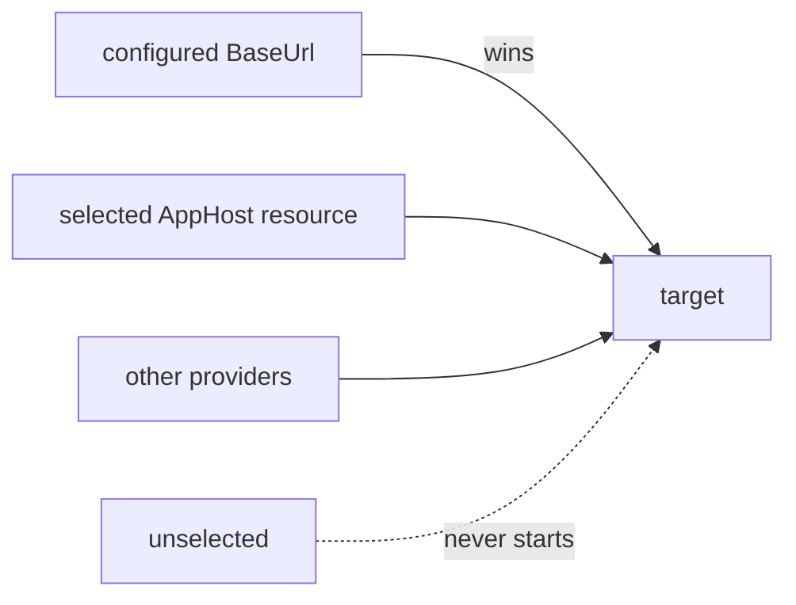

# Aspire

## What it adds

`ProtoTest.Aspire` runs an Aspire AppHost with the suite: the run starts the AppHost's own entry point after the infrastructure registered before it, each declared resource's endpoint is published as its application's `BaseUrl`, and the run stops the AppHost after the reports are written. Per-test contexts and the trace work on top. A test resolves the address and calls it.

## Install

```bash
dotnet add package ProtoTest.Aspire
```

The package targets `net8.0`, `net9.0` and `net10.0`, and the Aspire release is pinned once centrally: `Aspire.Hosting.Testing` in `Directory.Packages.props`, the `Aspire.AppHost.Sdk` version in `global.json`. The test AppHost itself is an Aspire AppHost SDK project, so restoring the suite needs NuGet access.

## Compose

```csharp
builder
    .AddAspireAppHost<TestAppHostAnchor>("api")
    .AddHttpReadiness("api", "/")
    .AddApplication("api", app => app
        .AddRest(rest => rest.AddClient("api")));
```

Registration order is start order. Register containers and other pieces before the AppHost when it needs them. Register the readiness probe after the AppHost: probes are awaited at their registration position, so a probe registered first resolves nothing.

The AppHost **serves only when selected**: `ProtoTest:Aspire:Enabled` starts every AppHost provider, or `ProtoTest:Aspire:Resources:{resource}:Enabled` starts one resource. Without either key it never starts. See [Options and keys](#options-and-keys).



:::caution[Selection keys must reach the host]
Setting the selection keys in a shell is not enough on its own: the host starts with an empty configuration, so `ProtoTest__Aspire__Enabled=true` reaches it only when the suite added `.AddEnvironmentVariables()` (or the runner supplied its own sources). A key that never arrives reads as unset and the AppHost stays off even though the shell shows it set; see [Adding configuration sources](../getting-started/configuration.md#adding-configuration-sources).
:::

`TEntryPoint` is any public type in the AppHost assembly; the testing host runs the assembly's entry point in-process. A top-level `Program` is internal, so expose an anchor:

```csharp
namespace MyApp.AppHost;

/// <summary>Anchor for the suite: pins the AppHost assembly for the Aspire testing host.</summary>
public sealed class AppHostAnchor;
```

`AddAspireAppHost` can be called more than once for different AppHosts; repeating the same entry point with the same composition is one AppHost, while the same entry point with different resources throws instead of silently dropping the second registration. Registering one resource under two AppHosts throws the same way.

### Serving targets through the chain

An AppHost can be one provider among others: register it, then reference its resources from the
targets they serve. The AppHost serves a target when the integration-owned selection key
`ProtoTest:Aspire:Enabled` is set (an environment variable in the run script), or when the served
resource's own key `ProtoTest:Aspire:Resources:{resource}:Enabled` is set: the global key selects
every AppHost provider, the resource's key only that resource's. A configured provider earlier in the
chain wins over it, and a target it serves needs no plain registration.

```csharp
builder
    .AddAspireAppHost<OpenCsmsAppHostAnchor>(options => options
        .MapConnectionString("opencsms", "ConnectionStrings:Csms"),
        "api")
    .AddApplication("Csms", app => app
        .UseConfigured()
        .UseAspireResource<OpenCsmsAppHostAnchor>("api")
        .UseInProcess<CsmsApi>())
    .AddInfrastructure("CsmsDatabase", piece => piece
        .UseConfigured()
        .UseAspireResource<OpenCsmsAppHostAnchor>("opencsms")
        .UseContainer(PostgresDatabase.Container()),
        "ConnectionStrings:Csms");
```

- `UseAspireResource<OpenCsmsAppHostAnchor>("api")` on an application chain publishes the resource's
  endpoint under the application's derived `BaseUrl`. On an infrastructure chain it publishes the
  resource's **connection string** under every key the target declares.
- `ProtoAspireOptions.MapConnectionString(resource, key)` fills a key no target declares; the mapping
  is declared on the AppHost registration, so it joins the chain's keys like every other mapping.
- The AppHost starts **once** when it wins any target, at its registration position; a losing provider
  never starts it, and a target whose configured provider wins skips it without starting anything.
- The mixed compositions are one selection key away. Setting only
  `ProtoTest__Aspire__Resources__opencsms__Enabled=true` runs the store through the AppHost while the application stays in-process; setting only
  `ProtoTest__Aspire__Resources__api__Enabled=true` runs the AppHost's application against the suite
  container. `ProtoTest:Aspire:Enabled` keeps meaning "every AppHost provider".

The run hands the AppHost its configuration, the settings earlier infrastructure published and the
options' `Set` values, as command-line arguments in that order (each layer wins over the one before
it). The AppHost's own graph reads them - `builder.Configuration["ConnectionStrings:Csms"]` decides
whether it declares its own store, and `AddConnectionString`/`WithEnvironment` bridges a provided
value into its projects - so a suite container's address reaches the AppHost exactly as it reaches
the suite's readers.

The plain `AddAspireAppHost` registration follows the same selection semantics: it is one target whose
providers are the configured provider, the selected AppHost provider and a fallback, so a suite that
registers it without a selection key keeps resolving its targets through the other providers, and the
AppHost starts only when a selection key is set and at least one key it fills is not configured. The
skip record names the condition (`unselected`, or the missing keys for `configured`) like any other
chain.

The example above wires one AppHost, one probe, and one client.


*The API resource the AppHost starts serves the product dashboard and its public status page.*

## The tasks

```csharp
[ProtoTest]
public async Task Health_endpoint_answers()
{
    var address = Proto.Context.AspireResource("api");

    using var http = new HttpClient();
    using var response = await http.GetAsync(address);
    response.EnsureSuccessStatusCode();
}
```

`AspireResource` returns the base address the AppHost published for the resource, or the configured address when the run points at a deployed topology. The application's REST, GraphQL and gRPC clients resolve the same address, so the journey in [Compose](#compose) calls the resource through the normal client. The suite's composition for one AppHost, one probe and one client is in `tests/ProtoTest.Aspire.Tests/AspireAppHostTests.cs`.

## Options and keys

```csharp
builder.AddAspireAppHost<TestAppHostAnchor>(
    options => options
        .MapResource("api", "Api")
        .UseEndpoint("api", "https")
        .Set("Seed:Catalog", "smoke"),
    "api");
```

| Key | Type | Default | Means |
| --- | --- | --- | --- |
| `ProtoTest:Aspire:Enabled` | bool | unset → no AppHost provider serves | the global selection key; set it (`ProtoTest__Aspire__Enabled=true`) to resolve every AppHost provider's targets through the AppHost |
| `ProtoTest:Aspire:Resources:{resource}:Enabled` | bool | unset → only the global key selects the resource | the per-resource selection key; set it (`ProtoTest__Aspire__Resources__api__Enabled=true`) to resolve that resource's targets through the AppHost while the run's other targets stay on their other providers |
| `ProtoTest:Applications:{resource}:BaseUrl` | string | unset → the AppHost publishes it | set it to point the suite at a deployed topology instead of starting the AppHost; a configured key wins over the started AppHost's address for that resource |

`MapResource` publishes the resource under a different application name; `UseEndpoint` reads a non-default endpoint of the resource (the default is `http`); `MapConnectionString` publishes a resource's connection string under a target's key instead of an address; `Set` passes a setting to the AppHost as a command-line argument on top of the run's configuration and the settings earlier infrastructure published; the AppHost otherwise reads its own sources. Two resources cannot share one application name.

`UseEndpoint` chooses among the endpoints the AppHost declares, and the default is the resource's `http` endpoint. A project resource with no `http` endpoint (no `WithHttpEndpoint`, and no `applicationUrl` in a launch profile) fails the start with *"Aspire resource 'api' has no 'http' endpoint"*; declare the endpoint in the AppHost, or point `UseEndpoint` at the one the resource exposes.

## Context API

```csharp
string AspireResource(this ProtoExecutionContext context, string resource);
```

An unknown resource throws naming `AddAspireAppHost` and the resources the run composed; a resource whose address is neither published nor configured throws naming its `BaseUrl` key.

## In the trace and coverage

```text
run entity aspire · Aspire AppHost · MyApp.AppHost
├─ aspire.resource.api.address = https://localhost:5001 (endpoint http, AppHost published)
└─ aspire.resource.opencsms.address_source = configuration (key already filled, AppHost never started for it)
```

The AppHost is run-scoped infrastructure: the trace records an `aspire` run entity named `Aspire AppHost · {assembly}`, the run overview lists an `aspire` capability named for the AppHost assembly, and the entity carries the published endpoints as evidence (`aspire.resource.{resource}.address`, with the endpoint name beside it; a resource whose key configuration already fills carries `aspire.resource.{resource}.address_source = configuration`, and one another provider serves carries `..._source = not selected`). A published connection string is presence-only evidence (`aspire.resource.{resource}.connection_string = [REDACTED]`): entity state reaches the archive unredacted, so the secret never lands in the trace. A release failure follows the same path as any other run resource.

## Choosing between a worker and an AppHost

| | `ProtoTest.Hosting` worker | `ProtoTest.Aspire` AppHost |
| --- | --- | --- |
| Runs | the worker's own entry point **in-process** | the topology as a **closed box** outside the test process |
| Shares | process, container and clock with the test | only endpoints |
| Sees | white-box accessors reach the worker's services | service discovery, ports and process boundaries |
| Proves | the host's services, driven or inspected | the deployed topology |

Choose the worker when the test drives or inspects the host's services; choose the AppHost when the test must prove the deployed topology, including service discovery, ports and process boundaries. Neither substitutes for the other: the closed-box limits below apply only here.

## Skip

- The registration adds the capability `aspire` named for the AppHost assembly while the AppHost serves - selected and not fully configured - so `[RequiresCapability("aspire")]` proves composition. Tests that need one resource's application target use `[RequiresApplication]`.
- The AppHost needs Aspire's orchestration binaries at runtime. A machine without them fails the start with `ProtoAspireUnavailableException`; catch it to skip with its reason instead of failing:

```csharp
try
{
    await host.StartAsync();
}
catch (ProtoAspireUnavailableException exception)
{
    Assert.Ignore($"The Aspire orchestration runtime is unavailable: {exception.Message}");
    return;
}
```

## Limits

- **Closed box.** No per-test service substitution and no in-process assertions: the suite cannot reach the AppHost's container, replace its services or read its memory. White-box tests belong in `ProtoTest.Hosting`.
- **The suite's AppHost leg is `net10.0`.** The package ships `net8.0`/`net9.0`/`net10.0` assets; the test AppHost cannot multi-target because DCP launches its project resources with `dotnet run`, which cannot choose a target framework for a multi-targeted project.
- **One instance per run.** The AppHost is shared by every test in the run; tests must not assume a fresh topology per test.
- **No per-test lifetime.** `AddAspireAppHost` has no `PerTest` option; a topology that must restart between tests is not supported.
- **Start does not wait for readiness.** `StartAsync` completing means the AppHost accepted the topology, not that every resource answers. Register `AddHttpReadiness` after the AppHost for the HTTP resources tests call.
- **A configured address wins per resource.** Every declared key configured skips the AppHost entirely even when selected; with only some configured it starts and publishes only the selected missing keys, so `AspireResource` returns the configured value for one resource and the AppHost's address for another.
- **An AppHost serves only when selected.** Every AppHost provider - the ones `UseAspireResource` adds and the one `AddAspireAppHost` registers - holds on the global `ProtoTest:Aspire:Enabled` or on the resource's own `ProtoTest:Aspire:Resources:{resource}:Enabled`; a suite that registers the AppHost but sets neither key never starts it and resolves every target through its other providers. The AppHost publishes only the selected resources' keys, so selecting one resource leaves the others on their other providers.
- **The AppHost reads the run's settings, it does not inherit the run's graph.** The configuration, the settings earlier infrastructure published and the options travel to the AppHost as command-line arguments; bridging them into the AppHost's projects (`AddConnectionString`, `WithEnvironment`, a conditional resource) stays the AppHost project's code, because only it knows its graph.
- **A connection-string resource has no endpoint.** `MapConnectionString` replaces the resource's endpoint publish, and a resource that exposes neither an endpoint nor a connection string fails the AppHost start naming the resource.
- **The AppHost project restores the Aspire SDK from NuGet.** Offline restores cannot build a suite that composes one.

## Links

- [Background workers](./hosting.md) - the in-process alternative and how to choose.
- [Infrastructure](../foundation/infrastructure.md) - run-scoped settings and readiness.
- [REST clients](./rest/index.md) - calling a published resource through its application.
