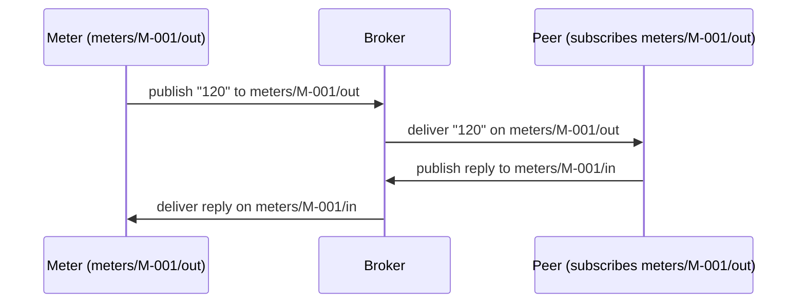

# Devices

## What it adds

`ProtoTest.Devices` talks to devices the way other integrations talk to APIs: a typed device class per kind of device, one instance per test, and every exchange in the same trace. The transport is a separate package - `ProtoTest.Devices.WebSocket` for sockets, `ProtoTest.Devices.Mqtt` for publish/subscribe - so the same suite runs against a simulator in CI and lab hardware on a bench.

## Install

```bash
dotnet add package ProtoTest.Devices
dotnet add package ProtoTest.Devices.WebSocket              # ws:// and wss:// endpoints
dotnet add package ProtoTest.Devices.WebSocket.AspNetCore   # in-process endpoints, no socket
dotnet add package ProtoTest.Devices.Mqtt                   # MQTT publish/subscribe
dotnet add package ProtoTest.Devices.Mqtt.Testcontainers    # a Mosquitto broker for the run
```

## Defining a device

Derive from `ProtoDevice` and give it the domain methods your scenario reads; the protected primitives (`ConnectAsync`, `SendAsync`, `ReceiveAsync`, `ExpectAsync`) carry the trace and coverage:

```csharp
public sealed class AcCharger : ProtoDevice
{
    public async ValueTask<string> BootAsync()
    {
        await SendTextAsync("BOOT");
        var ack = await ExpectAsync(
            "the charger acknowledges boot",
            frame => frame.TryGetText(out var text) && text == "BOOT_ACK");
        return ack.AsText();
    }
}
```

`ExpectAsync` is the assertion: it waits for the frame the behaviour depends on, contributes device coverage, and a timeout fails with the description and the frames exchanged so far.

## Compose

```csharp
builder.AddDevices(devices => devices
    .AddWebSocketClient("Chargers", address: "ws://localhost:9000", path: "/ocpp/{deviceId}")
        .AddDevice<AcCharger>()
        .AddProtocol<OcppProtocol>());
```

Declare each client once: its transport, its address rules, its transport settings, and its typed devices and protocol catalog. The device id is passed to `For`, and `{deviceId}` is filled from it in the address, the path and a setting value. For anything more dynamic, pass a resolver instead of an address (`ProtoDeviceAddress.Template` and `.FromApplication` build the common ones).

A client can carry transport settings the transport reads off the endpoint; a hand-written transport names its own keys:

```csharp
// A transport the suite registered itself reads the settings it named.
devices.AddClient("Chargers", "MyTransport", resolveAddress: ProtoDeviceAddress.Template("memory://localhost:9000"))
    .WithSetting("model", "AC-{deviceId}")     // filled per device, like an address template
    .AddDevice<AcCharger>();
```

Settings are per client, handed to the transport unchanged and filled per device, so `{deviceId}` resolves in a value like it does in an address. The trace never records them, so a credential belongs here rather than in the address. The MQTT transport names its keys this way (`publishTopic`/`subscribeTopic`).

Inside `AddApplication`, a client without an address uses the application's address, with `http(s)` becoming `ws(s)`, so the same suite follows the application from the simulator to staging:

```csharp
builder.AddApplication("Api", app => app
    .AddAspNetCoreServer<Program>()
    .AddDevices(devices => devices
        .AddWebSocketClient("Chargers", path: "/ocpp/{deviceId}")
            .AddDevice<AcCharger>()));
```

An application hosted **in-process** has no listening socket. Register the in-process transport once per application and keep the same client registration: it uses the application's `TestServer` when the application is hosted in-process, and the configured address (socket) when it is published - so switching modes never touches the client:

```csharp
builder
    .AddInProcessWebSocketDevices<Program>("Api")
    .AddApplication("Api", app => app
        .AddAspNetCoreServer<Program>()                  // present in-process, absent when published
        .AddDevices(devices => devices
            .AddWebSocketClient("Chargers", path: "/ocpp/{deviceId}")
                .AddDevice<AcCharger>()));
```

The registration is keyed by `(TProgram, application)`: a second application, or a second program, gets its own transport, and a client is only routed through the transport of the application it was registered under - two applications exposing the same path each serve their own clients. A client that has only a path (no address resolver) and no matching in-process transport fails naming the application instead of falling back to another transport.

The shared connect bound lives in `ProtoTest.Devices`: `ProtoDeviceConnect.WithTimeoutAsync` bounds the connect with the registered `ConnectTimeout` and reports an elapsed attempt as a `TimeoutException` naming the endpoint; the socket, in-process and MQTT transports all use it.

### MQTT

`ProtoTest.Devices.Mqtt` talks to devices over publish/subscribe: a client declares one publish topic and one subscribe filter, `{deviceId}` is filled from the id passed to `For`, and the broker is the simulator in CI or the real one behind the lab.

```csharp
builder.AddDevices(devices => devices
    .AddMqttClient("Meters", "meters/{deviceId}/out", "meters/{deviceId}/in")
        .AddDevice<FlowMeter>()
        .AddProtocol<FlowProtocol>());
```

A send publishes to the publish topic; a receive yields the next message the subscribe filter matched, wildcards included. Text and binary frames stay themselves - the frame's media type rides the MQTT 5 content type. The registration carries both topics as endpoint settings (`publishTopic` and `subscribeTopic`, `{deviceId}` filled per device), so the trace records the broker address and the topics stay out of it. A client registered directly with `AddClient` may instead name both in the address query (`mqtt://host:port?publishTopic=…&subscribeTopic=…`); the transport reads the settings first and falls back to the address parameter, so a setting always wins.

A client without an address or a resolver resolves `ProtoTest:Devices:Mqtt:Broker`, so it needs a configured value or a registered piece that declares the key. `[RequiresDevice<TDevice>]` follows that: with no address, resolver or key the device capabilities are absent and gated tests skip instead of failing at device creation. An explicit `address:` or a resolver comes from code, so the capabilities stay unconditional.

The broker address comes from the registration (`address:`), from a resolver, or from `ProtoTest:Devices:Mqtt:Broker`. The container package starts a Mosquitto broker for the run and publishes its address under that key, so a client registered without an address follows the run's broker:

```csharp
builder
    .AddInfrastructure("Mqtt", chain => chain
        .UseConfigured()
        .UseContainer(MosquittoBroker.Container()), MqttDeviceOptions.BrokerSetting)
    .AddDevices(devices => devices
        .AddMqttClient("Meters", "meters/{deviceId}/out", "meters/{deviceId}/in")
            .AddDevice<FlowMeter>());
```

A configured `ProtoTest:Devices:Mqtt:Broker` (the environment's broker) steps the container aside like every provider chain, and the same registration follows it.

## The tasks

```csharp
[ProtoTest]
[RequiresDevice<AcCharger>]
public async Task A_charger_boots_and_acknowledges()
{
    var charger = Proto.Context.Devices("Chargers").For<AcCharger>("CP-001");
    await charger.BootAsync();
}
```

One instance per (client, type, id) and test, released with the test; a second `For` in the same test returns the same instance. `Devices()` without a name works when exactly one client is registered.

### A conversation with a test-side peer

A second client whose topics are swapped is the test-side peer for an MQTT device: it publishes what the device receives and receives what the device publishes, so the whole conversation stays in the suite. Both clients use the same `{deviceId}`, and both resolve the run's broker:



```csharp
public sealed class FlowMeter : ProtoDevice
{
    public ValueTask PublishReadingAsync(string reading) => SendTextAsync(reading);

    public async ValueTask<string> AwaitReadingAsync()
    {
        var frame = await ExpectAsync(
            "the peer reads a flow reading",
            candidate => candidate.TryGetText(out _),
            TimeSpan.FromSeconds(5));
        return frame.AsText();
    }
}
```

```csharp
builder
    .AddInfrastructure("Mqtt", chain => chain
        .UseConfigured()
        .UseContainer(MosquittoBroker.Container()), MqttDeviceOptions.BrokerSetting)
    .AddDevices(devices => devices
        .AddMqttClient("Meters", "meters/{deviceId}/out", "meters/{deviceId}/in")
            .AddDevice<FlowMeter>()
        .AddMqttClient("Peer", "meters/{deviceId}/in", "meters/{deviceId}/out")
            .AddDevice<FlowMeter>());
```

```csharp
[ProtoTest]
[RequiresDevice<FlowMeter>]
public async Task A_meter_converses_with_a_test_side_peer()
{
    var meter = Proto.Context.Devices("Meters").For<FlowMeter>("M-001");
    var peer = Proto.Context.Devices("Peer").For<FlowMeter>("M-001");

    await meter.PublishReadingAsync("120");            // meters/M-001/out
    var reading = await peer.AwaitReadingAsync();      // Peer subscribes to meters/M-001/out

    Assert.That(reading, Is.EqualTo("120"));
}
```

### Simulator or hardware

No entry is registered per device id. `[RequiresDevice<TDevice>]` skips a test when the device type is not registered on any client, so a lab-only suite runs where the hardware is and skips elsewhere; point the application's address (or the client's resolver) at the simulator or the bench and the same tests run against either.

## Coverage with gaps

A matched `ExpectAsync` records the message kind its `IProtoDeviceProtocol` classifies. `DeviceCoverageCollector` reports every catalog entry no test asserted as a gap - the OpenAPI treatment for a device protocol:

```csharp
builder.ConfigureServices(services => services.AddSingleton<IProtoCollector>(
    new DeviceCoverageCollector("Devices", [new OcppProtocol()])));
```

## Transport options

The WebSocket backend takes code defaults in `AddWebSocketClient(..., configure)` (or the same callback on `AddInProcessWebSocketDevices<TProgram>(application, configure)`) and lets configuration override them; the in-process
transport resolves and validates the same registered options, so a bad value fails when the device is
created and `ConnectTimeout` bounds the in-process connect too:

| Key | Meaning | Default |
| --- | --- | --- |
| `ProtoTest:Devices:WebSocket:ConnectTimeout` | how long a connection attempt may take | 10 s |
| `ProtoTest:Devices:WebSocket:ReceiveBufferBytes` | the buffer a receive reads into | 16 KB |
| `ProtoTest:Devices:WebSocket:KeepAliveInterval` | the keep-alive interval | unset |

The MQTT backend takes the same shape - code defaults in `AddMqttClient(..., configure)`, overridden by configuration, validated when the device is created:

| Key | Meaning | Default |
| --- | --- | --- |
| `ProtoTest:Devices:Mqtt:Broker` | the broker address a client without one resolves | unset |
| `ProtoTest:Devices:Mqtt:ConnectTimeout` | how long a connection attempt may take | 10 s |
| `ProtoTest:Devices:Mqtt:KeepAlivePeriod` | the keep-alive interval sent to the broker | library default |
| `ProtoTest:Devices:Mqtt:MaxPacketBytes` | the largest MQTT packet the client accepts, offered to the broker as MQTT 5 `MaximumPacketSize`; 0 reads without a cap | 4 MiB |

## In the trace and coverage

A `device` entity per device (client, type, transport, address, connection state) and `device.connect`,
`device.send`, `device.receive` and `device.command` operations; a failed expectation is a failed
`device.command` carrying the awaited description and the frame log. The entity id is
`device:{client}:{deviceType}:{id}`, so two device types can share an id, and the test's end disconnects
the device: the final state is `device.connected = false` with a `device.disconnect` event, even when
the test never called `DisconnectAsync`.

## Limits

- **One instance per (client, type, id) per test.** Devices are not shared across tests; state that must persist belongs to the product.
- **One conversation per device instance.** Connection creation is single-flight and sends are serialized; one receive may be in flight at a time - a second concurrent receive fails fast naming the device instead of stealing frames. A send that races a disconnect fails with a device error naming the device. Send and receive may run concurrently.
- **Per-client configuration, resolved per device.** The client's address template or resolver, its settings and the device id are the whole story; `{deviceId}` resolves in the address, the path and a setting value alike, and the shared transport options stay per run.
- **In-process endpoints follow the application's winner.** When `AddInProcessWebSocketDevices<TProgram>(application)` is registered, the client uses the application's `TestServer` while the application's provider chain is served in-process (`UseInProcess<TProgram>()`, or `AddAspNetCoreServer` without a chain); when a configured, loopback or AppHost provider wins, the same registration declines and the socket at the winner's address serves it. The transport belongs to one `(TProgram, application)` pair, so multi-application suites route each client to its own application, and its `device` capability is declared only while the in-process winner can actually serve it.
- **`ExpectAsync` consumes frames.** The bounded exchange log is for failure messages, not for matching a frame twice.
- **Two transports ship.** WebSocket and MQTT are available; there is no TCP/serial transport.
- **MQTT speaks MQTT 5 over plain TCP.** `mqtt://` only. An MQTT 3.1.1-only broker and `mqtts://` fail the connect.
- **An MQTT client carries one publish topic and one subscribe filter.** `{deviceId}` is the only placeholder, so one client covers one topic convention; two device families are two clients. The filter may use the `+` and `#` wildcards, the publish topic may not.
- **MQTT transport options are one set per run.** Connect timeout, keep-alive, the packet cap and a broker set through `configure` are shared by every MQTT client; a client that needs its own broker passes a resolver, because a configured or container broker wins over the registration's `address:`.
- **A missing MQTT broker drops the device capabilities.** A client registered without an address or a resolver declares `ProtoTest:Devices:Mqtt:Broker` as its address key, so `[RequiresDevice<TDevice>]` skips while no configured value and no registered piece (a Mosquitto container) can provide it. An ungated test still fails when the device is created, naming the key; an explicit `address:` or a resolver is code-provided and keeps the capabilities unconditional.
- **The MQTT broker is shared state.** One broker serves the run (and a parallel suite), so tests publish and subscribe in their own topic namespace; ProtoTest leaves no topics behind and cleans up none.
- **The transport moves frames.** Protocol semantics - message kinds, sessions, OCPP operations - are the suite's code, and coverage only names what the catalog declares.

## Writing a transport

A hand-written in-process transport applies `ProtoTestContextPropagation.ApplyTo(HttpRequest)` (from `ProtoTest.AspNetCore`) to the request it opens, so the handshake carries the test id and the application's clock bridge pushes the connecting test's clock, exactly like the in-process HTTP client.
