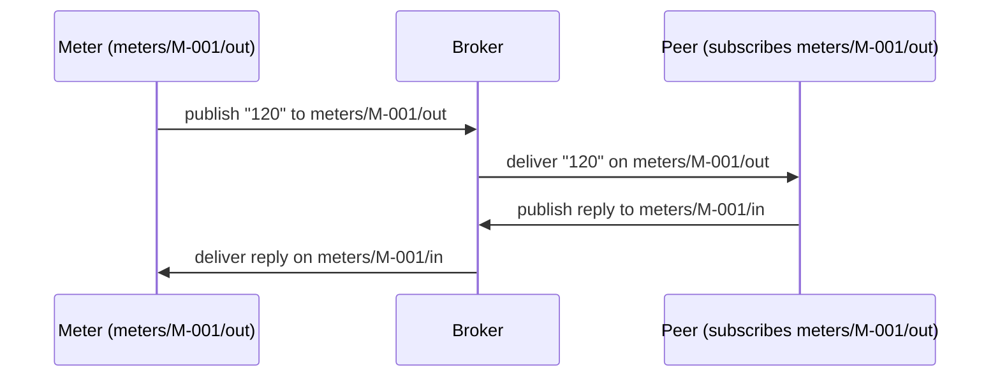

# Devices

`ProtoTest.Devices` talks to devices the way other integrations talk to APIs: a typed device class per kind of device, one instance per test, and every exchange in the same trace.

```csharp
[ProtoTest]
[RequiresDevice<AcCharger>]
public async Task A_charger_boots_and_acknowledges()
{
    var charger = Proto.Context.Devices("Chargers").For<AcCharger>("CP-001");
    await charger.BootAsync();
}
```

Run it with `dotnet test`. A green run prints `Passed A_charger_boots_and_acknowledges`, and the trace records a `device` entity with `device.command` operations for the exchange.

## What it adds

- **Typed devices.** You write a class per kind of device, with domain methods such as `BootAsync`. A test asks for one by id.
- **One instance per test.** It connects on first use and disconnects when the test ends.
- **Every exchange in the trace**, with the frames sent and received.
- **Protocol coverage.** A catalog of message kinds reports the ones no test asserted.

The transport is a separate package, `ProtoTest.Devices.WebSocket` for sockets and `ProtoTest.Devices.Mqtt` for
publish/subscribe. So the same suite runs against a simulator in CI and lab hardware on a bench.

## Install

```bash
dotnet add package ProtoTest.Devices
dotnet add package ProtoTest.Devices.WebSocket              # ws:// and wss:// endpoints
dotnet add package ProtoTest.Devices.WebSocket.AspNetCore   # in-process endpoints, no socket
dotnet add package ProtoTest.Devices.Mqtt                   # MQTT publish/subscribe
dotnet add package ProtoTest.Devices.Mqtt.Testcontainers    # a Mosquitto broker for the run
```

## Compose

```csharp
builder.AddDevices(devices => devices
    .AddWebSocketClient("Chargers", address: "ws://localhost:9000", path: "/ocpp/{deviceId}")
        .AddDevice<AcCharger>()
        .AddProtocol<OcppProtocol>());
```

Declare each client once: its transport, its address, its settings, its device types and its protocol catalog. A
test passes the device id to `For`, and `{deviceId}` is filled in from it, in the address, the path and any setting.
For anything more dynamic, pass a resolver instead of an address. `ProtoDeviceAddress.Template` and
`.FromApplication` build the common ones.

### Settings

A client can carry settings for its transport. A hand-written transport names its own keys:

```csharp
// A transport the suite registered itself reads the settings it named.
devices.AddClient("Chargers", "MyTransport", resolveAddress: ProtoDeviceAddress.Template("memory://localhost:9000"))
    .WithSetting("model", "AC-{deviceId}")     // filled per device, like an address template
    .AddDevice<AcCharger>();
```

Settings go to the transport unchanged, with `{deviceId}` filled in per device. The trace never records them, so a
credential belongs in a setting rather than in the address. The MQTT transport uses this for its topics
(`publishTopic` and `subscribeTopic`).

### Following an application

Inside `AddApplication`, a client without an address uses the application's address, with `http(s)` becoming
`ws(s)`. The same suite then follows the application from the simulator to staging:

```csharp
builder.AddApplication("Api", app => app
    .AddAspNetCoreServer<Program>()
    .AddDevices(devices => devices
        .AddWebSocketClient("Chargers", path: "/ocpp/{deviceId}")
            .AddDevice<AcCharger>()));
```

An application hosted **in-process** has no listening socket. Register the in-process transport once per
application, and keep the same client. It uses the application's `TestServer` while the application runs
in-process, and the socket at the configured address when it is published. Switching modes never touches the
client:

```csharp
builder
    .AddInProcessWebSocketDevices<Program>("Api")
    .AddApplication("Api", app => app
        .AddAspNetCoreServer<Program>()                  // present in-process, absent when published
        .AddDevices(devices => devices
            .AddWebSocketClient("Chargers", path: "/ocpp/{deviceId}")
                .AddDevice<AcCharger>()));
```

Each in-process transport belongs to one `(TProgram, application)` pair. A client is routed only through the
transport of its own application, so two applications with the same path each serve their own clients. A client
with only a path, and no matching in-process transport, fails naming the application instead of falling back to
another transport.

Every transport bounds its connect the same way: `ProtoDeviceConnect.WithTimeoutAsync` applies the registered
`ConnectTimeout`, and an attempt that runs out is a `TimeoutException` naming the endpoint.

### MQTT

`ProtoTest.Devices.Mqtt` talks to devices over publish/subscribe. A client declares one publish topic and one
subscribe filter, with `{deviceId}` filled in from the id passed to `For`. The broker is a simulator in CI, or the
real one behind the lab.

```csharp
builder.AddDevices(devices => devices
    .AddMqttClient("Meters", "meters/{deviceId}/out", "meters/{deviceId}/in")
        .AddDevice<FlowMeter>()
        .AddProtocol<FlowProtocol>());
```

- A send publishes to the publish topic. A receive returns the next message the subscribe filter matched, wildcards included.
- Text and binary frames keep their form. The frame's media type travels as the MQTT 5 content type.
- The topics are settings (`publishTopic` and `subscribeTopic`), so the trace records the broker address but not the topics.
- A client registered directly with `AddClient` may put both topics in the address query instead (`mqtt://host:port?publishTopic=…&subscribeTopic=…`). A setting wins over the address.

The broker address comes from `address:`, from a resolver, or from `ProtoTest:Devices:Mqtt:Broker`. The container
package starts a Mosquitto broker for the run and publishes its address under that key, so a client without an
address follows the run's broker:

```csharp
builder
    .AddInfrastructure("Mqtt", chain => chain
        .UseConfigured()
        .UseContainer(MosquittoBroker.Container()), MqttDeviceOptions.BrokerSetting)
    .AddDevices(devices => devices
        .AddMqttClient("Meters", "meters/{deviceId}/out", "meters/{deviceId}/in")
            .AddDevice<FlowMeter>());
```

A configured `ProtoTest:Devices:Mqtt:Broker`, the environment's broker, wins over the container, as in every
provider chain, and the same registration follows it.

`[RequiresDevice<TDevice>]` follows the broker too. A client with no address, resolver or broker key has no device
capability, so gated tests skip instead of failing when the device is created. An explicit `address:` or a
resolver comes from code, so the capability stays.

## The tasks

The `A_charger_boots_and_acknowledges` test above is the whole pattern: resolve the device for an id, call its domain method.

There is one instance per client, type, id and test, released with the test. A second `For` in the same test
returns the same instance. `Devices()` without a name works when exactly one client is registered.

Beyond that:

1. [Define a device class](#defining-a-device) with the domain methods your scenarios use.
2. [Let a test-side peer talk to an MQTT device](#a-conversation-with-a-test-side-peer).
3. [Run the same tests on a simulator or on hardware](#simulator-or-hardware).
4. [Report the message kinds no test asserted](#coverage-with-gaps).

### Defining a device

Derive from `ProtoDevice` and give it the domain methods your scenarios read. The protected primitives
(`ConnectAsync`, `SendAsync`, `ReceiveAsync`, `ExpectAsync`) record the trace and the coverage:

```csharp
public sealed class AcCharger : ProtoDevice
{
    public async ValueTask<string> BootAsync()
    {
        await SendTextAsync("BOOT");
        var ack = await ExpectAsync(
            "the charger acknowledges boot",
            frame => frame.TryGetText(out var text) && text == "BOOT_ACK");
        return ack.AsText();
    }
}
```

`ExpectAsync` is the assertion. It waits for the frame the behavior depends on and counts toward device coverage.
A timeout fails with the description and the frames exchanged so far.

### A conversation with a test-side peer

A second client with the topics swapped acts as the other side of an MQTT device. It publishes what the device
receives, and receives what the device publishes, so the whole conversation stays in the suite. Both clients use
the same `{deviceId}` and the run's broker:



```csharp
public sealed class FlowMeter : ProtoDevice
{
    public ValueTask PublishReadingAsync(string reading) => SendTextAsync(reading);

    public async ValueTask<string> AwaitReadingAsync()
    {
        var frame = await ExpectAsync(
            "the peer reads a flow reading",
            candidate => candidate.TryGetText(out _),
            TimeSpan.FromSeconds(5));
        return frame.AsText();
    }
}
```

```csharp
builder
    .AddInfrastructure("Mqtt", chain => chain
        .UseConfigured()
        .UseContainer(MosquittoBroker.Container()), MqttDeviceOptions.BrokerSetting)
    .AddDevices(devices => devices
        .AddMqttClient("Meters", "meters/{deviceId}/out", "meters/{deviceId}/in")
            .AddDevice<FlowMeter>()
        .AddMqttClient("Peer", "meters/{deviceId}/in", "meters/{deviceId}/out")
            .AddDevice<FlowMeter>());
```

```csharp
[ProtoTest]
[RequiresDevice<FlowMeter>]
public async Task A_meter_converses_with_a_test_side_peer()
{
    var meter = Proto.Context.Devices("Meters").For<FlowMeter>("M-001");
    var peer = Proto.Context.Devices("Peer").For<FlowMeter>("M-001");

    await meter.PublishReadingAsync("120");            // meters/M-001/out
    var reading = await peer.AwaitReadingAsync();      // Peer subscribes to meters/M-001/out

    Assert.That(reading, Is.EqualTo("120"));
}
```

### Simulator or hardware

Nothing is registered per device id. `[RequiresDevice<TDevice>]` skips a test when no client registers that device
type, so a lab-only suite runs where the hardware is and skips elsewhere. Point the application's address, or the
client's resolver, at the simulator or the bench, and the same tests run against either.

## Coverage with gaps

A matched `ExpectAsync` records the message kind its `IProtoDeviceProtocol` recognizes. `DeviceCoverageCollector`
reports every kind in the catalog that no test asserted as a gap, as the OpenAPI integration does for endpoints:

```csharp
builder.ConfigureServices(services => services.AddSingleton<IProtoCollector>(
    new DeviceCoverageCollector("Devices", [new OcppProtocol()])));
```

A report row names the message kind, whether a test asserted it, and how often:

```text
kind        status    count
PING_ACK    covered   1
PONG_ACK    gap       0  (no test asserted it)
```

## Transport options

Each transport takes code defaults, and configuration overrides them. Bad values fail when the device is created.

The WebSocket transport takes its defaults in `AddWebSocketClient(..., configure)`, or the same callback on
`AddInProcessWebSocketDevices<TProgram>(application, configure)`. The in-process transport uses the same options,
so `ConnectTimeout` bounds its connect too:

| Key | Meaning | Default |
| --- | --- | --- |
| `ProtoTest:Devices:WebSocket:ConnectTimeout` | how long a connection attempt may take | 10 s |
| `ProtoTest:Devices:WebSocket:ReceiveBufferBytes` | the buffer a receive reads into | 16 KB |
| `ProtoTest:Devices:WebSocket:KeepAliveInterval` | the keep-alive interval | unset |

The MQTT transport takes its defaults in `AddMqttClient(..., configure)`:

| Key | Meaning | Default |
| --- | --- | --- |
| `ProtoTest:Devices:Mqtt:Broker` | the broker address a client without one resolves | unset |
| `ProtoTest:Devices:Mqtt:ConnectTimeout` | how long a connection attempt may take | 10 s |
| `ProtoTest:Devices:Mqtt:KeepAlivePeriod` | the keep-alive interval sent to the broker | library default |
| `ProtoTest:Devices:Mqtt:MaxPacketBytes` | the largest MQTT packet the client accepts, offered to the broker as MQTT 5 `MaximumPacketSize`; 0 reads without a cap | 4 MiB |

## In the trace and coverage

```text
device.command · the peer reads a flow reading
├─ device:Meters:FlowMeter:M-001 (client, type, transport, address, connection state)
├─ predicate + timeout 5s; matched frame → message kind recorded for coverage
└─ timeout fails with the description and the frames exchanged so far
```

- **A `device` entity per device**, with its client, type, transport, address and connection state. Its id is `device:{client}:{deviceType}:{id}`, so two device types can share an id.
- **Operations** `device.connect`, `device.send`, `device.receive` and `device.command`. A failed expectation is a failed `device.command`, with the awaited description and the frame log.
- **A disconnect at the end of the test.** The final state is `device.connected = false`, with a `device.disconnect` event, even when the test never called `DisconnectAsync`.

## Limits

- **One instance per client, type, id and test.** Devices are not shared across tests. State that must last belongs to the product.
- **One conversation per device instance.** Connecting happens once and sends run one at a time. One receive may be waiting at a time: a second fails at once, naming the device, instead of stealing frames. A send and a receive may run together. A send that races a disconnect fails with a device error.
- **Configuration is per client.** The address template or resolver, the settings and the device id are all there is. The transport options are shared by the whole run.
- **In-process endpoints follow the application's provider chain.** With `AddInProcessWebSocketDevices<TProgram>(application)` registered, the client uses the `TestServer` while the in-process provider (`UseInProcess<TProgram>()`, or `AddAspNetCoreServer` without a chain) serves the application. When a configured, loopback or AppHost provider wins, the in-process transport declines, and the socket at that address serves the client. Its `device` capability exists only while the in-process provider can serve it.
- **`ExpectAsync` consumes frames.** The exchange log is for failure messages, not for matching a frame twice.
- **Two transports ship.** ProtoTest ships WebSocket and MQTT. There is no TCP or serial transport.
- **MQTT speaks MQTT 5 over plain TCP.** `mqtt://` only. An MQTT 3.1.1-only broker and `mqtts://` fail the connect.
- **An MQTT client has one publish topic and one subscribe filter.** `{deviceId}` is the only placeholder, so one client covers one topic convention, and two device families need two clients. The filter may use the `+` and `#` wildcards; the publish topic may not.
- **MQTT options are one set per run.** Connect timeout, keep-alive, the packet cap and a broker set through `configure` apply to every MQTT client. A client that needs its own broker passes a resolver, because a configured or container broker wins over `address:`.
- **A missing MQTT broker removes the device capabilities.** A client without an address, a resolver or a broker set through `configure` depends on `ProtoTest:Devices:Mqtt:Broker`. `[RequiresDevice<TDevice>]` skips while nothing provides that key. An ungated test still fails when the device is created, naming the key.
- **The MQTT broker is shared.** One broker serves the run, and a parallel suite, so tests use their own topic namespace. ProtoTest neither leaves topics behind nor cleans any up.
- **The transport moves frames.** Protocol meaning, such as message kinds, sessions and OCPP operations, is the suite's code. Coverage names only what the catalog declares.

## Writing a transport

A hand-written in-process transport applies `ProtoTestContextPropagation.ApplyTo(HttpRequest)` (from `ProtoTest.AspNetCore`) to the request it opens. The handshake then carries the test id, and the application's clock bridge uses the connecting test's clock, as with the in-process HTTP client.
