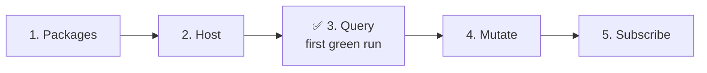

# Your first GraphQL suite

This page goes from a fresh test project to a passing query, a mutation whose result is asserted, and a subscription waiting for an event. It uses NUnit and an in-process server. A deployed endpoint needs one configuration change. Other runners differ only in the setup class ([Test runners](../../runners/overview.md)).



## 1. Add the packages

```bash
dotnet new nunit -n Api.Tests
cd Api.Tests
dotnet add reference ../Api/Api.csproj
dotnet add package ProtoTest.NUnit
dotnet add package ProtoTest.GraphQL
dotnet add package ProtoTest.AspNetCore
```

`ProtoTest.NUnit` needs NUnit 4.6.1 or newer. The standard `dotnet new nunit` template pins an older version, so update NUnit first.

## 2. Configure the host

One `[SetUpFixture]` per test project builds the host, with GraphQL registered under the application so its client shares the application's address:

```csharp
using ProtoTest.AspNetCore;
using ProtoTest.Core;
using ProtoTest.GraphQL;
using ProtoTest.NUnit;

namespace Api.Tests;

[SetUpFixture]
public sealed class Setup : ProtoTestAssembly
{
    protected override void Configure(IProtoHostBuilder builder) =>
        builder.AddApplication("Api", app => app
            .AddAspNetCoreServer<Program>()
            .AddGraphQL(graphQL => graphQL.AddClient("GraphQL", endpoint: "GraphQL")));
}
```

`endpoint: "GraphQL"` appends `ProtoTest:Applications:Api:Endpoints:GraphQL` to the application's address. Set the key when the path differs. The in-process server steps aside when `ProtoTest:Applications:Api:BaseUrl` is configured, so the same suite runs against a deployed environment.

## 3. Query with a shape

```csharp
using NUnit.Framework;
using ProtoTest.Core;
using ProtoTest.GraphQL;
using ProtoTest.Json;

namespace Api.Tests;

[Application("Api")]
public sealed class ViewerTests
{
    [ProtoTest]
    public async Task CountsWorkspaces()
    {
        using var response = await Proto.Context.GraphQL()
            .Query("controlPlane")
            .ExpectAsync(new { workspaceCount = JsonValue.GreaterThan(0) });

        response.Should.HaveNoErrors();
    }
}
```

`ExpectAsync` builds the selection set from the shape and asserts the same shape against the result. `JsonValue` adds constraints beyond equality: greater than, not null, one of. Run it with `dotnet test`. [Queries and mutations](./operations.md) covers variables, the fluent builder and raw documents.

:::tip[Checkpoint: first green run]
`dotnet test` passes after this step. The trace lands at `TestResults/prototest-{runId}.prototrace` with a `graphql.operation` entry for the query. Steps 4 and 5 build on this host without changing it.
:::

## 4. Mutate and read the result

```csharp
using var created = await Proto.Context.GraphQL()
    .Mutation("createOrder", new
    {
        input = Gql.Variable("CreateOrderInput!", new CreateOrderRequest("notebook", 2, 25m))
    })
    .Select(new { id = Gql.Field, status = Gql.Field })
    .ExecuteAsync();

created.Should.HaveNoErrors();
created.Should.MatchShape(new { id = JsonValue.GreaterThan(0), status = "pending" });
```

`Select` names the fields the assertion needs, so the response stays small. `ReadRequired<T>()` deserializes the same response into a record when the test wants a typed value. See [Responses](./responses.md).

## 5. Subscribe to an event

```csharp
await using var subscription = await Proto.Context.GraphQL()
    .Subscription("orderCreated")
    .Select(new { id = Gql.Field, status = Gql.Field })
    .SubscribeAsync();

// The server acknowledges the connection, not the subscription, so trigger until the event lands.
using var timeout = new CancellationTokenSource(TimeSpan.FromSeconds(10));
var triggers = TriggerAsync(timeout.Token);
using var notification = await subscription.ExpectNextAsync(
    new { id = JsonValue.GreaterThan(0), status = "pending" },
    timeout.Token);
timeout.Cancel();
await triggers;

notification.Should.HaveNoErrors();

async Task TriggerAsync(CancellationToken cancellationToken)
{
    while (!cancellationToken.IsCancellationRequested)
    {
        using var created = await Proto.Context.GraphQL()
            .Mutation("createOrder", new
            {
                input = Gql.Variable("CreateOrderInput!", new CreateOrderRequest("live-notebook", 1, 15m))
            })
            .Select(new { id = Gql.Field })
            .ExecuteAsync();
        created.Should.HaveNoErrors();
    }
}
```

Pass a cancellation token. Without one, a subscription with no events waits indefinitely. [Subscriptions](./subscriptions.md) has the full surface, including SSE, connection payloads and custom sockets.

:::tip[Checkpoint: the suite is green]
`dotnet test` passes with all three tests. The trace holds `graphql.operation` entries for the query and the mutation plus `graphql.subscription.start|next|complete` events for the subscription. If the subscription test flakes, check two things: a token on every wait, and triggers that run until the event lands.
:::

## Where the run is recorded

Every call is a ProtoTest trace entry. Queries and mutations record `graphql.operation`, subscriptions record `graphql.subscription.start|next|complete`, and coverage reads the `graphql.response` and `graphql.failure` observations. The details are on the [GraphQL overview](./index.md#in-the-trace-and-coverage) and [ProtoTrace](../../observability/prototrace.md). The trace lands at `TestResults/prototest-{runId}.prototrace` unless `ConfigureTracing` set `OutputPath`. Open it on [trace.prototest.dev](https://trace.prototest.dev).

## Where to next

- [Queries and mutations](./operations.md) - shape-driven, fluent and raw documents, variables and uploads.
- [Responses](./responses.md) - errors, data and assertions.
- [Subscriptions](./subscriptions.md) - WebSocket or SSE, connection payloads, custom sockets.
- [Schema coverage](./coverage.md) - which types, fields and arguments the suite exercised.
