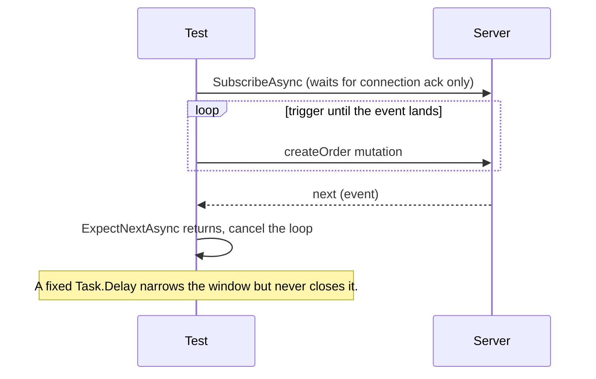

# Subscriptions

Subscriptions stream results over **WebSocket** (the `graphql-transport-ws` protocol, the default) or **Server-Sent Events**. This page shows how to subscribe, wait for the next event with a shape and a timeout, and choose or supply the transport.

## A complete example

```csharp
[ProtoTest]
[SampleUser]
public async Task SubscriptionStreamsShapeMatchedEvents()
{
    var expected = new
    {
        id = JsonValue.GreaterThan(0),
        product = "live-notebook",
        total = 15m,
        status = "pending"
    };

    await using var subscription = await Proto.Context.GraphQL()
        .Subscription("orderCreated")
        .Select(expected)
        .SubscribeAsync();

    // The server acknowledges the connection, not the subscription, so trigger until the event
    // lands; the bounded read below is what waits.
    using var timeout = new CancellationTokenSource(TimeSpan.FromSeconds(10));
    var triggers = TriggerAsync(timeout.Token);
    using var notification = await subscription.ExpectNextAsync(expected, timeout.Token);
    timeout.Cancel();
    await triggers;

    notification.Should.HaveNoErrors();
}

private static async Task TriggerAsync(CancellationToken cancellationToken)
{
    while (!cancellationToken.IsCancellationRequested)
    {
        using var created = await Proto.Context.GraphQL()
            .Mutation("createOrder", new
            {
                input = Gql.Variable("CreateOrderInput!", new CreateOrderRequest("live-notebook", 1, 15m))
            })
            .Select(new { id = Gql.Field })
            .ExecuteAsync();
        created.Should.HaveNoErrors();
    }
}
```

The same `expected` object builds the subscription's selection set and asserts the event that arrives.

:::caution[Subscription registration has no acknowledgement]
`SubscribeAsync` returns after the server acknowledges the connection, not the subscription. Triggering at once can lose the event. Trigger in a loop until `ExpectNextAsync` returns. A fixed `Task.Delay` only narrows the window. In the example above the trigger loop runs on the test's own flow, the bounded `ExpectNextAsync` is the wait, and cancelling the token ends the loop. Every trigger produces an event and the test consumes the first, so a later duplicate is harmless.
:::

## `GraphQLSubscription`

```csharp
public sealed class GraphQLSubscription : IAsyncEnumerable<GraphQLResponse>, IAsyncDisposable
{
    bool IsCompleted { get; }
    GraphQLSubscriptionTransport Transport { get; }

    Task<GraphQLResponse?> NextAsync(CancellationToken cancellationToken = default);   // null = stream ended
    Task<GraphQLResponse> ExpectNextAsync<TShape>(TShape expectedShape, CancellationToken cancellationToken = default);
}
```

Every `GraphQLResponse` you receive is yours to dispose. Only one `NextAsync` may be pending at a time, and a concurrent call throws `InvalidOperationException`.

Because it is `IAsyncEnumerable`, you can also iterate. The enumerator disposes the previous event as it advances, so `await foreach` without a per-element `using` does not leak. The event currently in the loop body, and the last event after the loop, stay yours:

```csharp
await foreach (var message in subscription.WithCancellation(timeout.Token))
{
    using (message)
    {
        message.Should.HaveNoErrors();
        if (++received == 3) break;
    }
}
```

Pass a cancellation token. Without one, a subscription with no events waits indefinitely.

## Connection payload

Many servers authenticate WebSocket connections through the `connection_init` payload rather than headers:

```csharp
await using var subscription = await Proto.Context.GraphQL()
    .ConnectionPayload(new { authToken = token })
    .Subscription("orderCreated")
    .Select(expected)
    .SubscribeAsync();
```

Without `ConnectionPayload`, `connection_init` is sent with a `null` payload.

## Protocol behaviour

Trigger in a loop until the event lands. The timing is where these tests go wrong:



| Behaviour | WebSocket (`graphql-transport-ws`, the default) | SSE |
| --- | --- | --- |
| Handshake | `connection_init` with your payload, wait for `connection_ack`, answer server `ping` with `pong` (echoing the ping payload) | plain HTTP request, no handshake |
| Message mapping | `next` becomes a response, `complete` ends the stream, `error` arrives as a final response with errors | `event: next`, `event: complete` and `event: error` frames map the same way |
| Scheme | endpoint scheme is rewritten: `http` to `ws`, `https` to `wss` | endpoint scheme is used as configured |
| Size cap | `ProtoTest:GraphQL:Responses:MaxResponseBodyBytes` (10 MiB default) | same cap, same key |
| Failure | `connection_error`, an unexpected message before the ack, or a non-text or oversized message throws `GraphQLProtocolException` | a response that is not `text/event-stream` is read to the end within the message limit and delivered as one response |

Each event records a `graphql.response` observation and a `graphql.subscription.next` event (event number, transport, error count). Its response attachments are named `graphql-{n:00}-event-{nn}-response`. The end of the stream records `graphql.subscription.complete` with the event count, transport and duration.

**Disposal** sends `complete`, then closes the socket. Socket errors during close are swallowed so they never mask a test failure.

## Choosing the transport

```csharp
graphQL.AddClient("Api", "https://api.example.test/graphql")
    .WithSubscriptionTransport(GraphQLSubscriptionTransport.Sse);
```

or `ProtoTest:Applications:Api:GraphQL:SubscriptionTransport = "Sse"` in configuration. The per-target registration wins. Otherwise the configured value is read the first time the test calls `GraphQL()`. An invalid value throws `InvalidOperationException` naming `WebSocket` and `Sse`.

## Supplying your own WebSocket

By default ProtoTest opens a real `ClientWebSocket`. An in-process test server cannot be reached that way, so you register a factory:

```csharp
public interface IGraphQLWebSocketFactory
{
    ValueTask<WebSocket> ConnectAsync(
        Uri endpoint,
        IReadOnlyDictionary<string, string> headers,
        CancellationToken cancellationToken = default);
}
```

The returned socket must already have negotiated the `graphql-transport-ws` subprotocol. The sample suite connects straight to ASP.NET Core's `TestServer`:

```csharp
using System.Net.WebSockets;
using ProtoTest.AspNetCore;
using ProtoTest.Core;
using ProtoTest.GraphQL;

internal sealed class SampleAppGraphQLWebSocketFactory : IGraphQLWebSocketFactory
{
    public async ValueTask<WebSocket> ConnectAsync(
        Uri endpoint,
        IReadOnlyDictionary<string, string> headers,
        CancellationToken cancellationToken = default)
    {
        var client = Proto.Context.ServerFactory<Program>("Api").Server.CreateWebSocketClient();
        client.SubProtocols.Add("graphql-transport-ws");
        client.ConfigureRequest = request =>
        {
            foreach (var header in headers)
                request.Headers[header.Key] = header.Value;
        };
        return await client.ConnectAsync(endpoint, cancellationToken);
    }
}
```

```csharp
builder.ConfigureServices(services =>
    services.AddSingleton<IGraphQLWebSocketFactory, SampleAppGraphQLWebSocketFactory>());
```

Your registration replaces the default one.
