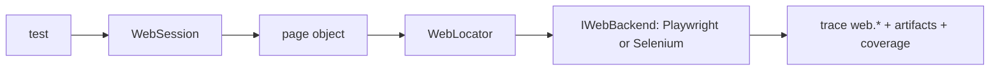
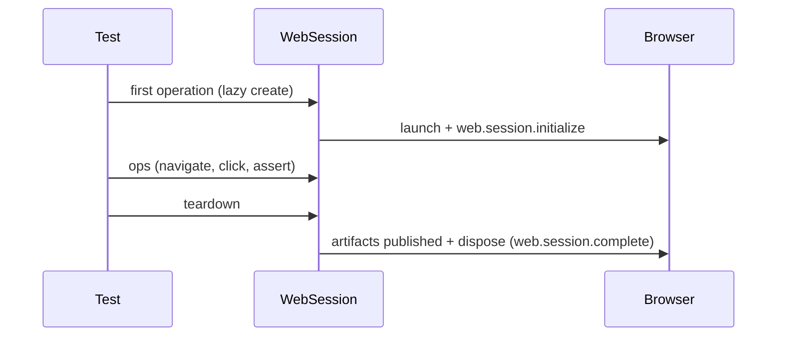

# Web

`ProtoTest.Web` gives each test a browser session behind page objects, with Playwright or Selenium underneath.

```csharp
[ProtoTest]
public async Task Valid_credentials_sign_in()
{
    var login = Proto.Context.Web().Page<LoginPage>();
    await login.OpenAsync("/login");

    await login.Form.Flow("Sign in")
        .Fill(form => form.Username, "matthias")
        .Fill(form => form.Password, "correct horse")
        .Click(form => form.Submit)
        .RunAsync();

    await login.Form.Status.Should.HaveTextAsync("Signed in");
}
```

Run it with `dotnet test`. A green run prints `Passed Valid_credentials_sign_in`, and the trace lands at `TestResults/prototest-{runId}.prototrace` with a `web.session.initialize` operation holding every step the browser took. The page objects behind the test live under [The tasks](#the-tasks); the two backends that can run them are compared under [Which backend](#which-backend).

## What it adds

`ProtoTest.Web` is a browser-testing model for pages, components, elements, tables, flows and login that doesn't depend on any particular browser driver. A backend package plugs a real driver in underneath:

- `ProtoTest.Web.Playwright` - launches and manages browsers for you.
- `ProtoTest.Web.Selenium` - drives any `IWebDriver` you create.

Your page objects and tests stay the same for both. The backends differ underneath, most visibly in [locator translation](./locators.md#how-each-backend-translates-a-locator), but everything in this section is backend-neutral.



## Which backend

Default to Playwright. It launches and manages browsers for you, downloads the browser on a clean machine with `InstallBrowsers`, probes for it without launching one for skips, records the native Playwright trace, supports downloads, and translates the wider set of locator combinations. Pick Selenium when the browsers are driven through WebDriver already: a grid, a driver setup, or a browser you provide yourself through your own `IWebDriver` factory.

| Question | Playwright | Selenium |
| --- | --- | --- |
| Default | Start here for a new suite | When WebDriver drives your browsers already |
| Browser install | `InstallBrowsers = true` downloads the selected browser before the first launch; `Channel` (`"msedge"`, `"chrome"`) uses an installed system browser instead | You create the `IWebDriver`, so the browser must already be installed on the machine |
| Missing browser | `[RequiresPlaywrightBrowser]` probes without launching and skips with a reason naming the install options | No probe; gate on the `browser` capability and handle the first session use (see [Skip](#skip)) |
| Sessions and pooling | One test-scoped pool; sessions with identical launch options share a browser process inside the test | One driver per session, no pooling, so sessions share no cookies or storage |
| Channels and system browsers | `Channel` names an installed browser; Linux system libraries come from Playwright's own tooling | Any driver your factory builds, with its own options and grid address |
| Downloads | `DownloadAsync` registers the file as a test attachment | No download API in the WebDriver protocol; the call fails with `WebBackendCapabilityException` before the trigger runs |
| Locator parity | ARIA role resolution and native text matching, with the wider `And` combinations | Implicit HTML role mappings instead of ARIA resolution, XPath 1.0 deepest-match text, and only `HasText` as the right-hand side of `And` with no `By.Css` left side (see [Locators](./locators.md)) |
| Diagnostics artifact | The native Playwright trace (`playwright-{session}-trace.zip`, kept per `TraceRetention`), plus console, page-error and failed-request events | ProtoTest's own `selenium-{session}-diagnostics.json` with every actionability attempt (kept per `DiagnosticTraceRetention`); there is no second report system |
| What both share | The same page objects and tests, the same `web.*` trace vocabulary with a `web.backend.execute` child per driver call, and the same failure screenshot, page HTML and location files | The same |

## Install

```bash
dotnet add package ProtoTest.Web.Playwright
# or
dotnet add package ProtoTest.Web.Selenium
```

Either backend brings `ProtoTest.Web` with it. The packages target `net8.0`, `net9.0` and `net10.0`; the project templates default to `net10.0`, so pass `--framework net8.0` or `--framework net9.0` when a suite targets an older baseline.

## Browsers

Playwright launches Chromium by default on Windows, Linux, and macOS. Set `Channel` (`"msedge"`, `"chrome"`) to use an installed system browser instead. `InstallBrowsers = true` downloads the selected browser through the Playwright driver before the first launch, so a clean machine or CI runner needs no separate step. It is ignored when `Channel` names a system browser:

```csharp
builder.AddWeb(options =>
{
    options.Browser = PlaywrightBrowser.Chromium;   // the default
    options.InstallBrowsers = true;                 // download it when missing
});
```

On Linux, the operating-system libraries a bundled browser needs come from Playwright's own tooling; ProtoTest only runs the driver's install command for the browser binary.

Selenium takes the driver factory you provide, so the browser itself must already be installed on the machine.

A machine may have no browser at all. Gate Playwright tests with the opt-in skip condition from the Playwright package (see [Skip](#skip)):

```csharp
[RequiresPlaywrightBrowser]                       // the configured browser
[RequiresPlaywrightBrowser(PlaywrightBrowser.Firefox)]
[RequiresPlaywrightBrowser(channel: "msedge")]
public async Task ...() { ... }
```

It probes the installed browser before the lifecycle starts, without launching one, and skips with a reason naming Playwright and the install options; `InstallBrowsers = true` never skips. Selenium has no equivalent probe (see [Skip](#skip)).

A session uses its application address from `ProtoTest:Applications:{application}:BaseUrl`. It appends `Endpoints:{endpoint}` when the session names one. Infrastructure that started an application with the run advertises that same setting, so a browser journey can run against a standalone instance, an application image in its own container or an in-process loopback listener without fixture code ([ASP.NET Core](../aspnetcore.md#hosting-a-browser-journey) has both recipes).

## Compose

Registration is the same `AddWeb(...)` call regardless of backend; the reference you install selects the backend. On a host builder:

```csharp
public static IProtoHostBuilder AddWeb(
    this IProtoHostBuilder builder,
    Action<PlaywrightWebOptions>? configure = null);          // Playwright

public static IProtoHostBuilder AddWeb(
    this IProtoHostBuilder builder,
    Func<IWebDriver> createDriver,
    Action<SeleniumWebOptions>? configure = null);            // Selenium
```

On an application builder, the form the sample suite uses, so the application's REST and GraphQL clients can share one address:

```csharp
public static IProtoApplicationBuilder AddWeb(
    this IProtoApplicationBuilder application,
    Action<PlaywrightWebOptions>? configure = null);

public static IProtoApplicationBuilder AddWeb(
    this IProtoApplicationBuilder application,
    Func<IWebDriver> createDriver,
    Action<SeleniumWebOptions>? configure = null);
```

The shipped backends compose shared helpers from `ProtoTest.Web`, so a hand-written backend behaves the same way. See [Writing a backend](#writing-a-backend).

Sessions are not declared at registration: a test names the sessions it needs with `Proto.Context.Web(name)` ([below](#sessions)). `AddWebBackend` keeps the first registration. A host resolves exactly one `IWebBackendFactory`. Zero or more than one throws `InvalidOperationException`. For Playwright, every `AddWeb(...)` call still runs its `configure` callback while only the first supplies the skip-probe defaults; the Selenium application overload guards the whole call so a repeat is a no-op.

### Options and keys

Both backends also read their options from configuration, so CI can run headless on another browser without code changes. Values are applied in this order, later winning:

1. your `AddWeb(...)` callback,
2. `ProtoTest:Web:Playwright` or `ProtoTest:Web:Selenium`, the run's backend options.

Started infrastructure settings are merged over static configuration before binding, so they win over the same key in `appsettings.json`. Selenium's `ActionTimeout`/`PollInterval` and Playwright's `ActionTimeout` are validated after binding; a non-positive value throws `ArgumentOutOfRangeException`. `TimeSpan` values bind as `"hh:mm:ss(.fffffff)"` and enums bind by name.

#### Playwright options

Key names below are relative to `ProtoTest:Web:Playwright` (see `PlaywrightWebOptions`):

| Key | Type | Default | Notes |
| --- | --- | --- | --- |
| `Browser` | `PlaywrightBrowser` | `Chromium` | `Chromium`, `Firefox` or `Webkit` |
| `Headless` | bool | `true` | |
| `SlowMo` | float? (ms) | `null` | delay between actions, for watching a run |
| `Channel` | string? | `null` | e.g. `"msedge"` or `"chrome"` to use an installed browser |
| `InstallBrowsers` | bool | `false` | download the selected browser before the first launch when it is missing |
| `ActionTimeout` | `TimeSpan` | 5 s | how long a read or action waits for its element before failing with the documented resolution/actionability exception |
| `Locale`, `TimezoneId`, `UserAgent`, `ViewportWidth`, `ViewportHeight`, `StorageStatePath` | string/int? | unset | the context settings ProtoTest models; a viewport needs both dimensions |
| `MaxTraceBytes` | long | 32 MiB (33554432) | the largest attached native trace; 0 reads without a cap |
| `TraceRetention` | `PlaywrightTraceRetention` | `OnWebFailure` | `Off`, `OnWebFailure`, `Always` |
| `CorrelateTraceGroups` | bool | `true` | group Playwright trace actions under ProtoTest operations |
| `ConsoleCapture` | `PlaywrightConsoleCapture` | `WarningsAndErrors` | `Off`, `Errors`, `WarningsAndErrors`, `All` |
| `CapturePageErrors` | bool | `true` | uncaught page exceptions |
| `CaptureRequestFailures` | bool | `true` | failed network requests |

#### Selenium options

Key names below are relative to `ProtoTest:Web:Selenium` (see `SeleniumWebOptions`):

| Key | Type | Default | Notes |
| --- | --- | --- | --- |
| `ActionTimeout` | `TimeSpan` | 5 s | how long an action retries until the element is actionable |
| `PollInterval` | `TimeSpan` | 50 ms | how often it re-checks |
| `WaitForStableBounds` | bool | `true` | wait until the element stops moving before clicking |
| `CheckClickObstruction` | bool | `true` | fail if something covers the element |
| `DiagnosticTraceRetention` | `SeleniumDiagnosticTraceRetention` | `OnWebFailure` | `Off`, `OnWebFailure`, `Always` |

#### Demanding a session

A test creates a session by asking for it in code. Demand it in code with the attribute:

```csharp
[WebSession("Admin", Application = "BackOffice", Endpoint = "Admin", DiscoverRoutes = true,
            Open = "/back-office")]
```

or inside the test with the accessor:

```csharp
var session = Proto.Context.Web("Admin", application: "BackOffice", endpoint: "Admin");
```

| Member | Effect |
| --- | --- |
| name | the session name; `context.Web()` uses the application's `Web:` binding, then `"Default"` |
| `Application` | the `ProtoTest:Applications:{application}` section that supplies the address and owns the session's coverage; defaults to the test's application, then the session name |
| `Endpoint` | joins `ProtoTest:Applications:{application}:Endpoints:{endpoint}` to the base URL, like an HTTP client |
| `DiscoverRoutes` | records the session's Vue Router routes as page inventory after the first navigation |
| `Open` | navigates the session during setup; a relative value resolves against the application address |

Configuration holds the environment, never the session: addresses under `ProtoTest:Applications:{application}`, backend options under `ProtoTest:Web:{backend}`.

#### From configuration

```json
{
  "ProtoTest": {
    "Web": {
      "Playwright": {
        "Browser": "Firefox",
        "Headless": true,
        "TraceRetention": "Always",
        "Locale": "nl-BE",
        "ViewportWidth": 1280,
        "ViewportHeight": 720
      }
    },
    "Applications": {
      "ControlPlane": { "BaseUrl": "https://ops.example.test" }
    }
  }
}
```

The context settings ProtoTest models (`Locale`, `TimezoneId`, `UserAgent`, `ViewportWidth`, `ViewportHeight`, `StorageStatePath`) bind from configuration. Anything else on Playwright's `BrowserNewContextOptions` is set in code through the `ConfigureContext` action, which runs after the settings above:

```csharp
builder.AddWeb(options => options.ConfigureContext = context =>
    context.ColorScheme = ColorScheme.Dark);
```

Options are bound once, the first time a session opens a browser.

### Sessions

`Proto.Context.Web(sessionName = null, application = null, endpoint = null, discoverRoutes = false)` returns the test's `WebSession`. The browser is created **lazily** on the first operation, so a test that never touches the browser never starts one, and the session is completed and disposed at teardown. `application` defaults to the application selected for the test; `sessionName` defaults to the application's `Web` client name, then `"Default"`.



```csharp
public sealed class WebSession : IAsyncDisposable
{
    string Name { get; }
    string Application { get; }
    Uri? BaseUrl { get; }
    string BackendName { get; }
    TPage Page<TPage>() where TPage : WebPage, new();
    TBackend GetBackend<TBackend>() where TBackend : class, IWebBackend;
    ValueTask<TBackend> GetBackendAsync<TBackend>(CancellationToken cancellationToken = default)
        where TBackend : class, IWebBackend;
    ValueTask WaitUntilAsync(
        Func<CancellationToken, ValueTask<bool>> condition,
        TimeSpan? timeout = null,               // default 5 s
        string? description = null,             // defaults to the predicate's source text
        CancellationToken cancellationToken = default);
}
```

`WaitUntilAsync` polls until the condition holds or the timeout passes, throwing `WebAssertionException` with the expectation when it doesn't. Inside the predicate, "element not found yet" and "not actionable yet" (`WebElementResolutionException`, `WebActionabilityException`) are treated as "not yet"; every other exception fails the wait immediately.

#### Several sessions in one test

Sessions are per-test: the builder registers only the backend, and a test names the sessions it needs. Each named session is an isolated browser context (Playwright) or driver (Selenium), created lazily on first use and closed at teardown. Pages are cached per session, so `Web("Admin").Page<T>()` returns the same object each time.

```csharp
builder.AddWeb();   // register the backend once
```

```csharp
var admin = Proto.Context.Web("Admin").Page<BackOfficePage>();
var customer = Proto.Context.Web("Customer").Page<StorefrontPage>();

await admin.Orders.RowMatching(By.HasText("42")).Approve.ClickAsync();

// The customer waits until the admin's change is reflected, then verifies it.
await customer.Orders.RowMatching(By.HasText("42")).Status.Should.HaveTextAsync("Approved");
```

The `Should*` methods on an element poll until they pass, so they double as cross-session waits. For any other condition, including one that spans sessions, use `WaitUntilAsync`; its description defaults to the predicate's source text:

```csharp
await customer.WaitUntilAsync(async ct =>
    await customer.Orders.RowMatching(By.HasText("42")).Status.TextAsync(ct) == "Approved");

await customer.WaitUntilAsync(
    async _ => await customer.Total.TextAsync() == "€0.00",
    timeout: TimeSpan.FromSeconds(10));
```

Sessions can also be declared on the test, so setup creates (and optionally navigates) them before the body. `[WebSession]` defaults to `Order = -10`, so it runs before `[LoginAs]`:

```csharp
[WebSession("Admin", Open = "/back-office")]
[WebSession("Customer")]
[LoginAs<BackOfficeLogin>("billing.admin", Session = "Admin")]
public async Task ...() { ... }
```

`Application = "ControlPlane"` on the attribute names the application the session targets, defaulting to the test's application and then the session name. A relative `Open` resolves against the session's application address, `ProtoTest:Applications:{application}:BaseUrl`, optionally joined with the named endpoint.

#### Dropping down to the driver

When you need something the model doesn't offer, get the native backend:

```csharp
var backend = await Proto.Context.Web().GetBackendAsync<PlaywrightWebBackend>();
await backend.Page.SetContentAsync(html);
```

`GetBackendAsync` creates the browser if needed; the synchronous `GetBackend` throws until the backend exists, and asking for the wrong type throws `WebBackendCapabilityException`.

## The tasks

A page object describes the page; the sign-in test at the top of this page drives it. The smallest page objects behind that test are below; the sample's full journey is in [WebJourney.cs](../../../../samples/Northstar.ProtoTest/WebJourney.cs):

```csharp
public sealed class LoginPage : WebPage
{
    public LoginForm Form => Component<LoginForm>(By.TestId("login"));
}

public sealed class LoginForm : WebComponent
{
    public WebElement Username => Element(By.Label("Username"));
    public WebElement Password => Element(By.Label("Password"));
    public WebElement Submit => Element(By.Role(WebRole.Button, "Sign in"));
    public WebElement Status => Element(By.Role(WebRole.Status));
}
```

The driving test is the one at the top of this page. The flow behind it records one `web.flow` operation with a step per action, and the final read records `assert.web`.

### Going further

- [Pages and components](./page-objects.md) - page objects, scoping, lazy collections and tables.
- [Page coverage](./page-coverage.md) - visited versus verified, report rows, and the inventory sources.
- [Locators](./locators.md) - roles, labels, text, `And`, and how each backend translates them.
- [Actions and assertions](./interactions.md) - `Should`/`ShouldNot`, polling, redaction.
- [Flows](./flows.md) - name a sequence of steps so the trace reads as one operation.
- [Logging in](./login.md) - an application-owned `IWebLoginStrategy` applied with `[LoginAs]`.
- [Waits and middleware](./middleware.md) - your application's notion of ready, applied once.
- [Diagnostics and artifacts](./diagnostics.md) - screenshots, console output, traces and the full trace reference.
- [ASP.NET Core](../aspnetcore.md) - when the application is hosted in-process, its page inventory comes with it.

## In the trace and coverage

Every operation is a ProtoTest trace entry; a passing assertion is also what makes a page count as covered:

| What | Recorded as |
| --- | --- |
| Navigate, click, fill, check, select, press, reads, count | `web.navigate`, `web.click`, `web.fill`, `web.check`, `web.select_option`, `web.press`, `web.read_text`, `web.read_value`, `web.is_visible`, `web.is_enabled`, `web.is_checked`, `web.count` |
| Assertions | `assert.web` with `web.expectation`, `web.assert.negated` and `web.assert.timeout` |
| Wait-until | `web.wait.until` |
| Flows | `web.flow` with `web.flow.step_count` |
| Login | `web.login` during setup |
| Session lifetime | `web.session.initialize` / `web.session.complete` |
| Backend call | child `web.backend.execute`, linked by `web.correlation_id` |
| Coverage | observations `web.page.visited`, `web.page.verified`, `web.page.available` |

The complete tables for common attributes, backend events, artifacts and the Selenium diagnostics schema live on [Diagnostics and artifacts](./diagnostics.md#what-the-trace-records-for-every-operation).

### Page coverage

Coverage for a browser journey is measured in **pages**, not lines: a page counts as covered only when a test **verified** something on it. The visit-to-verified states, the report rows, and the inventory sources live on [Page coverage](./page-coverage.md).


## Skip

- `AddWeb(...)` registers a `browser` capability named `Playwright` or `Selenium`, so `[RequiresCapability(ProtoCapabilityKinds.Browser, CapabilityName = "…")]` proves the backend is composed. The required capability name must match the backend package.
- `[RequiresPlaywrightBrowser]` is the stronger gate: it probes the installed browser without launching one and skips with a reason. A recognized channel is accepted as-is, because only a real launch can resolve a system browser; `InstallBrowsers = true` always passes.
- Selenium ships no browser probe. Combine the capability gate with a try/catch around the first session that uses the browser, as shown in [skip conditions](../../foundation/skip-conditions.md#requiring-a-playwright-browser).
- The core web package registers no skip condition of its own: sessions are per-test, and the driver is only created on first use.

## Limits

- **One backend per host.** Resolving zero or more than one `IWebBackendFactory` throws `InvalidOperationException`, and `AddWebBackend` keeps the first registration.
- **`HasText` cannot stand alone**: it is a filter and must be composed with `And`. Selenium additionally accepts only `HasText` as the right-hand side and rejects a `By.Css` left side; Playwright accepts more combinations. See [Locators](./locators.md#combining-with-and).
- **`WaitUntilAsync`** only absorbs `WebElementResolutionException` and `WebActionabilityException`; any other exception fails it immediately.
- **Scanner:** a relative `Source` may not escape the test assembly's base directory; there is no Nuxt 2 underscore-dynamic support, only absolute route literals are collected, and there is no runtime React discovery.
- **Vue discovery** latches after the first non-null route table, so a router that later adds routes in the same session is not re-read.
- **Page origin:** an external redirect contributes no visited or verified coverage, and a backend that cannot report an address still passes the test.
- **Playwright:** the browser pool is scoped to one test; identical launch options share a process only inside that test. Reads and actions use Playwright's own auto-waiting, bounded by `ActionTimeout` (5 s by default); a timeout becomes the same resolution or actionability exception Selenium raises. `InstallBrowsers` does nothing when `Channel` is set, trace groups are serialized by a semaphore and skipped when `TraceRetention = Off`, console/page-error/request-failure text is truncated at 4096 characters, and the skip probe starts the Playwright driver.
- **Selenium:** one driver per session, no pooling, so sessions do not share cookies or storage; native failures surface as `WebActionabilityException` after `ActionTimeout`; `CheckAsync` and `SelectOptionAsync` verify the selected state after the click, so a click the page ignored fails like Playwright's auto-wait instead of passing silently; `SelectOptionAsync` requires exactly one option carrying the requested `value`.

## Writing a backend

A hand-written backend composes the same helpers the shipped backends use, so its behavior matches theirs:

```csharp
IProtoHostBuilder AddWebBackend(this IProtoHostBuilder builder, IWebBackendFactory factory);

IProtoHostBuilder AddWebMiddleware<TMiddleware>(this IProtoHostBuilder builder)
    where TMiddleware : class, IWebOperationMiddleware;

IProtoHostBuilder AddWebWait<TCondition>(
    this IProtoHostBuilder builder,
    WebWaitTiming timing,
    TimeSpan? timeout = null,               // default 5 s
    TimeSpan? pollInterval = null,          // default 50 ms
    params WebOperationKind[] operations)   // default Navigate, Click, Fill
    where TCondition : class, IWebWaitCondition;
```

- `WebBackendOptions.Resolve<TOptions>(context, configure, validate)` - the options precedence (code callback, started infrastructure, `ProtoTest:Web:{backend}` section, validation).
- `WebBackendErrors` - the resolution and actionability failures (`NotPresent`, `NotActionable`, `MultipleMatch`) with the documented wording.
- `WebFailureArtifacts.CaptureAsync(…)` - the screenshot, DOM and location attachments with the documented naming rule; `TraceArtifactFailure` records a capture that itself failed.
- `WebProbeLoop` with `WebProbe` - the retry loop whose observation form treats `WebElementResolutionException` and `WebActionabilityException` as "not yet", polling at the backend's `PollInterval`.
- `WebBackendDefaults` - the 5 s action timeout and 50 ms poll interval defaults; `IWebBackend.PollInterval` returns `WebBackendDefaults.DefaultPollInterval` unless the backend has its own interval option.
- `WebArtifactNames.SafeName` - the lowercased, dash-sanitized identifier rule for artifact file names.
- `WebMediaTypes.Guess` - the best-effort media type for a downloaded file, with `WebMediaTypes.Default` as the fallback.

## Next

- [Pages and components](./page-objects.md)
- [Locators](./locators.md)
- [Actions and assertions](./interactions.md)
- [Flows](./flows.md)
- [Logging in](./login.md)
- [Waits and middleware](./middleware.md)
- [Diagnostics and artifacts](./diagnostics.md)
