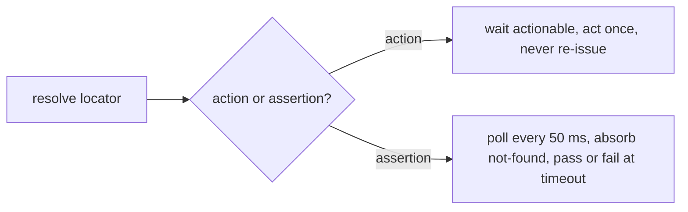

# Actions and assertions

Everything you do to a page goes through a `WebElement`. This page shows how to act on an element, read it and
assert on it. Actions wait until the element can take them and then act once. Assertions retry until they hold.

## Actions

```csharp
ValueTask ClickAsync(CancellationToken cancellationToken = default);
ValueTask FillAsync(string value, CancellationToken cancellationToken = default);
ValueTask CheckAsync(CancellationToken cancellationToken = default);
ValueTask UncheckAsync(CancellationToken cancellationToken = default);
ValueTask SelectOptionAsync(string value, CancellationToken cancellationToken = default);   // matches the option's value attribute
ValueTask PressAsync(WebKey key, CancellationToken cancellationToken = default);
```

`WebKey` has `Enter`, `Tab`, `Escape`, `Space`, `Backspace`, `Delete`, `ArrowUp`, `ArrowDown`, `ArrowLeft`, `ArrowRight`, `Home`, `End`, `PageUp` and `PageDown`. Both backends read one shared `WebKeyMap`, so a key means the same thing on each.

```csharp
await page.Search.FillAsync("invoice");
await page.Search.PressAsync(WebKey.Enter);
await page.Language.SelectOptionAsync("nl");
await page.RememberMe.CheckAsync();
```

### How actions wait

| | Playwright | Selenium |
| --- | --- | --- |
| Mechanism | its own auto-waiting: an action waits until the element is attached, visible, stable and enabled | retries until the element is displayed and enabled. Fills and selects also wait until it is not read-only. Clicks and checks also wait until it stops moving (with `WaitForStableBounds`) and nothing covers it (with `CheckClickObstruction`, when the driver supports JavaScript). |
| Bound | `ActionTimeout` (5 s by default) | `ActionTimeout` (5 s by default), polling every `PollInterval` |
| On timeout | `WebActionabilityException`. A read of an element that never appears becomes `WebElementResolutionException`. | `WebActionabilityException` with the component path, locator and last observation |

ProtoTest resolves the locator and calls the native action. It never re-issues a failed one. The shared exceptions keep polling assertions and negations identical on either backend.

To wait for something application-specific, such as a spinner or a pending XHR, add a [wait condition](./middleware.md#wait-conditions).

## Downloads

A test can capture a file the browser downloads and check its contents, without knowing where the browser would have put it:

```csharp
public sealed class ReportPage : WebPage
{
    public WebElement Export => Element(By.TestId("export"));
}
```

```csharp
var page = Proto.Context.Web().Page<ReportPage>();
await page.OpenAsync("/reports");

var download = await page.DownloadAsync(
    ct => page.Export.ClickAsync(ct).AsTask(),   // the trigger that starts the download
    name: "monthly-report.csv",                  // optional; defaults to the browser's suggested name
    timeout: TimeSpan.FromSeconds(15));          // optional; defaults to the backend's own wait

Encoding.UTF8.GetString(download.Content.Span);  // "name,total\natlas,42"
download.FileName;                                // monthly-report.csv
download.MediaType;                               // text/csv (guessed from the extension)
download.Size;                                    // bytes
```

`WebSession.DownloadAsync` and its `WebPage` shortcut run the trigger through the normal operation pipeline. They wait for the file, return a `WebDownload`, and register it as a test attachment. A trigger that runs other session operations (like the semantic click above) nests them inside the download's operation. An explicit `name` replaces the browser's suggested file name for the record and the attachment. Its extension refines the media type guess. A non-positive `timeout` throws `ArgumentOutOfRangeException`.

- **Playwright** captures natively: the trigger runs, Playwright waits for the download, and ProtoTest reads the completed file. This covers link, form and generated (`blob:`, `data:`) downloads.
- **Selenium** has no download API in the WebDriver protocol, so `DownloadAsync` throws `WebBackendCapabilityException` before the trigger runs, naming the limitation. Fetch the file over HTTP with [ProtoTest.Rest](../rest/index.md) instead.

## Reading state

```csharp
ValueTask<string> TextAsync(CancellationToken cancellationToken = default);
ValueTask<string?> ValueAsync(CancellationToken cancellationToken = default);
ValueTask<bool> IsVisibleAsync(CancellationToken cancellationToken = default);
ValueTask<bool> IsEnabledAsync(CancellationToken cancellationToken = default);
ValueTask<bool> IsCheckedAsync(CancellationToken cancellationToken = default);
```

These read **once**, right now. For checks in a test, prefer the assertions below, because they retry.

## Assertions

Assertions hang off `Should` (positive) and `ShouldNot` (negated), both returning a `WebAssertions`:

```csharp
public sealed class WebElement
{
    public WebAssertions Should { get; }      // the assertion must hold
    public WebAssertions ShouldNot { get; }   // the assertion must not hold
}

public sealed class WebAssertions
{
    ValueTask BeVisibleAsync(TimeSpan? timeout = null, CancellationToken cancellationToken = default);
    ValueTask BeEnabledAsync(TimeSpan? timeout = null, CancellationToken cancellationToken = default);
    ValueTask BeCheckedAsync(TimeSpan? timeout = null, CancellationToken cancellationToken = default);
    ValueTask HaveTextAsync(string expected, TimeSpan? timeout = null, CancellationToken cancellationToken = default);
    ValueTask ContainTextAsync(string expected, TimeSpan? timeout = null, CancellationToken cancellationToken = default);
    ValueTask HaveValueAsync(string expected, TimeSpan? timeout = null, CancellationToken cancellationToken = default);
}
```

```csharp
await page.Save.Should.BeEnabledAsync(TimeSpan.FromSeconds(2));
await page.Save.ClickAsync();
await page.Status.Should.HaveTextAsync("saved");
await page.Error.ShouldNot.BeVisibleAsync();
```

Two tracks, one rule: actions act once, assertions poll.



Assertions poll every 50 ms until the condition holds or the timeout passes. The default timeout is 5 seconds. While polling, "element not found yet" and "not actionable yet" are treated as "not yet", not as failures. When time runs out you get a `WebAssertionException` describing the last thing observed.

- `HaveTextAsync` compares the element's rendered text exactly and ordinally. `ContainTextAsync` checks for an ordinal substring. `ShouldNot` is the inverse of each.
- The text is what the browser renders: Playwright's inner text or Selenium's `Element.Text`. Runs of whitespace and line breaks arrive collapsed. When a failure message shows two strings that look identical, the expected one still carries the source formatting.
- `HaveValueAsync` compares the value ordinally, but the failure message reports only the value's length.
- A timeout of zero or less throws `ArgumentOutOfRangeException`.

### Trace evidence

```text
assert.web · Status should have text "saved"
├─ web.expectation = HaveText, web.assert.negated = false, web.assert.timeout = 5s
├─ poll every 50 ms: not-found and not-actionable count as "not yet"
└─ pass → web.page.verified observation (the page counts as covered)
```

Each assertion is a `assert.web` operation on the element, with `web.expectation`, `web.assert.negated` and `web.assert.timeout` attributes. A passing assertion records a `web.page.verified` [coverage observation](./page-coverage.md) for the page it was checked on. That observation is what makes a page count as covered.

:::note[Form values stay out of the trace]
`FillAsync` records only the *length* of what was typed (`web.value` is `[REDACTED]`), and `HaveValueAsync` failures report the value's length rather than the value. Passwords and personal data you type in tests never end up in a `.prototrace` file.
:::

## Element metadata

```csharp
string Name { get; }                    // e.g. "Submit"
string ComponentPath { get; }           // e.g. "LoginPage.Form.Submit"
WebLocator Locator { get; }
WebElementReference Reference { get; }  // what WaitUntilAsync and custom waits consume
```

## Next

- [Flows](./flows.md) - group actions on a component into one named operation.
- [Diagnostics and artifacts](./diagnostics.md) - what a failed action leaves behind.
