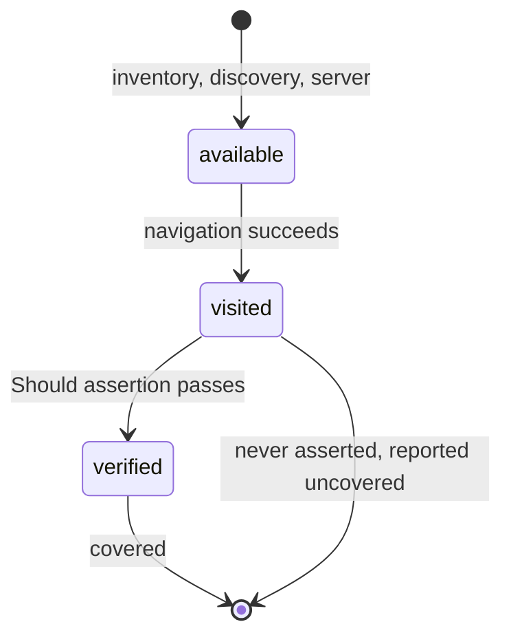

# Page coverage

Coverage for a browser journey is reported per page path in the same run report as every other collector. A page counts as covered only when a test verified something on it: reaching a page is not checking it.



A report row names the page, its state, and how many verifications landed on it:

```text
path                  status      count
/login                covered     3
/back-office/orders   covered     1
/settings             visited     0
/portal/legacy        available   0
```

## How pages become covered

Coverage for a browser journey is measured in **pages**, not lines. `AddWeb` registers a `WebCoverageCollector` that reports one item per page path, covered only when a test **verified** something on it. Three observations feed it, all recorded under the `Web` target:

| Observation | Recorded when | `web.page.source` |
| --- | --- | --- |
| `web.page.visited` | a navigation succeeds: the final address after redirects when the backend can report one | `navigate` |
| `web.page.verified` | a `Should*` assertion passes on the page | `assert` |
| `web.page.available` | a page is known to exist but was not visited, from the inventory, a discovered frontend route or the ASP.NET Core server | `vue-router` / `aspnetcore` |

A page that was visited but never asserted is reported **uncovered**: reaching a page is not the same as checking it, and the report keeps the two apart. Only `web.page.verified` moves an item to covered (`Status = Success`) and increments its count; inventory-only pages stay neutral. When the session has a `BaseUrl`, coverage is attributed to that application's origin only: scheme, IDN host and port must all match, so a redirect to an identity provider or a payment gateway, and any assertion checked there, is not recorded as this application's coverage. A backend that cannot report its address contributes navigation coverage from the target address instead of failing.

### The explicit inventory

List the pages a suite knows about under `ProtoTest:Web:Pages`; they appear as uncovered until a verification lands on them. The value may be a single scalar path, an array, or an object whose child values are entries; `Source` and `Framework` are configuration, never page entries:

```json
{
  "ProtoTest": {
    "Web": {
      "Pages": [ "/", "/login", "/back-office/orders", "/settings" ]
    }
  }
}
```

### Frontend source folder

Instead of listing pages by hand, point ProtoTest at the frontend source folder and let it inventory the routes that exist there:

```json
{
  "ProtoTest": {
    "Web": {
      "Pages": {
        "Source": "frontend/src",
        "Framework": "auto"
      }
    }
  }
}
```

`Source` is absolute or relative to the test assembly's base directory (a relative path may not escape it); a missing, unreadable or empty folder contributes no pages and is never an error. `Framework` is `auto` (the default) or one of `next`, `nuxt`, `remix`, `vue`, `react`; an unknown value falls back to `auto`.

In `auto`, ProtoTest reads the nearest `package.json`, walking at most three folders up and stopping at the first one found, so a parent repository's dependencies never decide how this folder is scanned, and falls back to the folder layout (`next.config.*`, `nuxt.config.*`, `app/routes`, `app/page.*`, `pages/`). The detected framework picks the discovery strategy:

- **Next.js / Nuxt file routes** - files under `pages/` or `src/pages/` with `.ts`, `.tsx`, `.js`, `.jsx` or `.vue`: subfolders become path segments, `index` becomes the folder's route, `[id]` becomes `{id}`, and catch-alls `[...slug]` and `[[...slug]]` become `{...}`. `_app`, `_document`, `_error`, `404`, `500` and `_middleware` are skipped, and Next's `pages/api/…` handlers are not pages. Test/spec files (`*.test.*`, `*.spec.*`) and TypeScript declarations (`*.d.ts`) are never routes. Nuxt 2's underscore dynamics (`_id.vue`, `_.vue`) are not mapped; use the explicit inventory for those.
- **Next.js app router** - only `page.*` files under `app/` or `src/app/`, mapped the same way; route groups `(group)` drop out of the path, and `layout`, `template`, `loading`, `error` and `not-found` never produce a route.
- **Remix** - flat file names under `app/routes/`: dots become `/`, `_index` becomes the folder's route, leading `_` segments are pathless and drop out, `$id` becomes `{id}`, and a bare `$` splat becomes `{...}`.
- **Vue Router / React Router** - source files are walked (skipping `node_modules`, `dist`, `build`, `.next`, `coverage` and any symlinked or junctioned directory, capped at 10,000 files and 1 MB per file) for **absolute** route literals: `path: "..."`, `path: '...'`, `path = "..."` and JSX `<Route path="/…">`. Relative child routes and aliased imports are not resolved. This strategy is also the fallback when `auto` detects nothing file-based.

Discovered paths join `ProtoTest:Web:Pages` in the same inventory and start out uncovered. React has no runtime route table that ProtoTest reads; see [React and Next.js](#react-and-nextjs).

### Dynamic page matching

A verification on a concrete path covers the inventory pattern it matches: `/users/42` marks `/users/{id}` covered and increments its count, so a detail page verified once is done, not one per id. Page identity is the absolute HTTP/HTTPS path, with query and fragment dropped, a leading slash and no trailing slash except `/`. Percent-encoding is decoded per segment, so `/a%20b` and `/a b` are one page; an encoded slash (`%2F`) stays inside its segment, so one segment never becomes two.

Patterns come from route definitions: `:name`, `:name?`, `[...]` and `$name` become `{name}`; `*`, a bare `$`, `[...slug]`, `[[...slug]]`, `:rest*` and regex catch-alls such as `:pathMatch(.*)*` become `{...}`. Configured `ProtoTest:Web:Pages` entries accept the same syntax, so `/users/:id` in configuration is the same pattern as a Vue route definition. `{name}` matches exactly one segment, `{...}` matches the rest and must be last, and matching is segment-wise and case-insensitive.

The collector resolves an observed path to its item in this order:

1. an existing item or an exact inventory entry with that path wins;
2. otherwise the first matching pattern **in inventory order**;
3. a catch-all (`{...}`) is used only when no non-catch-all pattern matched;
4. with no match, the concrete path keeps its own item.

### ASP.NET Core inventory

When the application runs **in-process** (`AddAspNetCoreServer<Program>()`), starting it also inventories its page-like GET routes and records a `web.page.available` for each. It is documented in full on [ASP.NET Core](../aspnetcore.md#in-the-trace-and-coverage); the short version: only concrete, explicitly-GET, page-like endpoints count, API-shaped routes are excluded unless they declare HTML, and `ProtoTest:Applications:{app}:Web:Pages:Include` / `:Exclude` globs refine the result:

```json
{
  "ProtoTest": {
    "Applications": {
      "Api": {
        "Web": {
          "Pages": {
            "Include": [ "/portal/*" ],
            "Exclude": [ "/portal/legacy/*" ]
          }
        }
      }
    }
  }
}
```

The inventory is run-level: it is recorded once, by the first test that initializes the server, and a failed or empty discovery does not latch, so a later test still contributes it. A published application never starts in-process, so its inventory comes from the explicit list, the frontend source folder or Vue discovery instead.

### Vue discovery

For Vue 3 and Vue 2 applications, opt in per session and ProtoTest reads the router's route table in the page after the first navigation:

```json
{
  "ProtoTest": {
    "Web": {
      "Sessions": {
        "Default": { "DiscoverRoutes": true }
      }
    }
  }
}
```

It evaluates Vue 3's `[data-v-app].__vue_app__.config.globalProperties.$router.getRoutes()` first, then Vue 2's `#app.__vue__.$router.options.routes`, records each absolute path as `web.page.available`, and answers nothing when Vue or its router is absent. Vue 2 relative child paths resolve against their parent (`{ path: '/orders', children: [{ path: 'new' }] }` records `/orders/new`); a top-level relative path is not a page. Discovery runs once per session, only on backends that support JavaScript evaluation, and only after it actually read a route table: an evaluation that fails or a page without Vue stays unlatched and is retried on a later navigation, with the failure traced as `web.page.discovery.failed`.

The demo combines both: its Northstar Console is a real Vue 3 SPA, so page coverage comes from the console's source folder (`samples/ProtoTest.SampleApp/Ui`) plus Vue Router discovery from the running router.

### React and Next.js

React has no generic runtime route table to read, and ProtoTest deliberately does not guess at one. Next.js, Nuxt and Remix are inventoried from the frontend source folder, and Vue Router / React Router route literals are read from their definitions. For everything the scanner cannot see, such as routes built at runtime, aliased imports or relative child paths, publish the route list instead: a small build step that emits the application's routes as a JSON array loaded into `ProtoTest:Web:Pages`. The pages then show as uncovered until a test visits and verifies them, exactly like the explicit inventory.

## Next

- [Overview](./index.md) - sessions, options, and the trace shape.
- [Diagnostics and artifacts](./diagnostics.md) - what a failed action leaves behind.
