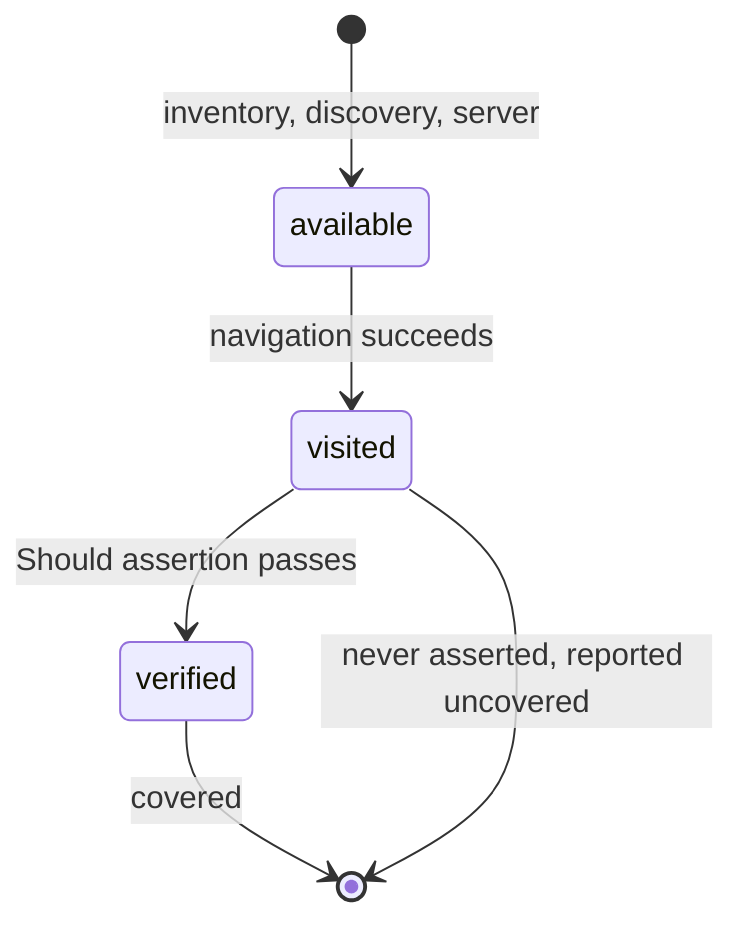

# Page coverage

Page coverage tells you which pages of your application a browser suite checked. It is reported per page path, in
the same run report as every other collector. A page counts as covered only when a test **verified** something on
it: reaching a page is not checking it.



A report row names the page, its state, and how many verifications landed on it:

```text
path                  status      count
/login                covered     3
/back-office/orders   covered     1
/settings             visited     0
/portal/legacy        available   0
```

## How pages become covered

`AddWeb` registers a `WebCoverageCollector` that reports one item per page path. Three observations feed it, all
recorded under the `Web` target:

| Observation | Recorded when | `web.page.source` |
| --- | --- | --- |
| `web.page.visited` | a navigation succeeds: the final address after redirects when the backend can report one | `navigate` |
| `web.page.verified` | a `Should*` assertion passes on the page | `assert` |
| `web.page.available` | a page is known to exist but was not visited, from the inventory, a discovered frontend route or the ASP.NET Core server | `vue-router` / `aspnetcore` |

Only `web.page.verified` makes an item covered (`Status = Success`) and adds to its count. A page that was visited
but never asserted is reported **uncovered**. Pages known only from an inventory stay neutral.

When the session has a `BaseUrl`, only that application's pages count. The scheme, the IDN host and the port must
all match. So a redirect to an identity provider or a payment gateway, and any check made there, is not counted
for this application. A backend that cannot report its address counts the target address of the navigation
instead of failing.

A page that no test reached appears only if something lists it. The sections below are the four ways to list
pages, from simplest to most automatic.

### The explicit inventory

List the pages a suite knows about under `ProtoTest:Web:Pages`. They appear as uncovered until a verification lands
on them. The value may be one path, an array, or an object whose child values are entries. `Source` and
`Framework` are settings, never page entries:

```json
{
  "ProtoTest": {
    "Web": {
      "Pages": [ "/", "/login", "/back-office/orders", "/settings" ]
    }
  }
}
```

### Frontend source folder

Instead of listing pages by hand, point ProtoTest at the frontend source folder. It lists the routes it finds there:

```json
{
  "ProtoTest": {
    "Web": {
      "Pages": {
        "Source": "frontend/src",
        "Framework": "auto"
      }
    }
  }
}
```

- `Source` is absolute, or relative to the test assembly's base directory. A relative path may not leave that directory. A missing, unreadable or empty folder adds no pages and is never an error.
- `Framework` is `auto` (the default) or one of `next`, `nuxt`, `remix`, `vue`, `react`. An unknown value means `auto`.

In `auto`, ProtoTest reads the nearest `package.json`, walking at most three folders up and stopping at the first
one. So a parent repository's dependencies never decide how this folder is scanned. Without one, it looks at the
folder layout (`next.config.*`, `nuxt.config.*`, `app/routes`, `app/page.*`, `pages/`). The framework it finds picks
the strategy:

- **Next.js / Nuxt file routes.** Files under `pages/` or `src/pages/` with `.ts`, `.tsx`, `.js`, `.jsx` or `.vue`. Subfolders become path segments, `index` becomes the folder's route, `[id]` becomes `{id}`, and the catch-alls `[...slug]` and `[[...slug]]` become `{...}`.
  - Skipped: `_app`, `_document`, `_error`, `404`, `500`, `_middleware`, and Next's `pages/api/…` handlers.
  - Never routes: test and spec files (`*.test.*`, `*.spec.*`) and TypeScript declarations (`*.d.ts`).
  - Not mapped: Nuxt 2's underscore dynamics (`_id.vue`, `_.vue`). List those explicitly.
- **Next.js app router.** Only `page.*` files under `app/` or `src/app/`, mapped the same way. Route groups `(group)` drop out of the path. `layout`, `template`, `loading`, `error` and `not-found` never produce a route.
- **Remix.** Flat file names under `app/routes/`. Dots become `/`, `_index` becomes the folder's route, leading `_` segments drop out, `$id` becomes `{id}`, and a bare `$` becomes `{...}`.
- **Vue Router / React Router.** Source files are searched for **absolute** route literals: `path: "..."`, `path: '...'`, `path = "..."` and JSX `<Route path="/…">`. The search skips `node_modules`, `dist`, `build`, `.next`, `coverage` and any symlinked or junctioned directory, and stops at 10,000 files and 1 MB per file. Relative child routes and aliased imports are not resolved. This is also the fallback when `auto` finds nothing file-based.

Discovered paths join `ProtoTest:Web:Pages` in one inventory and start as uncovered. React has no runtime route
table that ProtoTest reads; see [React and Next.js](#react-and-nextjs).

### Dynamic page matching

A verification on a concrete path covers the pattern it matches. `/users/42` marks `/users/{id}` covered and adds
to its count, so a detail page verified once is done, not once per id.

A page's identity is its absolute HTTP or HTTPS path:

- The query and the fragment are dropped. The path starts with a slash and has no trailing slash, except `/`.
- Percent-encoding is decoded per segment, so `/a%20b` and `/a b` are one page. An encoded slash (`%2F`) stays inside its segment, so one segment never becomes two.

Patterns come from route definitions. `:name`, `:name?`, `[...]` and `$name` become `{name}`. `*`, a bare `$`,
`[...slug]`, `[[...slug]]`, `:rest*` and regex catch-alls such as `:pathMatch(.*)*` become `{...}`. Configured
`ProtoTest:Web:Pages` entries accept the same syntax, so `/users/:id` in configuration matches a Vue route
`/users/:id`. `{name}` matches exactly one segment. `{...}` matches the rest and must come last. Matching goes
segment by segment, ignoring case.

The collector finds the item for an observed path in this order:

1. an existing item or an exact inventory entry with that path wins;
2. otherwise the first matching pattern **in inventory order**;
3. a catch-all (`{...}`) is used only when no non-catch-all pattern matched;
4. with no match, the concrete path keeps its own item.

### ASP.NET Core inventory

When the application runs **in-process** (`AddAspNetCoreServer<Program>()`), starting it also lists its page-like
GET routes, as `web.page.available`. [ASP.NET Core](../aspnetcore.md#in-the-trace-and-coverage) has the full rules.
In short: only concrete, explicitly-GET, page-like endpoints count, and API-shaped routes are excluded unless they
declare HTML. The `ProtoTest:Applications:{app}:Web:Pages:Include` and `:Exclude` globs refine the result:

```json
{
  "ProtoTest": {
    "Applications": {
      "Api": {
        "Web": {
          "Pages": {
            "Include": [ "/portal/*" ],
            "Exclude": [ "/portal/legacy/*" ]
          }
        }
      }
    }
  }
}
```

The first test that starts the server records the list once for the run. A failed or empty list does not count as
done, so a later test still adds it. A published application never starts in-process, so its pages come from the
explicit list, the source folder or Vue discovery.

### Vue discovery

For a Vue 3 or Vue 2 application, opt in per session, and ProtoTest reads the router's route table from the page
after the first navigation:

```json
{
  "ProtoTest": {
    "Web": {
      "Sessions": {
        "Default": { "DiscoverRoutes": true }
      }
    }
  }
}
```

It reads Vue 3's `[data-v-app].__vue_app__.config.globalProperties.$router.getRoutes()` first, then Vue 2's
`#app.__vue__.$router.options.routes`. Each absolute path becomes `web.page.available`. Without Vue or its router,
it finds nothing.

- A Vue 2 relative child path resolves against its parent: `{ path: '/orders', children: [{ path: 'new' }] }` records `/orders/new`. A top-level relative path is not a page.
- Discovery runs once per session, and only on backends that can evaluate JavaScript.
- It counts as done only once it has read a route table. A failed evaluation, or a page without Vue, is retried on a later navigation, and the failure is traced as `web.page.discovery.failed`.

The demo uses both. Its Northstar Console is a real Vue 3 SPA, so page coverage comes from the console's source
folder (`samples/ProtoTest.SampleApp/Ui`) plus Vue Router discovery from the running router.

### React and Next.js

React has no general runtime route table to read, and ProtoTest does not guess at one. Next.js, Nuxt and Remix are
listed from the source folder, and Vue Router and React Router route literals are read from their definitions.

For routes the scanner cannot see, such as routes built at runtime, aliased imports or relative child paths,
publish the route list yourself. A small build step that writes the application's routes as a JSON array into
`ProtoTest:Web:Pages` is enough. Those pages then show as uncovered until a test visits and verifies them, like the
explicit inventory.

## Next

- [Overview](./index.md) - sessions, options, and the trace shape.
- [Diagnostics and artifacts](./diagnostics.md) - what a failed action leaves behind.
