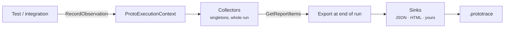

import CoverageMap from '@site/src/components/CoverageMap';
import VisibilityPanel from '@site/src/components/VisibilityPanel';

# Coverage and observations

Code coverage tells you which lines ran. It cannot tell you which **parts of your API** your tests actually checked. A setup helper can call an endpoint many times without any test asserting its response.

ProtoTest measures coverage against the *contract*: your OpenAPI document, your GraphQL schema. For REST, a response property counts as covered only when a shape assertion matched it. gRPC coverage counts the services and methods your calls reached. This page shows how coverage is built, how to turn it on, and how to write your own collector.

## What it is

Coverage is built from **observations**: facts the integrations record while tests run. The integrations record them for you, and you can record your own.


```mermaid
flowchart LR
    Test["Test / integration"] -->|RecordObservation| Context["ProtoExecutionContext"]
    Context --> Collectors["Collectors<br/><small>singletons, whole run</small>"]
    Collectors -->|GetReportItems| Export["Export at end of run"]
    Export --> Sinks["Sinks<br/><small>JSON · HTML · yours</small>"]
    Sinks --> Archive[".prototrace"]
```

Each edge carries a concrete payload. A REST response produces `http.response` (method, route, status, body). A matched shape assertion produces `http.contract.shape` (the paths it matched). The collector turns those into report items (endpoint, response, property with covered or uncovered). The sink writes the items into `report.json` and `report.html`. The archive embeds both files under `resources/run/`.

1. Integrations record **observations** as tests run. REST records `http.response` for every response and `http.contract.shape` for every successful shape assertion. GraphQL records `graphql.response` and `graphql.contract.shape`. gRPC records `grpc.response` per call and `grpc.contract.shape`. Messaging records `messaging.published` and `messaging.receive`, plus `messaging.contract.shape` from a message shape assertion.
2. Each observation is offered to every registered **collector** whose `CanCollect` accepts it. Collectors live for the whole run, so they aggregate across all tests.
3. When the run stops, every collector's **report items** are gathered, sorted by target, category and identifier, and passed to every **sink**.
4. Files the sinks wrote are added to the `.prototrace` archive.

### What the run could see

Where the observations came from matters as much as the counts. The run screen states where the application ran, which capabilities were composed, and which value sources were present or absent. Missing sources still appear in the list, marked as absent.

<VisibilityPanel />

### Turn it on

```csharp
builder
    .AddApplication("Api", app => app
        .AddRest(rest => rest
            .AddClient("Api")
            .AddCollector<RestCoverageCollector>()
            .AddCollector<OpenApiCoverageCollector>())
        .AddGraphQL(graphQL => graphQL
            .AddClient("GraphQL")
            .WithSchemaCoverage("schema.graphql"))
        .AddGrpc(grpc => grpc
            .AddClient("Projects")
            .AddCollector<GrpcCoverageCollector>()))
    .AddSink<HtmlReportSink>();
```

| Collector | Reports |
| --- | --- |
| `RestCoverageCollector` | every REST endpoint your suite called, with hit counts |
| `RestTrafficCoverageCollector` | the fields that arrived in REST responses but that no shape assertion mentioned, in their own section. Opt-in, and never counted as covered. |
| [`OpenApiCoverageCollector`](../integrations/openapi.md) | the **whole** OpenAPI document: endpoints, responses and response properties, covered or not |
| [GraphQL schema coverage](../integrations/graphql/coverage.md) | the whole schema: types, fields and arguments, and input types with their input fields |
| `GrpcCoverageCollector` | every gRPC service and method your suite called, from the client's `grpc.response` observations. A failed call records `grpc.failure` and does not count as covered |

Collectors gather, and [sinks](./reporting.md) write the results. Without a sink you see nothing.

`AddCollector` hangs off the `IProtoTargetBuilder` returned by a client registration. REST, GraphQL and gRPC all support it. The collector's first constructor argument is the target name, and any extra arguments to `AddCollector` follow it.

### Record your own observations

```csharp
public sealed record ProtoObservation(
    string TargetName,      // the registered target, e.g. "Api", or "Northstar:Api" under an application
    string Kind,            // what kind of fact, e.g. "http.response"
    string Identifier,      // what it is about, e.g. "GET /api/orders/{id}"
    object? Data = null,
    IReadOnlyDictionary<string, object>? Metadata = null);
```

Domain facts that deserve to be in a report are one call away:

```csharp
Proto.Context.RecordObservation(
    targetName: "Billing",
    kind: "invoice.state",
    identifier: invoice.State,
    data: new { invoice.Id, invoice.Total });
```

## How to read it

### Reading the report

The report nests endpoints, responses and properties. Covered items, partial items and gaps look different. A property no assertion matched is marked as unasserted:

<CoverageMap />

Three different gaps, three different fixes:

| The gap | It reads as | The fix |
| --- | --- | --- |
| The endpoint was never called | The whole endpoint is uncovered | Write a test for the feature |
| A response status was never reached | `403` or `404` is uncovered | Add the error-path test |
| A property was never asserted | `$.field` says unasserted | Add the path to a `Should.MatchShape` |

The summary at the top of each report gives the total, covered and uncovered counts and a coverage percentage.

:::tip[Coverage rewards shape assertions]
Property coverage comes from the paths `Should.MatchShape` matched. A test that only checks the status code covers the endpoint and the status, but none of the fields. That is deliberate. A field with no assertion can change without failing a test.
:::

### Traffic coverage (observed but unasserted)

`RestCoverageCollector` counts the routes your suite called. Traffic coverage looks inside the responses. It reports the fields that arrived in a response and that no shape assertion mentioned, in its own report section. The two count different things:

```text
REST coverage (asserted)                    Traffic (observed, never covered)
counts toward the percentage               never counts toward the percentage,
                                           the gates, or the property table
per method + route + status                Any() and NotNull() do not claim
                                           the fields inside the value
a property counts when a shape             a field here is still uncovered there;
matched it                                 the section names the gap
```

It is opt-in:

```csharp
builder.AddRest(rest => rest
    .AddClient("Api")
    .AddCollector<RestTrafficCoverageCollector>());
```

```
Traffic (observed but unasserted)
REST traffic  GET /api/v1/organizations/{id} · 200
              └ $.seatCount
              └ $.owner.email
```

Observed fields never count as covered. That is the point. The report's coverage percentage, the run gates and the OpenAPI property table keep counting only what an assertion matched. A field can appear here and still be uncovered there. The section is built from the observations the run already records: response bodies (`http.response`) and the matched paths of shape assertions (`http.contract.shape`).

The rules, so the section is read correctly:

| The rule | What it means for the section |
| --- | --- |
| The comparison is per method, route template and status code | A field any shape mentioned for that same combination counts as asserted for the run |
| A response no shape touched | It reports all of its fields. That is the gap the endpoint-level report cannot show |
| `JsonValue.Any()` and `JsonValue.NotNull()` | They mention the whole value but not the fields inside it, so those fields appear here |
| A body truncated by the diagnostic cap | It cannot be analyzed and contributes nothing |
| A shape assertion made without an execution context | It records no structured route and cannot claim a field |

## The artifact

Coverage reaches the outside world as **report items**. The [sinks](./reporting.md) receive them once, at the end of the run, and write them into the JSON and HTML reports. Those reports travel inside the `.prototrace` archive. A coverage percentage in CI is the same item tree a run gate reads.

`ProtoReportItem` is one normalized row. It is a positional record, and the order of its parameters is stable.

| Field | What it holds | Default |
| --- | --- | --- |
| `TargetName` | the registered target, e.g. `Api`, or `Northstar:Api` under an application | required |
| `Category` | what kind of surface the row is about, e.g. `OpenAPI` | required |
| `Identifier` | the specific unit, e.g. `GET /api/v1/orders` | required |
| `Kind` | `observation`, `coverage`, `finding`, `gate`, `metric`, `resource`, `run_metadata`, `traffic`, or your own | `observation` |
| `Status` | `Neutral`, `Info`, `Success`, `Warning`, `Error` | `Neutral` |
| `Count` | the hit count | `0` |
| `IsCovered` | the covered verdict, or `null` for an aggregate row | `null` |
| `Value`, `Unit` | a metric's value and unit | `null` |
| `Message` | a finding's or gate's text | `null` |
| `Tags` | the row's tags | `null` |
| `Children` | the nested rows, such as an endpoint's responses and properties | `null` |
| `Metadata` | anything the collector wants to carry | `null` |
| `DisplayName`, `DisplayGroup` | how a sink should label and group the row | `null` |

Items nest through `Children`. The kinds cover more than coverage. A `Metric` with a `Value` and `Unit`, or a `Finding` with a `Warning` status and a `Message`, show up in the same reports. A kind is an open string, so an integration can define its own. The built-in ones are named by `ProtoReportItemKinds`, and the HTML report keeps the kinds in their own sections (coverage, traffic, findings, run gates, resources, run metadata). An unknown kind gets its own section titled after it, so a passed gate is never read as a finding.

### Writing a collector

The simplest collector counts identifiers. Derive from `ProtoCoverageCollector` and give it a category:

```csharp
public sealed class InvoiceStateCoverage(string targetName) : ProtoCoverageCollector(targetName)
{
    public override string Category => "Invoice states";

    public override bool CanCollect(ProtoObservation observation) =>
        base.CanCollect(observation) && observation.Kind == "invoice.state";
}
```

The base class matches observations whose `TargetName` equals its own, ignoring case. It records one covered item per distinct `Identifier`, with a hit count. `RestCoverageCollector` and `GrpcCoverageCollector` are built the same way. Under an `[Application]` the client is registered under its qualified name (`Api` becomes `Northstar:Api`), and observations carry that same qualified name, so collectors attached to the client keep matching.

The valuable part is what was **not** observed. To report it, override `GetReportItems` and enumerate the full set, as the OpenAPI collector does with the specification:

```csharp
public sealed class InvoiceStateCoverage(string targetName) : ProtoCoverageCollector(targetName)
{
    private static readonly string[] AllStates = ["draft", "open", "paid", "overdue", "void"];

    // Category and CanCollect as above ...

    public override IEnumerable<ProtoReportItem> GetReportItems()
    {
        lock (_lock)
        {
            return AllStates.Select(state => _items.TryGetValue(state, out var hit)
                ? hit
                : new ProtoReportItem(TargetName, Category, state,
                    Kind: ProtoReportItemKinds.Coverage,
                    Status: ProtoReportStatus.Neutral,
                    IsCovered: false)).ToList();
        }
    }
}
```

### Collectors not tied to a client

For a collector that is not about any client, register it directly:

```csharp
builder.ConfigureServices(services =>
    services.AddSingleton<IProtoCollector>(new InvoiceStateCoverage("Billing")));
```

A messaging collector is one of these. The observation target is the broker name, not a client target. Construct the collector with that name (`RabbitMQ`) and register it directly.

Collectors must be thread-safe, because tests run in parallel. Use the base class's `protected readonly ProtoLock _lock`.

The interfaces underneath are small:

```csharp
public interface IProtoCollector
{
    bool CanCollect(ProtoObservation observation);
    void Collect(ProtoObservation observation);
}

public interface IProtoReportSource
{
    IEnumerable<ProtoReportItem> GetReportItems();
}
```

## Limits

- A field counts as covered only when a shape assertion matched it. A test that checks the status code covers the endpoint and the status, and none of the fields.
- Observed fields never count as covered. The traffic section reports a gap, but does not close it.
- `ProtoTest.Messaging` ships no collector, and its destinations are not a coverage category. The `messaging.published`, `messaging.receive` and `messaging.contract.shape` observations reach a report only through a collector you register with the broker's target name (`RabbitMQ`, or `InMemory` for the default broker). The same is true of `ProtoTest.Messaging.RabbitMq`.
- Traffic coverage ignores a truncated body and a shape assertion made without an execution context, as [its rules](#traffic-coverage-observed-but-unasserted) say.
- A report is a snapshot taken before the run's own resources are released. A run-scoped resource still reads as registered and neutral there, and its release is recorded in the [ProtoTrace](./prototrace.md) afterwards.
- A kind is an open string. An unknown kind gets an HTML section titled after it, so choose a name that reads as a section title.

## Learn more

- [Reporting](./reporting.md): the sinks that write these items out.
- [ProtoTrace](./prototrace.md): the run record the observations travel in.
- [OpenAPI contract coverage](../integrations/openapi.md) and [GraphQL schema coverage](../integrations/graphql/coverage.md): what "covered" means for each contract.
