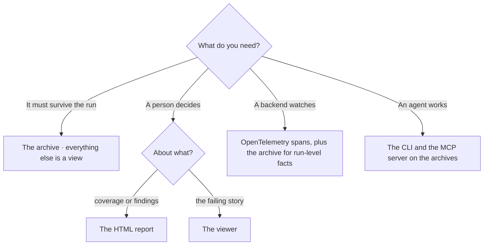

# Where your evidence goes

One run writes one `.prototrace` archive, and up to five readers consume it. Each surface shows different facts. Pick the surface that answers your question.

| Surface | What it holds | What it cannot see | Reach it via |
| --- | --- | --- | --- |
| **The archive** (`.prototrace`) | everything the run recorded: operations and events per test, entity state and tracked values, observations, findings, attachments, the run's identity and environment, gate verdicts and provider decisions, and the report files the sinks wrote | anything after the process. The archive is written once, at the end, so a killed run leaves none. An application's own spans are in it only when its activity sources are [configured](./prototrace.md#what-a-trace-contains). | the file the run wrote under `TestResults/`, or `trace.OutputPath` |
| **The viewer** | the archive, read entirely in your browser: the run verdict, the failing check, the per-test story, state and spans, findings and gates | the coverage the report carries. The report files travel in the archive and the viewer lists them as run attachments, but it does not render them. There are no live runs. | [trace.prototest.dev](https://trace.prototest.dev), drop the file on the page |
| **Report sinks** (JSON and HTML) | the collectors' items, once per run: coverage totals and units, findings, run gate verdicts, resources and run metadata | the operation tree and the bytes behind it. There are no request or response bodies and no per-test story, and the report is a snapshot taken before the run's own resources release. | `AddSink<JsonReportSink>()` and `AddSink<HtmlReportSink>()`, then the file each one wrote |
| **OpenTelemetry** | the operations as spans, with their events, outcome and tags, and the application's own spans when it is instrumented | run-level evidence: gate verdicts, provider decisions and skip records, capability decisions and run resources. The run identity and environment (`runId`, `environment.*`) are archive-only, as are values above the tag cap and app-source captures you did not subscribe to. | `AddSource("ProtoTest")` on a `TracerProvider`, see [OpenTelemetry](./opentelemetry.md) |
| **The CLI** (`prototest`) | one archive's diagnosis (`summary`), a shareable page over a folder (`index`), a report comparison (`verify`) and the feedback digest | live runs and interactive drill-down. It reads files and writes only the index page, the digests and the `--digest` file. | `prototest summary <file.prototrace>`, see the [CLI reference](../agent-workflows/cli.md) |
| **The MCP server** | the same archive story for an agent through four read-only tools: `list_runs`, `get_failure`, `get_diagnosis` and `get_coverage` | test execution and archives outside the repositories it was pointed at. `get_coverage` reads the report the run embedded, so a run without a sink reports none. | the four tools over stdio, see [Setup](../agent-workflows/setup.md#what-the-agent-can-see) |

## Pick the surface

Two cells in the table surprise people, so they are worth stating:

- The viewer lists the report files as run attachments but does not render coverage. Read the HTML report for coverage.
- `get_coverage` reads the report the run embedded, so a run with no sink reports no coverage.

The surfaces and their limits in full are on [ProtoTrace](./prototrace.md), [Reporting](./reporting.md) and [OpenTelemetry](./opentelemetry.md).
