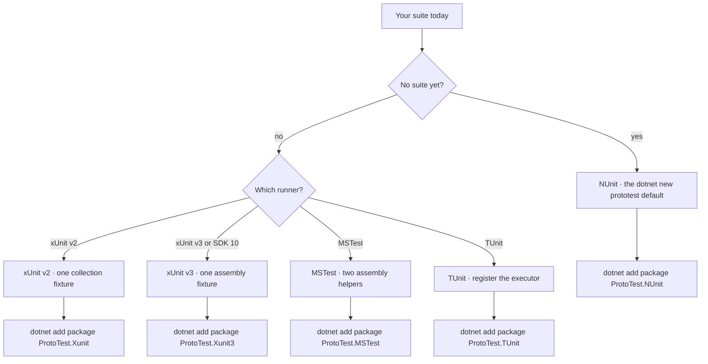

# Test runners

ProtoTest does not replace your test runner. It wraps each test in a ProtoTest execution context, so [the foundation](../foundation/overview.md) behaves the same on every runner.

## Which runner

All five adapters start the same host, evaluate the same skip conditions and write the same trace. Follow the branch that matches your suite:



| Your situation | Start with | What changes for you |
| --- | --- | --- |
| A new suite, no runner in mind | [NUnit](./nunit.md) | `dotnet new prototest` writes it. One `[SetUpFixture]` and one `[ProtoTest]` attribute |
| An existing xUnit v2 suite | [xUnit v2](./xunit.md) | Plain `[Fact]` tests keep running. A converted class joins the collection, one class at a time |
| An existing xUnit v3 suite on SDK 10 | [xUnit v3](./xunit3.md) | One assembly fixture covers every class. The project needs the Microsoft.Testing.Platform opt-in before `dotnet test` runs it |
| A team standardized on MSTest | [MSTest](./mstest.md) | The standard template already pins the version ProtoTest needs. Each data row is its own context |
| A parallel, async-first suite | [TUnit](./tunit.md) | You keep TUnit's own `[Test]` and register the executor. There is no test attribute to replace |

Converted and untouched tests can share a project on xUnit v2 and v3: see [Bring an existing xUnit suite](./bring-your-existing-suite.md) for the order that stays green.

## Install

| Runner | Package | Test attribute | Assembly setup | Framework floor |
| --- | --- | --- | --- | --- |
| [xUnit v2](./xunit.md) | `ProtoTest.Xunit` | `[ProtoTestFact]` / `[ProtoTestTheory]` | a collection fixture | xunit 2.9.3 |
| [xUnit v3](./xunit3.md) | `ProtoTest.Xunit3` | `[ProtoTestFact]` / `[ProtoTestTheory]` | `[assembly: AssemblyFixture]` | xunit.v3 4.0.0 |
| [NUnit](./nunit.md) | `ProtoTest.NUnit` | `[ProtoTest]` (replaces `[Test]`) | `[SetUpFixture]` | NUnit 4.6.1 |
| [MSTest](./mstest.md) | `ProtoTest.MSTest` | `[ProtoTest]` (replaces `[TestMethod]`) | `[AssemblyInitialize]` / `[AssemblyCleanup]` | MSTest.TestFramework 4.0.2 |
| [TUnit](./tunit.md) | `ProtoTest.TUnit` | `[Test]` (TUnit's own) | `[assembly: TestExecutor<ProtoTestExecutor>]` | TUnit 1.66.0 |

Install one package:

```bash
dotnet add package ProtoTest.NUnit   # or ProtoTest.Xunit, ProtoTest.Xunit3, ProtoTest.MSTest, ProtoTest.TUnit
```

ProtoTest and every adapter target **.NET 8, 9 and 10**. The NUnit adapter needs NUnit **4.6.1** or newer, and the standard `dotnet new nunit` template pins an older one: update it first with `dotnet add package NUnit --version 4.6.1`. Each adapter page names its own floor.

## Register

Whichever runner you use, you write the same two things.

**1. An assembly setup class** deriving from that package's `ProtoTestAssembly`. It builds the `ProtoHost` once per test process and exposes it as a static `Host`:

```csharp
protected override void Configure(IProtoHostBuilder builder) =>
    builder.AddApplication("Api", app => app.AddRest(rest => rest.AddClient("Api")));
```

**2. The runner's test attribute** (or, for TUnit, the registered executor). Each runner page below shows the exact form.

Tests select their application with `[Application("Api")]`. The protocol accessors (`Proto.Context.Rest()`, `Proto.Context.GraphQL()`, `Proto.Context.Web()`) then resolve the clients bound to it.

:::note[One host per process]
`Host` is a static member inside each adapter package, so there is one host per test process. Reading `Proto.Context` before the assembly setup runs throws `InvalidOperationException`. The message names the setup class the runner expects.
:::

## What the adapter changes

The adapter provides the host startup described above, wraps each test in the ProtoTest lifecycle, and maps the runner's own result to the trace. Discovery, ordering and parallelism stay the runner's.

| Runner | The host starts from | The context spans | Cancellation token | Row name |
| --- | --- | --- | --- | --- |
| NUnit | `[SetUpFixture]` | `[SetUp]`, the body and `[TearDown]` | `TestExecutionContext.CancellationToken`, cancelled by `[CancelAfter]` | NUnit's full name, arguments included |
| xUnit v2 | a collection fixture | the test invocation, the test class constructor included | the runner's `CancellationTokenSource` | xUnit's display name, arguments included |
| xUnit v3 | `[assembly: AssemblyFixture]` | the before- and after-attributes | `TestContext.Current.CancellationToken` | xUnit's display name, arguments included |
| MSTest | `[AssemblyInitialize]` and `[AssemblyCleanup]` | one data row | none at the 4.0.2 floor | `DeclaringType.MethodName[args]` |
| TUnit | `[Before(Assembly)]` and `[After(Assembly)]` | the registered executor | `TestContext.CancellationToken` | `DeclaringType.MethodName[args]` |

Where `Proto.Context` is available is a position on a line, not a paragraph. `|` marks the host bar, `[]` the context, and everything outside the bracket runs before the context exists:

```text
NUnit    |[SetUpFixture (host)]|  [[SetUp | body | TearDown]]
xUnit v2 |[collection fixture ]|  [[constructor | body ]]
xUnit v3 |[assembly fixture   ]|  ctor + InitializeAsync OUTSIDE  [[before | body | after]]
MSTest   |[AssemblyInit/Cleanup]| [[row 1]]  [[row 2]]
TUnit    |[Before(Assembly)  ]|  [[executor wraps body]]
```

### The lifecycle

Before the body the adapter calls `StartTestAsync`. That call creates the context and runs hooks and attributes. Then `test.execution` opens. After the body it calls `CompleteTestAsync` with the outcome the runner recorded, and the context is torn down. Those calls are the trace's `test.setup`, `test.execution` and `test.teardown` entries.

A setup failure is rolled back and reported as a failure. A skipped test never starts, so it has no context and no trace entry.

xUnit v2, MSTest and TUnit run this lifecycle asynchronously. NUnit and xUnit v3 call the host synchronously (`GetAwaiter().GetResult()`), so they need a synchronizing context.

### Outcomes

| Runner | ProtoTest records | Why |
| --- | --- | --- |
| xUnit v2 | Passed, Failed, Cancelled | xUnit's aggregator decides pass or fail. A body `OperationCanceledException` and a signalled cancellation source both read as Cancelled. A failure keeps its exception. |
| xUnit v3 | Passed, Failed, Skipped, Cancelled, Unknown | Skipped covers xUnit's Skipped and NotRun. A cancelled exception type maps to Cancelled. Anything unmapped is Unknown. |
| NUnit | Passed, Failed, Skipped, Partial, Unknown | Inconclusive maps to Skipped. Warning maps to Partial because the test passed with warnings attached. NUnit exposes no exception type, so a cancelled test reads as Failed. |
| MSTest | Passed, Failed, Skipped, Cancelled, Unknown | Ignored, Inconclusive and NotRunnable map to Skipped. A cancelled exception, a timeout or an abort maps to Cancelled. |
| TUnit | Passed, Failed, Skipped, Cancelled | `SkipTestException` maps to Skipped and `OperationCanceledException` to Cancelled. Anything else fails. |

Failure detail: xUnit v2 carries the exception into the trace. xUnit v3 records the state's exception type, message and stack. When NUnit reports no label, the type is `NUnit.Failed`. The message and stack are recorded. MSTest uses `MSTest.{Outcome}` when the result has no failure exception. TUnit records the thrown exception.

A skipped test appears only in the runner's own results. ProtoTest writes no trace entry, no report row and no teardown for it.

### Skips

All adapters evaluate [`[RequiresCapability]`, `[RequiresInProcess]` and `[RequiresPlaywrightBrowser]`](../foundation/skip-conditions.md) before `StartTestAsync`, so a skipped test has no context, no trace entry and no teardown. The reason reaches the runner:

| Runner | How the skip is raised | Reason reported |
| --- | --- | --- |
| NUnit | an ignored result (`ResultState.Ignored`) | as-is |
| xUnit v2 | xUnit's `SkipReason` | as-is |
| xUnit v3 | `Assert.Skip(reason)` | as-is |
| TUnit | `TUnit.Core.Skip.Test(reason)` | as-is |
| MSTest | an ignored `TestResult` | on the display name and `LogOutput` |

MSTest has no public dynamic-skip API in the version ProtoTest targets, so the adapter returns an ignored result and the reason travels on `LogOutput` and the display name.

### Attachments

Artifacts ProtoTest captures (request and response bodies, screenshots, Playwright traces) go to the runner's own reporting:

| Runner | How |
| --- | --- |
| NUnit | `TestContext.AddTestAttachment(path, description)` |
| xUnit v3 | `TestContext.Current.AddAttachment(name, bytes, mediaType)` |
| MSTest | appended to the row's `TestResult.ResultFiles` |
| TUnit | `context.Output.AttachArtifact(path, name, description)` |
| xUnit v2 | written to a file, with the path on the console, because v2 has no attachment API |

### Test names

NUnit and xUnit v3 record the name the runner gives the test case: the fully qualified method name for a plain method, with the row's arguments included for a parameterized one. xUnit v2 records xUnit's display name. MSTest and TUnit compose `DeclaringType.MethodName[args]` through `ProtoTestName.ForRow`, so parallel rows stay apart.

## Limits

- A skipped test exists only in the runner's own output. ProtoTest records nothing for it: no context, no trace entry and no teardown.
- Four adapters pass the runner's per-test token into the lifecycle. MSTest has no token, so those tests use `CancellationToken.None`.
- NUnit and xUnit v3 call the host synchronously, so the test project needs a synchronizing context.
- xUnit v3 starts its context after class construction and `IAsyncLifetime.InitializeAsync`, and completes it before class disposal. Class-level setup and cleanup stay outside the context.
- xUnit v2 has no dynamic skip and no attachment API, so its skip reason is decided before the test method is invoked and artifact paths go to the console.
- MSTest has no public dynamic-skip API and no assembly-wide hook: every test method carries `[ProtoTest]`, and the skip reason is not a first-class MSTest property.
- TUnit runs a test with no reflection `MethodInfo` unwrapped, because the executor has nothing to prepare from.

## Learn more

- [NUnit](./nunit.md), [xUnit v2](./xunit.md), [xUnit v3](./xunit3.md), [MSTest](./mstest.md), [TUnit](./tunit.md): the registration, the adapter's behavior and its limits.
- [Bring an existing xUnit suite](./bring-your-existing-suite.md): the conversion order for a suite you already have.
- [Skip conditions](../foundation/skip-conditions.md): the conditions every adapter evaluates.
- [Attributes](../foundation/attributes.md): what a `ProtoAttribute` you write resolves to on every runner.
- [Lifecycle](../foundation/lifecycle.md): the hooks and attributes around a test.
